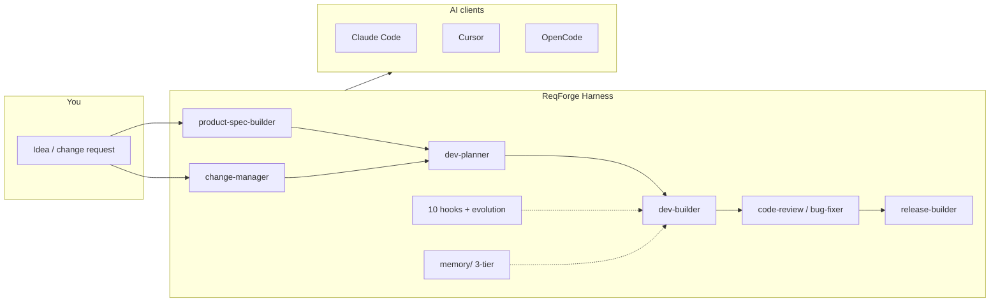

# ReqForge

[](CHANGELOG.md) [](LICENSE) [](README.md) [](README.zh-CN.md)

**From requirements to shippable products** — a full AI-guided path for founders, PMs, and indie developers (Spec → Plan → Build → Review → Release).

**Open-source Agent Harness** for Claude Code, Cursor, and OpenCode — skills, hooks, memory, and evolution constrain the model so work stays verifiable, not just conversational.

**Harness in one line:** the model is the CPU; the harness is the OS — orchestration, memory, guardrails, and validation so work **ships**, not just chats. ReqForge targets **requirements → shippable product** (spec, code, release), not consumer “run after you close the chat” life automation. [Maturity checklist →](core/docs/harness-maturity-checklist.md) · [Seven-layer map →](core/docs/agent-harness-seven-layer-map.md) · [Loadout scenarios →](core/docs/loadout-scenarios.md) · [Platform compliance →](core/docs/platform-compliance.md)

> **vs [OpenSpec](https://github.com/Fission-AI/OpenSpec)?** One change at a time. **ReqForge** = **requirements → product** + Harness. [OpenSpec →](core/docs/openspec-comparison.md) · **vs [Superpowers](https://github.com/obra/superpowers)?** TDD/subagents vs full pipeline. [Superpowers →](core/docs/superpowers-comparison.md) · **vs [Open Design](https://github.com/nexu-io/open-design)?** OD = mockups/preview; ReqForge = Spec→code (absorbs discovery checklist). [Open Design →](core/docs/open-design-comparison.md) · **vs [Context7](https://github.com/upstash/context7)?** Library docs injection; use **with** ReqForge. [Context7 →](core/docs/context7-comparison.md) · **vs [RTK](https://github.com/rtk-ai/rtk)?** Shell output compression; optional with ReqForge. [RTK →](core/docs/rtk-comparison.md) · **vs [nanochat](https://github.com/karpathy/nanochat)?** LLM training harness; Forge borrows golden-path / fast-loop discipline. [nanochat →](core/docs/nanochat-comparison.md) · **vs [autoresearch](https://github.com/karpathy/autoresearch)?** Scoped edit + fixed budget + single metric; Forge maps to Spec/Plan lock + Primary metric. [autoresearch →](core/docs/autoresearch-comparison.md) · **vs [llm-council](https://github.com/karpathy/llm-council)?** Multi-LLM peer review; Forge uses role-based council in code-review + spec Step 7. [llm-council →](core/docs/llm-council-comparison.md) · **vs [jobs](https://github.com/karpathy/jobs)?** BLS data + LLM rubric batch scoring (occupations, not job queues); Forge maps to risk_rank + PROJECT-HEALTH. [jobs →](core/docs/jobs-comparison.md) · **vs [LLM Wiki gist](https://gist.github.com/karpathy/442a6bf555914893e9891c11519de94f)?** raw/wiki/schema + ingest/query/lint; Forge maps to memory/ + ADR filing. [llm-wiki →](core/docs/llm-wiki-comparison.md) · **Skill self-evolution papers?** [EmbodiSkill](https://arxiv.org/abs/2605.10332) + [SkillEvolver](https://arxiv.org/abs/2605.10500) vs Forge feedback/evolution. [Skill evolution →](core/docs/skill-evolution-comparison.md) · **vs [SkillOpt](https://microsoft.github.io/SkillOpt/)?** Bounded Skill edits + eval validation gate; no in-repo optimizer. [SkillOpt →](core/docs/skillopt-comparison.md) · **Harness as mirror?** Tencent 显形 / 三块石碑 / 不可能三角. [Harness mirror →](core/docs/tencent-harness-mirror-comparison.md) · **vs [Matt Pocock Skills](https://github.com/mattpocock/skills)?** Composable daily engineering vs full pipeline; Light Grill absorbed. [Matt Pocock →](core/docs/mattpocock-skills-comparison.md)

**No npm install required to use the framework** — copy adapter files into your project and open your AI client. Node.js + pnpm are only needed if you contribute to this repo or run `scripts/`.

### Architecture at a glance



| Section | Description |
|---------|-------------|
| [Installation & Usage](#installation--usage) | Clone, copy adapters, hooks, first run |
| [Workflow](#workflow) | Spec → Plan → Build → Release (brownfield: `/change-manager`) |
| [Requirements depth](#requirements-depth-pm-frameworks--chain-of-thought) | PM frameworks + CoT in product-spec-builder |
| [Agent execution discipline](#agent-execution-discipline-8-rules) | Plan-before-act, read-before-edit, minimal diff, tests before done |
| [Karpathy behavior discipline](#karpathy-behavior-discipline-4-principles) | Think Before Coding, Simplicity First, Surgical Changes, Goal-Driven |
| [Framework Development](#framework-development) | Tests, sync, `pnpm forge-smoke`, dependency graph (contributors) |

---

## What's New

### v1.35.12 — 2026-06-01
- **forge-loop --fde**: `pnpm forge-fde` — Forward Deployed Engineer 模式，执行前读取项目上下文，完成时输出 `.forge/evidence/phase-N-report.md` 证据报告（测试通过率 + 交付清单 + 文件变更）。
- **forge-ops**: `pnpm forge-ops <url>` — 运营监控闭环。健康检查 → 验证套件 → 基线对比 → 回归检测 → 自动修复。支持 `--interval` 循环模式、`--baseline save|compare`、`--fix`。输出 `.forge/ops/report.md`。
- **skill-eval judge v2**: Rubric 从 5 维扩展到 6 维，新增"工作流质量与可重复性"(30%)和"实测效果与基线对比"(15%)。强调工作流在真实项目中产生可重复结果的能力。
- **forge-ui-check fix**: Phase 无独立章节时不再误报，跳过而非 exit 1。

### v1.35.11 — 2026-06-01
- **forge-phase-check**: `pnpm forge-phase-check <N>` — parses DEV-PLAN.md Phase N checklist, cross-references `git diff` against deliverables/keyfiles/acceptance items. Outputs omission/completion/redundancy report. Pure mechanical comparison, no AI judgment. (`--json` for programmatic use)
- **forge-phase-loop**: `pnpm forge-phase-loop <N>` — single-iteration auto-completion. Runs check, generates `.forge/phase-loop/fix-brief.md` with structured fix instructions for each omitted item. Supports `--max` (default 5) and `--reset`. Designed for YOLO + loop workflows: iterate check→fix→re-check until clean.
- **ref-lint**: `skill-eval run` now checks SKILL.md for mismatched numeric references (e.g. "four dimensions" but only 3 items listed). CN/Arabic/EN numeral support with 20+ quantifiers. ([OpenSpec article](https://mp.weixin.qq.com/s/iSWtR665phTo5dv8sHFgqA) inspired)
- **Windows hook fix**: CRLF `.sh` files caused "cannot execute binary file" on Git Bash. `.gitattributes` enforces `*.sh eol=lf`. Platform-split settings: hooks in `settings.unix.json` (`.sh`) / `settings.windows.json` (`.bat`), `settings.json` empty.
- **forge-ui-check**: `pnpm forge-ui-check <N>` — scans DEV-PLAN.md for UI checklist items, checks file existence, auto-generates Playwright tests (form/button/input/nav/page assertions) with `--url` for dynamic browser validation.
- **forge-ui-loop**: `pnpm forge-ui-loop <N>` — UI auto-completion loop. Runs check, generates `.forge/ui-loop/fix-brief.md`, supports `--url`/`--max`/`--reset`. YOLO: check → fix → re-check until UI passes.
- **forge-loop**: `pnpm forge-loop` — 下班前跑这条命令，第二天来就完事了。

### v1.35.10 — 2026-05-30
- **Output Status Protocol**: New `_shared/output-status-protocol.md` — every Phase/output ends with `[Decision]` / `[Assumption]` / `[Next]` / `[Status]` (DONE / DONE_WITH_CONCERNS / BLOCKED / NEEDS_CONTEXT). Wired into product-spec-builder, dev-planner, bug-fixer, change-manager, dev-builder Output Style sections. ([Digidai/product-manager-skills](https://github.com/Digidai/product-manager-skills) output contract inspired)
- **ETHOS principles**: Three shared output principles (`Thinking Before Templating`, `Opinions With Tradeoffs`, `Compression Over Completeness`) added to `_shared/output-style-concise.md`

### v1.35.9 — 2026-05-30
- **Skill Taxonomy (P7-lite)**: Three-tier classification (`workflow` / `interactive` / `component`) + `intent` field added to all 13 `skill.json` files. New `core/docs/skill-taxonomy.md` with classification table, decision criteria, and rationale. `validate-skill.mjs` extended to enforce `tier` (required enum) and `intent` (required string). Propagated to all 3 adapters. ([Product-Manager-Skills](https://github.com/deanpeters/Product-Manager-Skills) taxonomy inspired)

### v1.35.8 — 2026-05-26
- **Prompt slimming**: `change-manager` SKILL index-only (~11k→~4.7k); brownfield workflow → `references/workflow.md`

### v1.35.7 — 2026-05-26
- **Prompt slimming (P6)**: `CLAUDE.md` General Rules pointerized (~7.9k→~5.3k); details → `forge-quickref` §通用规则; removed duplicate `[Available Skills]` block

### v1.35.6 — 2026-05-26
- **`forge-install --loadout`**: install only loadout skills/agents + hooks; writes `.forge/loadout-active.json`

### v1.35.5 — 2026-05-30
- **Prompt slimming (P4)**: `bug-fixer` (~14k→~5k) and `code-review` (~11k→~4.5k) SKILL index-only; four-stage debug/review workflows → `references/`; retry-gate and parallel reviewers unchanged

### v1.35.4 — 2026-05-30
- **Prompt slimming (P3)**: `design-brief-builder` (~20k→~4k) and `release-builder` (~18k→~5k) SKILL index-only; interview/release workflows → `references/workflow.md`

### v1.35.3 — 2026-05-30
- **Prompt slimming (P2)**: `product-spec-builder` SKILL index-only (~17k→~7k); Quick path → `references/workflow-quick-mode.md` (skips full 0-to-1 interview chain)

### v1.35.2 — 2026-05-30
- **Prompt slimming (P1)**: `dev-planner` SKILL index-only (~28k→~5k); analysis/workflow in `references/`; CLAUDE.md volatile routing → `forge-quickref` §项目状态路由
- **`lite` loadout**: 8 skills + 8 hooks (change-manager included; no design/release/evolution) — `pnpm apply-loadout lite <client>`

### v1.35.1 — 2026-05-30
- **Prompt slimming (P0)**: `dev-builder` SKILL index-only (~36k→~7k chars); full workflow → `references/workflow.md`; principles → `references/first-principles.md`; shared pointers in `core/skills/_shared/`; compressed `forge-bootstrap`; deduped Karpathy blocks in `bug-fixer` / `code-review`
- **Cross-client handoff**: fixed read-order in `forge-quickref` / `AGENTS.md` — switch clients via files, not chat recap

### v1.35.0 — 2026-05-29
- **AGENTS.md template**: enhanced with parallel worktree workflow — branch naming, dependency sharing, multi-agent coordination. Written to project root by `pnpm forge-install`. ([FreeTodo](https://github.com/FreeU-group/FreeTodo) inspired)
- **Structured exploration trace**: `pnpm forge-trace` — record Phase decisions, dead ends, and evidence bindings in `.forge/trace/phase-<N>.json`. Hooked into dev-builder Loading Phase and Phase Completion Assessment. Checked by `forge-verify trace-fresh`. ([ARA paper](https://arxiv.org/abs/2604.24658) inspired)
- **Scope filter (巽)**: `pnpm forge-scope` — declare Phase file boundaries (modify/readonly/outOfScope), enforced by `forge-verify scope-check` against `git diff`. Prevents scope creep during implementation.
- **Evolution proposals (兌)**: dev-builder Phase Completion triggers evolution-engine scan; presents actionable pattern-based proposals to user as Y/N choices. Closes the feedback→evolution loop proactively. ([八卦信息论 巽兌 protocol audit] inspired)
- **Skill quality judge**: `pnpm skill-eval judge <name>` — independent sub-agent evaluates Skill quality against a 5-dim rubric (structure/specificity/failure-mode/anti-patterns/effectiveness). Results recorded to `judge-history.json`. ([darwin-skill](https://github.com/alchaincyf/darwin-skill) inspired)
- **Skill authoring patterns**: [`core/docs/skill-authoring-patterns.md`](core/docs/skill-authoring-patterns.md) — practical reference for SKILL.md authors: workflow design, failure-mode encoding, anti-pattern blacklists, rubric self-check table.
- **skill-eval ref-lint**: automatic numeric reference consistency check on SKILL.md — detects mismatches like "four dimensions" followed by a 3-item list. Zero-config, runs with `pnpm skill-eval <name>`. ([OpenSpec verify bug](https://mp.weixin.qq.com/s/iSWtR665phTo5dv8sHFgqA) inspired)

### v1.34.0 — 2026-05-28
- **Matt Pocock Skills 对照**：[mattpocock-skills-comparison.md](core/docs/mattpocock-skills-comparison.md) — Light Grill、zoom-out、架构保健、GitHub issue 切片（吸收思路，不整包合并）
- **Light Grill Mode**：`/product-spec-builder` —「grill me / 烤问」轻量对齐，不写完整 Spec
- **Zoom-out / 架构保健**：dev-builder、dev-planner 可选 pass 文档
- **GitHub issues 模板**：DEV-PLAN 确认后可选垂直切片导出

### v1.33.0 — 2026-05-28
- **Tencent Harness mirror**: [tencent-harness-mirror-comparison.md](core/docs/tencent-harness-mirror-comparison.md) — legibility, three steles, impossible triangle ↔ Forge
- **`.forge/project-taste.md`**: team preference statements (soft S3 taste); `forge-install` via `installProjectTaste`; distinct from hard-line `security-guidance.md`
- **Judgment Spectrum (S1–S5)**: `product-spec-builder`, `code-review`, `dev-builder` Loading Phase

### v1.32.0 — 2026-05-28
- **SkillOpt comparison**: [skillopt-comparison.md](core/docs/skillopt-comparison.md) — bounded edits, rejected-edit buffer, train/held-out
- **skill-eval**: `rejected-edits.json` template; evolution-engine ≤3 structured edits per proposal

### v1.31.0 — 2026-05-28
- **Custom Skill evaluator**: `pnpm skill-eval init <name>` + `pnpm skill-eval <name>`; `.forge/skills/<name>/eval/` (trigger cases + output assertions); see [skill-eval.md](core/docs/skill-eval.md)
- **skill-builder**: ships eval pack with new Skills; **forge-install** writes `.forge/skills/_template/eval/`

### v1.30.0 — 2026-05-28
- **Release preflight gate**: `pnpm preflight` — machine checks before publish/deploy (clean git, version field, artifact privacy scan); configurable via `.forge/preflight.json` (includes WeChat draft example).
- **release-builder**: new Step 3b Preflight Gate — exit code 1 blocks publish; see [external-publish-preflight.md](core/docs/external-publish-preflight.md).
- **forge-install**: writes `.forge/preflight.json` when missing.

### v1.29.0 — 2026-05-28
- **`.forge/security-guidance.md`**: team security rules on `pnpm forge-install`; code-review / release-builder / dev-builder read it for sensitive work.
- **forge-verify** `security-patterns`: lightweight `eval` / `new Function` scan — [comparison doc](core/docs/security-guidance-comparison.md).

### v1.28.0 — 2026-05-27
- **dev-map**: Project-level navigation index at `.forge/dev-map.md` — AI explores module structure and existing patterns before coding. Maintained by dev-builder (who changes code updates the map). Template installed via `pnpm forge-install`.
- **forge-verify**: Unified post-verification entry `pnpm forge-verify` with 5 checks and baseline comparison (`--baseline save|compare|check`). Turns "I think I'm done" into "the system confirms I'm done."
- **dev-builder integrated**: Loading Phase auto-saves baseline; Phase Completion runs forge-verify + compares baseline + updates dev-map. New Post-Verification Gate principle.

### v1.27.0 — 2026-05-27
- **CLAUDE.md zone partitioning**: [Immutable/Stable/Volatile](CLAUDE.md#L1) zones — session-varying content at end of prompt preserves prefix for caching.
- **Hook repair**: PreToolUse/PostToolUse now arrays (was objects); removed invalid events (PreCommit, BeforeCommand, AfterCommand, PostCommit, OnInit); merged BeforeCommand/AfterCommand into PreToolUse/PostToolUse arrays.
- **Skill quality**: 13/13 PASS, 0 FAIL; 4 skills at perfect 33/33 (dev-planner, release-builder, request-dispatcher, skill-builder). Fixed Gotchas/step-counting cross-contamination, rename Analysis Strategies→Analysis Strategy (plural broke regex).
- **Feedback cleanup**: Converted stray JSON to proper .md frontmatter, fixed missing FEEDBACK-INDEX.md entries.

### v1.26.0 — 2026-05-27
- **Verify loop**: Agent discipline rule 8 = fix → re-run checks until green; anti-patterns in [session-execution-discipline.md](core/docs/session-execution-discipline.md).
- **`.forge/quickref.md`**: one-page gates, 4 principles, Skill commands — written on `pnpm forge-install`.
- **Idea Validation Gate** + **MVP Scope**: Founder's Playbook — Spec § Idea Stage Exit Criteria; DEV-PLAN scope block; six-step PreToolUse chain.
- **OpenSpec + Superpowers handoff**: [shuge-openspec-superpowers-comparison.md](core/docs/shuge-openspec-superpowers-comparison.md); change-manager Change-Scoped → dev-builder; Delta Spec + G/W/T templates.
- **`request-dispatcher`**: meta-skill for ambiguous request routing; HTML knowledge boundaries on all 12 skills.

### v1.25.0 — 2026-05-25
- **Harness hardening**: `forge-bootstrap` session iron laws; PreToolUse chain (Spec → confirmations → Plan → implementer session); **HARD-GATE** on product-spec, dev-planner, dev-builder; implementer + worktree per Task; forge-smoke **12** items.
- **PM frameworks (product-spec)**: Optional [pm-skills](https://github.com/phuryn/pm-skills)-inspired references (MIT) — OST, JTBD, assumptions, competitors; see [Requirements depth](#requirements-depth-pm-frameworks--chain-of-thought).
- **Chain-of-Thought (CoT)**: Step-by-step reasoning before conclusions in spec interviews, implementer, bug-fixer, bootstrap Iron Law 9.
- **Evolution**: `failure_class` + RED/GREEN/Verify-by on evolution proposals.
- **Agent execution discipline (8 rules)**: Plan → approve → act; read before edit; minimal diff; diff approval before commit; **verify loop** (re-run checks until pass) — [full doc](core/docs/session-execution-discipline.md), summary in `forge-bootstrap`, user copy in [agents-template.md](core/templates/agents-template.md); human quickref `.forge/quickref.md` on install.

### v1.24.0 — 2026-05-24
- **Karpathy comparisons**: [autoresearch](core/docs/autoresearch-comparison.md), [llm-council](core/docs/llm-council-comparison.md), [jobs](core/docs/jobs-comparison.md), [llm-wiki gist](core/docs/llm-wiki-comparison.md) — methodology mapped to Forge Skills, not copied wholesale.
- **Harness discipline**: Primary metric per DEV-PLAN Phase; dev-builder Spec/Plan read-only + Task micro-cycle; code-review **risk_rank** (S×I×C); **PROJECT-HEALTH-template.md**; product-spec **LLM-as-Judge** + Spec Step 7 quality council.
- **OpenCode fix**: `pnpm sync` copies root `CLAUDE.md` → `.opencode/AGENTS.md` (was empty template — Skill Dispatch broken). `forge-smoke` `machine-gates-doc` guards OpenCode parity.
- **Memory**: LLM Wiki pattern cross-ref in `memory-system.md`; dev-builder **Query filing** — important conclusions → ADR / project-memory, not chat-only.

### v1.23.0 — 2026-05-24
- **forge-smoke**: `pnpm forge-smoke` — 10 static release-gate smokes (includes test-demo golden path); GitHub Actions on push/PR only (no cron).
- **loadout-scenarios.md**: scenario → loadout → first Skill command; `scenarios[]` tags on built-in loadouts; README Step 3b quick picker.
- **platform-compliance.md**: GitHub/OSS policy (no central secrets, fork intent, no cron CI); enforced by forge-smoke workflow guards.

### v1.22.2 — 2026-05-23
- **Completeness**: Windows `settings.windows.json` aligned; `retry-gate` in loadouts/docs; 10-hook count; GitHub URLs for `core/docs` in Skills.

### v1.22.1 — 2026-05-23
- **Seven-layer Harness map** + **phase-exit-guard** hook (Ralph-style Phase stop); evolution proposals need predicted effect + verify-by.

### v1.22.0 — 2026-05-23
- **Context7**: comparison doc, library-docs strategy in dev-builder, Context7 ID columns in Spec/Plan templates, optional MCP in `web-app` loadout.

### v1.21.0 — 2026-05-23
- **Harness maturity checklist**: P0/P1/P2 self-assessment + README positioning (OS analogy, shippable product scope).
- **Product-Spec**: Integrations / ops / scheduling table; Quick Mode + SKILL 0-to-1 reference fix.

### v1.20.9 — 2026-05-23
- **Open Design**: comparison doc + design discovery questionnaire, 5 visual presets, anti-slop + 5D self-critique in design skills.

### v1.20.8 — 2026-05-23
- **superpowers-comparison.md**: vs obra/superpowers (TDD, subagents, when to use which).

### v1.20.7 — 2026-05-23
- **Positioning**: Hero = requirements → product; subline = Agent Harness; brand **ReqForge** in README titles.

### v1.20.6 — 2026-05-23
- **Discoverability**: OpenSpec diff + architecture diagram at README top; `pnpm` script to sync GitHub About/topics from `.github/repo-metadata.json`.

### v1.20.5 — 2026-05-23
- **memory-guard**: PostToolUse bundles context-compaction + check-handoff (10 default hooks).

### v1.20.4 — 2026-05-23
- **SKILL slimming**: `dev-builder` and `product-spec-builder` detail moved to `references/`; main SKILL files stay under 500 lines.

### v1.20.3 — 2026-05-23
- **All Skill commands thinned**: Every `commands/*.md` is now an index to `SKILL.md` (no duplicated phase prose).
- **auto-push off by default**: Removed from adapter `settings.json` and loadouts; enable manually if you want push-after-commit.

### v1.20.2 — 2026-05-23
- **Spec / change-manager split**: Iteration mode no longer creates `changes/` — use `/change-manager` for scoped features; major edits stay in Product-Spec.md.
- **Review default**: Parallel 4-agent review only when complexity is moderate/complex; default is quick pass (`change_complexity=simple`).
- **Commands thinned**: Key slash commands point to SKILL.md sections instead of duplicating workflows.

### v1.20.1 — 2026-05-23
- **Audit fixes**: CLAUDE.md routes active `changes/` to `/change-manager`; Mission includes brownfield step; `change-verify-template.md` added.
- **CHANGELOG**: Documents `openhuman-comparison.md` (shipped in prior commit).
- **Loadouts**: `cli-tool` / `minimal` omit change-manager by design — use `full` or `web-app` for brownfield.

### v1.20.0 — 2026-05-23
- **change-manager Skill**: For projects that already have `Product-Spec.md` — one feature per `changes/<name>/` folder with **propose → apply → verify → archive** (OpenSpec-aligned). Templates + `/change-manager` command; implementation still delegates to `/dev-planner` and `/dev-builder`.
- **openspec-comparison.md**: When to use Forge vs OpenSpec CLI, artifact mapping, and workflow diagram — [core/docs/openspec-comparison.md](core/docs/openspec-comparison.md).
- **openhuman-comparison.md**: Forge vs OpenHuman (memory, context compression, what not to copy) — [core/docs/openhuman-comparison.md](core/docs/openhuman-comparison.md).
- **12 Skills**: `change-manager` wired into `full` / `web-app` loadouts and all adapter bundles via `pnpm sync`.

### v1.19.1 — 2026-05-23
- **Hallucination Gate wired**: All adapter `settings.json` register `PreToolUse` → `hallucination-gate`; hook reads `tool_name` from stdin JSON; Windows `.bat` uses Node parsing.
- **Parallel review docs aligned**: code-review, dev-builder, bug-fixer SKILLs and README workflow unified to parallel 4-agent + aggregation; removed stale Stage 1/2 language; confidence thresholds ≥0.6 / 0.3.
- **Commands layer complete**: Added `commands/*.md` for design-brief-builder, design-maker, evolution-engine, feedback-writer (all 11 skills with slash commands now have command files).
- **Loadout cleanup**: Removed ReqForge-only `check-sync` from user-facing loadouts.
- **Cross-platform tooling**: `pnpm validate-skill` defaults to `scripts/validate-skill.mjs`; added `pnpm apply-loadout <name> <client>`.
- **Docs & version**: package.json, DEV-PLAN, Product-Spec, core/docs synced to v1.19.1; Sub-Agent count corrected to 10.

### v1.19 — 2026-05-23
- **Loadout mechanism**: Reusable bundles of skills, agents, hooks, and MCP servers for different project types. 4 built-in loadouts: `full`, `web-app`, `cli-tool`, `minimal`. Validated by `loadout.schema.json`. Synced to all adapters via `pnpm sync`.
- **loadout.schema.json**: JSON Schema v7 validation for loadout definitions (required fields: name, version, description, skills, agents, hooks).

### v1.18 — 2026-05-23
- **skill.json metadata**: All 11 skills now ship with machine-readable `skill.json` (name, version, triggers, prerequisites, agents, hooks). Validated by `validate-skill.sh` via Node/Python. JSON Schema at `core/skills/skill.schema.json`.
- **Commands layer**: All 11 skills with slash commands now have `commands/<name>.md` (v1.19.1 completed the remaining 4). YAML frontmatter + phased workflows. `pnpm validate-skill` uses cross-platform `validate-skill.mjs` by default.
- **Parallel agent code review**: 4 specialized review agents (design, bug, security, types) run concurrently, each returning structured findings with confidence scores (0.0-1.0). Aggregator applies thresholding (≥0.6 confirmed, 0.3-0.6 suspected, <0.3 suppressed) with cross-agent boost. Replaces the old serial two-stage review.
- **Hallucination Gate**: PreToolUse hook verifies Write/Edit target directories exist (v1.19.1: registered in all adapter settings).
- **Project state injection**: `check-evolution.sh` now detects Product-Spec/DEV-PLAN/Code presence on session start and injects routing guidance as `additionalContext`.
- **validate-skill.sh — skill.json validation**: Added existence check + required field validation (name, version, description, triggers.auto/manual/command).
- **sub-agent-orchestration.md**: Documented parallel review pattern with all 4 specialist agents and aggregation rules.
- Propagated to all 3 adapters (claude-code, cursor, opencode) via `pnpm sync`.

### v1.17 — 2026-05-22
- **Decidable Activation — [Not For] section**: All 11 skills now include a `[Not For]` section specifying when NOT to use the skill and what to use instead. Added as a required section in validate-skill.sh. Updated skill-template.md.
- **Three-Layer Diagnostic Model**: bug-fixer now goes beyond root cause to ask: Symptom → Design Flaw → Principle Violation. Every fix report includes all three layers to prevent recurrence, not just patch the symptom.
- **Numeric Quality Rubric**: skill-builder gets a 16-item, 32-point scoring system. Ship threshold ≥ 24 with no critical item at 0. Run `pnpm validate-skill:bash --score` to compute (bash script only).
- **create-skill.sh scaffold**: CLI tool to generate a new Skill directory from a name. Supports `--minimal` (required sections only) and `--full` (with recommended sections). Run `pnpm create-skill <name>`.

### v1.16 — 2026-05-21
- **Harness Engineering principles**: dev-builder upgraded with Tool AI-fication Priority (CLI > MCP > Skill > GUI), Substitute Don't Mock (real substitutes over mocks), Environment-First (project must run before features), Minimum Runnable Subset (each Phase delivers an end-to-end core path). Scripted Verification (complex Phases generate `verify-phase-N.sh`).
- **Machine Gates**: 3-level enforceable gates added to CLAUDE.md — Hallucination Gate (fails on wrong paths/missing deps), Sloppiness Gate (blocks completion without verification evidence), Overstepping Gate (rejects scope creep). Codification principle: gates that can be linted MUST be codified.
- **Iron Rules**: 8 baseline rules extracted as the Forge foundation (knowledge offloading, no prompt magic, real files, guardrails, etc.). Documented in Product-Spec.md and README.
- **llms.txt**: AI-searchable project summary at repo root for LLM discoverability.
- **Per-directory AGENTS.md**: Local operational boundaries for `core/skills/`, `core/agents/`, `core/hooks/`, `core/templates/`, `core/feedback/` — each directory gets MUST/MUST NOT/SHOULD rules.
- **validate-skill.sh**: Formal SKILL.md specification validator — checks frontmatter, required sections, kebab-case, Gotchas count, file size, placeholder markers. Runs via `pnpm validate-skill`.
- **Claude Code adapter rules migration**: Per-directory rules converted from AGENTS.md (which Claude Code doesn't read) to `.claude/rules/*.md` with path-scoped `globs` frontmatter. AGENTS.md retained for OpenCode adapter.
- **SKILL.md structural audit**: All 11 skills validated — 11 missing-section errors and 19 warnings fixed (added [Dependency Check], [File Structure], [Initialization], [Output Style], [Gotchas] sections across design-maker, evolution-engine, feedback-writer, bug-fixer, code-review, dev-builder, dev-planner).
- **Gotchas in every skill**: `[Gotchas]` section added to all 11 skills capturing domain-specific failure points (vague requirements, privacy leaks, premature evolution, duplicate feedback, etc.). Each skill accumulates hard-won lessons over time.
- **Skill template updated**: New skills automatically include a `[Gotchas]` section as a recommended component.
- **CLI best practices in CLAUDE.md**: `/model`, `/compact`, `/context`, `/sandbox` usage guidance encoded as General Rules. Key rules wrapped in `<important if="">` tags for better adherence.
- **Renamed `[Anti-Rationalization Checklist]` → `[Gotchas: Anti-Rationalization]`** in dev-builder, code-review, bug-fixer for naming consistency.
- **Glue Code First**: dev-builder's "SDK-First" upgraded to "Glue Code First" — priority chain: framework built-in → open-source library → AI prompt → custom logic only when necessary.
- **Generator/Optimizer recursion**: evolution-engine now has explicit First Principles — the engine that evolves rules should itself be evolvable through the same feedback loop.
- **Cross-session audit**: code-review added principle that complex reviews must run in isolated sub-agent sessions to prevent self-confirmation bias.
- **Prompt remediation**: feedback template now includes a `prompt_remediation` field — each failure can carry a reusable prompt fragment to prevent recurrence.

### v1.14.2 — 2026-05-20
- **forge-install**: `pnpm forge-install <client> --target <dir>` copies the adapter and writes `.forge/quickref.md`; `install.sh` / `install.ps1` wrappers included
- **Safe upgrade**: `--force` merges without overwriting `feedback/` or `settings.local.json`

### v1.14.1 — 2026-05-20
- **Script unit tests**: `scripts/__tests__/` covers `sync.ts` and `dependency-graph.ts` (Vitest 4.1.6); run `pnpm test` to verify
- **Dependency graph fix**: Named imports (`import { x } from "./y"`) now resolve correctly for more accurate blast-radius
- **Engineering alignment**: `package.json` at `1.14.1` with exact patch-pinned devDependencies; `DEV-PLAN.md` progress table added

### v1.14 — 2026-05-19
- **Exact version pinning**: Every dependency pinned to `major.minor.patch` — no ranges, no `latest`
- **Dedicated AGENTS.md template**: OpenCode user-project constraints use `templates/agents-template.md` (v1.24.0: adapter control file `.opencode/AGENTS.md` mirrors root `CLAUDE.md` via `pnpm sync`)
- **Dependency graph**: `scripts/dependency-graph.ts` — file-level import graph for blast-radius analysis. `pnpm dep-graph build | affected | risk | stats`. Integrated into dev-builder review loop: code-reviewer receives `affected_files` for focused review

### v1.13 — 2026-05-19
- **Planner sub-agent**: Dedicated agent for architecture design and Phase splitting, decoupled from implementer context
- **Session handoff**: `handoff-template.md` + `check-handoff` hook to generate session summaries before context reset, preventing lost progress
- **Complexity gate**: `code-reviewer` now skips parallel specialist agents for `change_complexity="simple"`, matching review depth to change scope
- **Model version tracking**: `feedback-observer` records model version with each feedback, enabling evolution to detect outdated rules

### v1.10–1.12 — 2026-05-19
- **test-writer sub-agent**: Vitest-based test generator for tools/scripts (v1.14.1 ships the `sync` / `dependency-graph` test suite)
- **check-sync hook**: Detects `core/` vs `adapters/` divergence after edits
- **Self-wired settings**: ReqForge's own `.claude/settings.json` with hook events wired; `settings.local.json` pruned 65→32 lines

### v1.9 — 2026-05-19
- **AI Only for Judgment Tasks**: Deterministic logic is plain code, not AI busywork
- **Fail Loudly**: Uncertainty must be stated explicitly, never hidden
- **Token Budget Awareness**: Check context headroom after each Task

See [CHANGELOG.md](./CHANGELOG.md) for the full version history.

---

## Overview

If you've done Vibe Coding, you know the hard part isn't getting AI to write code — it's managing the entire product development process. You tell AI "build me a writing tool," and it starts coding. Halfway through, you realize the direction is wrong and start over. Features finally work, but the UI looks terrible — no design specs, so AI pieced together default styles from training data. Fix the UI, introduce bugs. Fix bugs, introduce more bugs. Context gets long, AI forgets earlier requirements, code starts drifting.

The root cause isn't that models aren't smart enough. It's that there's no **system** around the model.

Forge is an **Agent Harness** — not about optimizing how you talk to AI, but building a complete system of constraints, guidance, and feedback. The AI knows what to do before it starts, automatically verifies results afterward, self-corrects when things go wrong, and never makes the same mistake twice.

**Harness = Guides (feedforward) + Sensors (feedback) + Steering Loop (evolution)**

- **Guides** — Each Skill defines methodology, workflow, and acceptance criteria. Before the agent acts, it knows exactly "how to do it" and "what counts as done."
- **Sensors** — Hook scripts + Code Review check every critical node after the agent acts. No reliance on the model's self-awareness.
- **Steering Loop** — Every correction you give is recorded. When the same issue surfaces 3+ times, it's automatically promoted to a formal rule in the Skill.

---

## Installation & Usage

Forge is **copy-to-use**: no package publish, no `npm install` in your app project. You only need a supported AI coding assistant.

### Prerequisites

| Required | Notes |
|----------|-------|
| **AI client** (one of) | [Claude Code](https://docs.anthropic.com/en/docs/claude-code), [Cursor](https://cursor.com), or [OpenCode](https://opencode.ai) |
| **Git** | Clone this repo; optional for your own project |
| **Empty or existing project folder** | Forge files live at the project root alongside your code |

| Optional (contributors only) | Notes |
|------------------------------|-------|
| Node.js 22.x LTS + pnpm 10.x | Run `pnpm test`, `pnpm sync`, `pnpm dep-graph` — see [Framework Development](#framework-development) |

### Step 1 — Clone Forge

```bash
git clone https://github.com/zxpmail/ReqForge.git
cd ReqForge
```

Keep the clone path handy — you will copy files **from** `ReqForge/adapters/...` **into** your app project.

### Step 2 — Install into your project

**Option A — One-command install (recommended)**

From your Forge clone (requires Node.js for `ts-node`):

```bash
# Install into another project
pnpm forge-install claude-code --target /path/to/my-app

# Install into current directory
pnpm forge-install cursor .

# Merge upgrade (keeps your feedback/ and settings.local.json)
pnpm forge-install claude-code --target ../my-app --force

# Install only a loadout bundle (skills + agents + hooks)
pnpm forge-install cursor . --loadout lite
pnpm forge-install claude-code --target ../my-app --loadout minimal --force
```

```powershell
# Windows — or use the PowerShell wrapper from the Forge repo root
.\scripts\install.ps1 claude-code C:\path\to\my-app
```

```bash
# macOS / Linux wrapper
./scripts/install.sh opencode /path/to/my-app
```

On Windows, `settings.windows.json` is applied automatically. Use `--windows` on other platforms if needed.

`forge-install` also writes into the project root (if missing):

| File | Purpose |
|------|---------|
| `.forge/quickref.md` | One-page gates + Skill commands |
| `.forge/dev-map.md` | Dev navigation map template |
| `.forge/security-guidance.md` | Team security rules template (hard red lines) |
| `.forge/project-taste.md` | Team taste / preferences (soft S3 — naming, structure) |
| `.forge/preflight.json` | Release preflight checklist (editable) |
| `.forge/preflight-wechat.example.json` | WeChat draft rules example (merge into preflight.json) |
| `.forge/skills/_template/eval/` | Custom Skill eval templates (`triggers.json` / `cases.json`) |
| `.forge/loadout-active.json` | Active loadout when installed with `--loadout` |

**Option B — Manual copy**

Create or open your app directory, then copy **only** the adapter folder for your AI client.

| Client | Copy from (inside Forge clone) | Into your project |
|--------|-------------------------------|-------------------|
| **Claude Code** | `adapters/claude-code/.claude/` | `<your-project>/.claude/` |
| **Cursor** | `adapters/cursor/.cursor/` | `<your-project>/.cursor/` |
| **OpenCode** | `adapters/opencode/.opencode/` | `<your-project>/.opencode/` |

**Examples** (replace paths with your actual locations):

```bash
# macOS / Linux — Claude Code
cp -R /path/to/ReqForge/adapters/claude-code/.claude /path/to/my-app/.claude

# macOS / Linux — Cursor
cp -R /path/to/ReqForge/adapters/cursor/.cursor /path/to/my-app/.cursor

# macOS / Linux — OpenCode
cp -R /path/to/ReqForge/adapters/opencode/.opencode /path/to/my-app/.opencode
```

```powershell
# Windows — Claude Code (PowerShell)
Copy-Item -Recurse -Force C:\path\to\ReqForge\adapters\claude-code\.claude C:\path\to\my-app\.claude

# Windows — Cursor
Copy-Item -Recurse -Force C:\path\to\ReqForge\adapters\cursor\.cursor C:\path\to\my-app\.cursor
```

> **OpenCode** uses `.opencode/AGENTS.md` as the control file — **same Forge dispatch content as root `CLAUDE.md`** (filename follows OpenCode convention). User-project constraint templates live under `templates/agents-template.md`.

### Step 3 — Enable hooks (Claude Code & Cursor)

Hooks run before tool use, on commit, edit, session start, etc. Default `settings.json` registers **10 hooks** (including `hallucination-gate`, `phase-exit-guard`, `retry-gate`; auto-push is optional). After copying `.claude/` or `.cursor/`:

| Platform | Action |
|----------|--------|
| **Windows** | Run `pnpm use-platform` (or `node scripts/use-platform.mjs --windows`) to swap `.sh` → `.bat` hooks in `.claude/settings.json` |
| **Linux / Mac** | Default `settings.json` uses `.sh` hooks — no change needed |
| **OpenCode** | No `settings.json`; `.sh` / `.bat` hooks work per platform |

### Step 3b — Loadouts (optional)

Adapters ship **4 loadout bundles** under `loadouts/` (`full`, `web-app`, `cli-tool`, `minimal`). Each JSON lists recommended skills, agents, and hooks for a project type.

**Not sure which one?** See **[loadout-scenarios.md](core/docs/loadout-scenarios.md)** — scenario → loadout → first Skill command.

| You want to… | Loadout |
|--------------|---------|
| New web app (spec → design → ship) | `web-app` |
| One feature on existing code | `full` or `web-app` + `/change-manager` |
| CLI / library | `cli-tool` |
| Quick spike / script | `minimal` |

- **Default install** copies all skills/agents (≈ `full` loadout hooks in `settings.json`).
- **`--loadout <name>`** (`full`, `web-app`, `lite`, `cli-tool`, `minimal`): copies **only** that bundle’s skills/agents (+ `_shared`), merges its hooks, writes `.forge/loadout-active.json`.
- **Trim hooks only** (maintainers, from Forge clone): `pnpm apply-loadout minimal claude-code` merges a lighter hook set into adapter `settings.json`. Add `--dry-run` to preview.
- **Brownfield** (`/change-manager`): included in `full`, `web-app`, and `lite` only; `cli-tool` and `minimal` omit it — use `--loadout web-app` / `full`, or copy the skill from `core/skills/change-manager/`.

### Step 4 — First run in your AI client

1. Open **your project folder** (the one that now contains `.claude/`, `.cursor/`, or `.opencode/`) in the AI client.
2. Start a new chat. Forge detects progress from files present (`Product-Spec.md`, `DEV-PLAN.md`, code, `memory/`).
3. Describe your product idea in natural language, or invoke a Skill:

| Goal | Skill command (Claude Code / OpenCode style) | Output |
|------|-----------------------------------------------|--------|
| Requirements | `/product-spec-builder` | `Product-Spec.md` |
| Design brief (optional) | `/design-brief-builder` | `Design-Brief.md` |
| Dev plan | `/dev-planner` | `DEV-PLAN.md` |
| Brownfield feature (existing Spec) | `/change-manager propose <name>` → apply → verify → archive | `changes/<name>/` → `changes/archive/` |
| Implementation | `/dev-builder` | Code + `memory/` (auto-created) |
| Bug fix | Describe the bug (auto-triggers `/bug-fixer`) | Fix + review loop |
| Release | `/release-builder` | Build / deploy checklist |

**Cursor**: rules load from `.cursor/rules/` automatically; refer to skills in chat (e.g. “run product-spec-builder”) or use your client’s skill UI if configured.

**Quick Spec**: one sentence like *“A habit tracker with AI coaching”* — the agent can generate a minimal `Product-Spec.md` with `[待确认]` markers for you to refine.

**Reference walkthrough**: [test-demo/](test-demo/) shows **sample output** after Spec + Plan via Forge (`todo-cli/`). **Not** the framework CLI — no install needed. Maintainers run `pnpm test-demo-golden-path`; see [test-demo/README.md](test-demo/README.md).

### After installation — what appears in your project

```
my-app/
├── .claude/                    # or .cursor/ or .opencode/  ← adapter bundle
│   ├── CLAUDE.md               # control file (OpenCode: AGENTS.md)
│   ├── settings.json           # 10 hooks (Unix .sh); run `pnpm use-platform` on Windows
│   ├── skills/                 # 12 Skill definitions + commands/
│   ├── agents/                 # 10 Sub-agent definitions
│   ├── hooks/                  # .sh + .bat hook scripts
│   ├── loadouts/               # full | web-app | cli-tool | minimal
│   ├── feedback/               # evolution fuel (lessons learned)
│   ├── EVOLUTION.md            # evolution engine levels
│   └── rules/                  # Claude Code: .claude/rules/*.md; Cursor: .cursor/rules/*.mdc
├── Product-Spec.md             # after /product-spec-builder
├── DEV-PLAN.md                 # after /dev-planner
├── Design-Brief.md             # optional
├── changes/                    # optional — brownfield iterations (/change-manager)
│   └── archive/
├── memory/                     # auto-created on first /dev-builder
│   ├── project-memory.md
│   ├── decisions-log.md
│   └── task-history.md
├── .forge/                     # written by forge-install (version in git)
│   ├── quickref.md
│   ├── preflight.json          # → pnpm preflight
│   ├── preflight-wechat.example.json
│   ├── dev-map.md
│   ├── security-guidance.md
│   ├── project-taste.md        # team preferences (forge-install)
│   ├── skills/_template/eval/  # custom Skill eval templates (forge-install)
│   ├── skills/<name>/eval/     # per-Skill eval pack (`pnpm skill-eval init <name>`)
│   └── config                  # optional — copy from config.example
├── eval-output/                # optional — artifact dir for skill-eval assertions
└── <project-name>/ ...         # your application code (not flat in root)
```

Forge does **not** modify your `package.json` unless you ask the agent to add dependencies during development.

### Custom Skill eval (skill-eval)

When you add **project-local custom Skills** (via `/skill-builder` or by hand), ship an eval pack:

```bash
pnpm skill-eval init my-skill       # → .forge/skills/my-skill/eval/
pnpm skill-eval my-skill            # static checks + assertions on eval-output/
```

- Templates: `.forge/skills/_template/eval/` (from `forge-install`)
- Trigger accuracy: run `triggers.json` prompts in your client with Skill on vs off
- Details: [skill-eval.md](core/docs/skill-eval.md)

### Project taste vs security guidance

| File | Role | Example |
|------|------|---------|
| `.forge/security-guidance.md` | **Red lines** (S1–S2) | No `eval`, no secrets in repo |
| `.forge/project-taste.md` | **Team fingerprint** (S3) | Prefer simple over clever; max 2 inheritance levels |

Written on `pnpm forge-install`. See [tencent-harness-mirror-comparison.md](core/docs/tencent-harness-mirror-comparison.md).

### Preflight (before publish)

From your project root (Node.js only needed to run the check):

```bash
pnpm preflight                      # built-in: git clean, package.json version
pnpm preflight --build-dir dist     # scan build output for secrets / .env / dev paths
pnpm preflight --strict             # treat warnings as failures
```

- Edit `.forge/preflight.json` for custom rules (env vars, file exists, max bytes, regex).
- WeChat / external APIs: see `.forge/preflight-wechat.example.json` and [external-publish-preflight.md](core/docs/external-publish-preflight.md).
- **Exit code 1 = do not publish**; enforced by `release-builder` Step 3b.

### Updating Forge in an existing project

1. Pull the latest `ReqForge` clone (or download a new release).
2. Re-copy the adapter directory over your project’s `.claude/` / `.cursor/` / `.opencode/` (back up local `feedback/` if you customized it).
3. Run `pnpm use-platform` on Windows to activate `.bat` hooks.

### YOLO mode (not recommended)

> Forge’s value is **gating** — phases, reviews, and evolution proposals ask for confirmation. YOLO auto-approves them and weakens the harness.
>
> If enabled, gates switch to **async write mode** (artifacts under `changes/` and `.claude/.yolo-pending/`). 🔴 red-boundary actions still require explicit approval.
>
> Enable (priority: project > global > env):
> 1. Copy `.forge/config.example` → `.forge/config`, set `FORGE_MODE=yolo`
> 2. Or `~/.forge/config` / `%USERPROFILE%\.forge\config`
> 3. Or env `FORGE_MODE=yolo`

More detail: [core/docs/](core/docs/) (behavior boundaries, memory, sub-agents). Comparisons: [OpenSpec](core/docs/openspec-comparison.md) · [Superpowers](core/docs/superpowers-comparison.md) · [Open Design](core/docs/open-design-comparison.md) · [OpenHuman](core/docs/openhuman-comparison.md) · [RTK](core/docs/rtk-comparison.md) · [nanochat](core/docs/nanochat-comparison.md) · [autoresearch](core/docs/autoresearch-comparison.md) · [llm-council](core/docs/llm-council-comparison.md) · [jobs](core/docs/jobs-comparison.md) · [llm-wiki](core/docs/llm-wiki-comparison.md).

---

## Core Architecture

```
┌─────────────────────────────────────────────────────────────┐
│  Control File (CLAUDE.md / .cursor/rules/reqforge.mdc)      │ ← Orchestration Layer
│  <60 lines — dispatch map only, details in core/docs/       │
│  Project state detection, flow routing, Skill dispatch       │
├─────────────────────────────────────────────────────────────┤
│  Three-Tier Memory (Context Preservation)                    │ ← Memory Layer
│  ├─ project-memory.md  Long-term: architecture, constraints │
│  ├─ decisions-log.md   Mid-term: ADRs, technical decisions  │
│  └─ task-history.md    Short-term: recent task summaries     │
├─────────────────────────────────────────────────────────────┤
│  Sub-Agents × 10 (Context Firewall)                         │ ← Execution Layer
│  ├─ implementer        Code + compile verify + self-check   │
│  ├─ code-reviewer      Parallel dispatch + confidence aggregation   │
│  ├─ code-reviewer-*  4 specialists (design, bug, security, types)│
│  ├─ feedback-observer  Capture failures + user corrections  │
│  ├─ evolution-runner   Scan feedback accumulation           │
│  ├─ test-writer        Generate tests for tools/scripts     │
│  └─ planner            Analyze Spec, split phases, plan     │
├─────────────────────────────────────────────────────────────┤
│  Skills × 12 + Loadouts × 4 (Guides / Feedforward Control)  │ ← Guidance Layer
│  Inject methodology and standards BEFORE the agent acts     │
├─────────────────────────────────────────────────────────────┤
│  Hooks + Review Loop (Sensors / Feedback Control)           │ ← Inspection Layer
│  Check results AFTER the agent acts, deterministic          │
├─────────────────────────────────────────────────────────────┤
│  feedback/ + EVOLUTION.md (Steering Loop)                   │ ← Evolution Layer
│  Each correction improves the harness. Never repeat errors  │
└─────────────────────────────────────────────────────────────┘
```

### Memory Layer — Three-Tier Project Memory

AI amnesia is real. Every new session, the AI forgets what your project looks like, what decisions were made, and what was built last week. Forge solves this with three tiers of version-controlled memory:

| Tier | File | Retention | Content |
|------|------|-----------|---------|
| Long-term | `memory/project-memory.md` | Permanent | Architecture, tech stack, constraints, known pitfalls, dev environment |
| Mid-term | `memory/decisions-log.md` | Permanent | ADR-format decision records (context → options → decision → impact) |
| Short-term | `memory/task-history.md` | Last 30 entries | Task summaries (date, phase, type, changed files, notes) |

**How it works**:
- **Session start**: AI reads all three memory files before any task — mandatory context loading
- **Task completion**: AI appends to `task-history.md` (always), `decisions-log.md` (if a decision was made), `project-memory.md` (if architecture facts changed)
- **Initialization**: `memory/` directory is created automatically on first `/dev-builder` invocation, populated from templates using Product-Spec.md and DEV-PLAN.md info

Memory files are plain markdown committed to your project repo — shared across sessions, across team members, and across AI tools.

### Behavior Boundaries — Traffic Light System

Not all AI actions should have the same level of autonomy. Forge classifies every action into three levels:

| Level | Rule | Examples |
|-------|------|---------|
| 🟢 Green | Execute without confirmation | Variable naming, code style, tests, bug fixes (obvious), docs, dev deps |
| 🟡 Yellow | Confirm before proceeding | External deps, DB schema, core business logic, project config, new routes |
| 🔴 Red | Always require explicit approval | Deleting data, production config, force push, releases, auth changes |

**YOLO mode**: In YOLO mode, 🟢 and 🟡 actions proceed automatically. 🔴 Red actions **always** require confirmation, even in YOLO mode. There is no override for red boundaries.

### Quick Start Mode

Don't want the full interview? Just describe your project in one sentence:

```
You: "A habit tracker app with AI coaching"
Forge: ⚡ Quick Spec generated! Items marked [待确认] are my best guesses.
```

AI infers everything — product type, target users, core features, tech stack, layout. Uncertain items default to the simpler option and are marked for your review. Switch to deep-dive mode anytime with `/product-spec-builder`.

### Requirements depth: PM frameworks & Chain-of-Thought

Beyond the interview flow, **product-spec-builder** ships optional references (no extra Skills to install):

| Layer | What | Where |
|-------|------|--------|
| **PM frameworks** | OST, JTBD value prop, assumption table, competitive brief — adapted from [pm-skills](https://github.com/phuryn/pm-skills) (MIT) | `core/skills/product-spec-builder/references/pm-frameworks-*.md` → optional sections in `Product-Spec.md` |
| **Chain-of-Thought (CoT)** | Think step-by-step before conclusions (tech choice, edge cases, self-critique); analysis vs implementation split | `conversation-strategy.md`; also implementer pre-code step, bug-fixer checklist, forge-bootstrap Iron Law 9 |

You do **not** need to type “think first” in every message — the Skill and session bootstrap apply the structure. See [What's New → v1.25.0](#v1250--2026-05-25).

### Agent execution discipline (8 rules)

**Task-level** rules (how to execute *this* change) — in addition to product-level Iron Laws and HARD-GATEs. Injected in summary on every session via `forge-bootstrap`; **full text** in your project’s `AGENTS.md` from [agents-template.md](core/templates/agents-template.md).

| # | Rule (summary) |
|---|----------------|
| 1 | List steps; wait for approval before non-trivial edits |
| 2 | Read files before Write/Edit |
| 3 | Minimal diff; reuse abstractions — no stack rewrites |
| 4 | Ask when there is no precedent — do not invent requirements |
| 5 | Confirm before user-impacting pivots; replan if scope changes |
| 6 | Report off-scope issues — do not drive-by fix |
| 7 | Show diff summary; user approves before commit |
| 8 | **Verify loop**: run lint / types / tests → fix failures → **re-run** until green; attach last-run output before DONE |

Details, anti-patterns, test placement, role split: [session-execution-discipline.md](core/docs/session-execution-discipline.md). Human one-pager: `.forge/quickref.md` (written by `pnpm forge-install`). Also [harness-maturity-checklist.md](core/docs/harness-maturity-checklist.md).

### Karpathy behavior discipline (4 principles)

ReqForge 的行为层直接继承 [Andrej Karpathy 指出的 LLM 编码通病](https://x.com/karpathy/status/2015883857489522876)。四原则嵌入所有 Skill 的执行过程：

| 原则 | 要对抗什么 | 检验信号 |
|------|-----------|---------|
| **Think Before Coding** | 不猜假设就开干、隐藏困惑、不摆 tradeoff | 编码前有无澄清问题？实现是否偏离用户说的范围？ |
| **Simplicity First** | 200 行抽象工厂解决 10 行问题、投机性灵活度 | diff 是否比预期大很多？有无"以后也许会用"的代码？ |
| **Surgical Changes** | 修 bug 顺手改格式/注释、重构没坏的代码 | diff 里有无格式/注释变更？提交信息写"顺便修了 XX"？ |
| **Goal-Driven Execution** | 没有可验证标准就声称完成、不附证据 | 完成声明有无验证命令输出？是先写测试还是先写代码？ |

完整说明 + ❌→✅ 示例 → [behavior-rules.md](core/docs/behavior-rules.md)。与上游 [andrej-karpathy-skills](https://github.com/multica-ai/andrej-karpathy-skills) 的同源映射 → [karpathy-skills-comparison.md](core/docs/karpathy-skills-comparison.md)。

### Guidance Layer — 12 Skills

Each Skill is an independent methodology module — composable, extensensible, pluggable. Every skill includes a `[Gotchas]` section documenting common failure points and lessons learned:

| Skill                    | Responsibility                                                                                                                                         |
| ------------------------ | ------------------------------------------------------------------------------------------------------------------------------------------------------ |
| **product-spec-builder** | Requirements gathering. Multi-round interviews → Product-Spec.md; optional PM frameworks (OST, JTBD, assumptions, competitors) and CoT templates for trade-offs and edge cases. Iterative + Quick Mode. |
| **change-manager**       | Brownfield changes. One feature per `changes/<name>/` folder: propose → apply → verify → archive (OpenSpec-aligned; see [openspec-comparison](core/docs/openspec-comparison.md)). |
| **design-brief-builder** | Design language. Quantifies vague descriptions ("dark theme, minimal") into concrete direction: color palette, interaction style, information density. |
| **design-maker**         | Design prototyping. Generates full page mockups through Pencil or Figma MCP.                                                                           |
| **dev-planner**          | Development planning. Analyzes dependency relationships, splits into phases, outputs phased development plan.                                          |
| **dev-builder**          | Implementation. Breaks work into Tasks — each Task goes through "code → review → fix → commit" loop.                                                   |
| **bug-fixer**            | Four-stage systematic debugging. Don't guess, don't try blindly: gather evidence → analyze patterns → hypothesize → fix.                               |
| **code-review**          | Parallel agent review — 4 specialists (design, bug, security, types) with confidence-scored aggregation (≥0.6 confirmed, 0.3-0.6 suspected).               |
| **release-builder**      | Build & deploy. Built-in privacy audit and smoke testing.                                                                                              |
| **feedback-writer**      | Records user corrections and feedback as structured files. Feeds the evolution engine with data.                                                       |
| **evolution-engine**     | Scans accumulated feedback, identifies patterns (3+ occurrences), generates proposals to upgrade rules or optimize skills.                             |
| **skill-builder**        | Creates new Skill definitions from scratch using project templates. Triggered by evolution proposals or manual invocation.                             |

### Execution Layer — Sub-Agent Isolation (Context Firewall)

Every Task gets a **fresh Sub-Agent instance**. No reuse, no inherited context. The orchestrator provides complete task context (spec items, deliverables, files, project structure) but NOT previous task history. This prevents error assumptions from cascading across tasks.

| Sub-Agent | Skill | Responsibility |
|-----------|-------|----------------|
| **planner** | dev-planner | Architecture design + Phase splitting |
| **implementer** | dev-builder | Code + compile verify + self-check |
| **code-reviewer** | code-review | Aggregate parallel review findings |
| **code-reviewer-design** | code-review | Spec compliance, UI consistency, drift |
| **code-reviewer-bug** | code-review | Bug patterns, races, resource leaks |
| **code-reviewer-security** | code-review | OWASP Top 10, credential leaks, XSS |
| **code-reviewer-types** | code-review | Type safety, nullability, edge cases |
| **feedback-observer** | feedback-writer | Record failures + user corrections |
| **evolution-runner** | evolution-engine | Scan feedback → evolution proposals |
| **test-writer** | dev-builder | Generate Vitest tests for scripts/utilities |

### Inspection Layer — Hook + Review Loop

Code isn't done until it's reviewed:

```
Feature complete → code-reviewer parallel review
  ├─ change_complexity="simple" → quick quality check
  ├─ moderate/complex → 4 agents in parallel (design, bug, security, types)
  ├─ confirmed spec gaps → re-implement → re-review
  └─ confirmed quality issues → bug-fixer fix → re-review
  └─ pass → commit (push when ready) → Task done
```

Ten hook scripts fire automatically in shipped adapters (plus `check-sync` in the ReqForge repo only — see note below):

> **Comparison docs** (`core/docs/*-comparison.md`, seven-layer map) live in the [ReqForge GitHub repo](https://github.com/zxpmail/ReqForge/tree/main/core/docs) — not inside adapter bundles. Clone the repo or browse online; Skill links use those URLs.

| Hook                   | Trigger            | Action                                  |
| ---------------------- | ------------------ | --------------------------------------- |
| hallucination-gate     | Before tool use    | Block Write/Edit to non-existent dirs   |
| pre-commit-check       | Before commit      | Block commit if compilation fails       |
| phase-exit-guard       | Before agent stops | Block stop while `.forge/phase-exit-block` exists (incomplete Phase) |
| stop-gate              | Before agent stops | Block stop if code hasn't been reviewed |
| retry-gate             | Before agent stops | Block when `.forge/.retry-counter.json` is `escalated` (max retries)   |
| detect-feedback-signal | On user message    | Auto-detect correction signals          |
| mark-review-needed     | After file edit    | Mark changes as needing review          |
| check-evolution        | On session start   | Check feedback accumulation             |
| memory-check           | After file edit    | Remind to update memory if code changed |
| memory-guard           | After tool use     | Archive old task-history (>30 rows) + suggest session handoff |

> **Note**: `check-sync` (detects core/ vs adapters/ divergence) ships only in the ReqForge repo's `core/hooks/` — not in installed adapter bundles.

> **Optional — auto-push**: Not enabled by default. To push after every commit, add to `settings.json`: `"PostCommit": { "run": "sh .claude/hooks/auto-push.sh" }` (adjust path for Cursor/OpenCode). Script remains in `hooks/auto-push.sh`.

### Evolution Layer — Steering Loop

A harness that doesn't learn from usage is static. Forge evolves:

1. **Level 0: Harness Foundation** — Context compaction, progressive disclosure, tool-call offloading, auto-scoring on failure — prerequisites for reliable evolution
2. **Experience accumulation** — Failures and corrections are auto-recorded with inferred Skill scores (Precision/Coverage/Efficiency/Satisfaction). Scored data is the fuel for Level 2+.
3. **Rule graduation** — Same feedback appears 3+ times → proposed as formal rule in Skill or control file
4. **Skill optimization** — Skill's feedback scores consistently low → proposed adjustment
5. **New Skill creation** — Repeated operation pattern without Skill coverage → proposed new Skill

All evolution proposals require your explicit confirmation. No automatic rule changes.

### Iron Rules — Non-Negotiable Baseline

1. Define the problem before writing code
2. Plan before executing
3. Every step must be verifiable — "looks right" is not completion
4. Commit frequently — every progress point should be a rollback checkpoint
5. Keep docs updated — context loss is the silent killer
6. Trust only machine evidence (reproducible commands, test output, CI status) — not AI's verbal assurance
7. Codify rules — if it can be lint/test/schema/hook/CI, it MUST be; natural language alone is not enforcement
8. Non-compliant output must fail, not rely on humans remembering to check

---

## Control File Philosophy

CLAUDE.md is kept under 60 lines — a dispatch map, not a manual. Detailed procedures live in each Skill's SKILL.md (loaded only when that skill is active). Reference docs (behavior boundaries, memory system, sub-agent orchestration) live in `core/docs/`.

Every rule in CLAUDE.md must be traceable to a specific failure or feedback. Generic best-practice rules belong in SKILL.md, not the control file. This keeps the prompt lean and every rule earns its place.

## Design Priority

```
Design tool mockups (highest) → Design-Brief.md → Product-Spec.md (functional logic)
```

When design mockups exist, all UI must match the design. Conflicts are resolved in favor of the design tool.

---

## Workflow

1. **Describe your idea** — `/product-spec-builder` interviews you (or Quick Mode for one sentence). For fuzzy ideas, optional **PM discovery** (OST, assumptions) and **CoT** templates improve Spec quality before any code.
2. **Generate spec** — Outputs `Product-Spec.md` (may include optional JTBD, metrics, competitors, assumptions sections) → user confirms → `.forge/spec-confirmed.json`
3. **Design brief (optional)** — Invoke /design-brief-builder
4. **Design mockups (optional)** — Invoke /design-maker
5. **Development plan** — Invoke /dev-planner, outputs DEV-PLAN.md
6. **Build** — Invoke /dev-builder, works through each Task in each Phase
7. **Memory auto-update** — After each Task, project memory is updated automatically
8. **Auto-review** — code-reviewer parallel agent review + confidence aggregation
9. **Auto-fix** — Failed review triggers bug-fixer automatically
10. **Commit & push** — Review passes → auto commit + push
11. **Phase verification** — Cross-Task integration check + compile + functional test
12. **Iterate** — Request changes in conversation; auto-update Spec → Plan → code → review
13. **Brownfield feature** (optional, when Spec already exists) — `/change-manager propose <name>` → fill `changes/<name>/` → apply (dev-planner/dev-builder scoped) → verify → archive
14. **Release** — Invoke `/release-builder`; after build, run `pnpm preflight --build-dir <artifact-dir>` before deploy/tag

## Repository Structure

```
Forge/
├── core/                      # Shared core content
│   ├── skills/                # 12 skill definitions, each in its own directory
│   ├── agents/                # 10 Sub-agent definitions
│   ├── loadouts/              # Reusable skill/agent/hook bundles
│   ├── templates/             # Document templates
│   │   └── memory/            # Three-tier memory + session handoff templates
│   ├── hooks/                 # Hook scripts (.sh/.bat/.ps1)
│   ├── docs/                  # Detailed docs (behavior boundaries, memory system, etc.)
│   └── feedback/              # Feedback templates
├── adapters/
│   ├── claude-code/           # Claude Code adapter (.claude/ + .claude/rules/)
│   ├── cursor/                # Cursor adapter (.cursor/rules/)
│   └── opencode/              # OpenCode adapter (.opencode/)
├── .forge/                    # Forge project config
│   └── config.example         #     config template (copy to config to activate)
├── .claude/                   # Forge's own control files (self-wired hooks via settings.json)
├── CLAUDE.md                  # Main control file
├── llms.txt                   # AI-searchable project summary
├── scripts/
│   ├── sync.ts                # core → adapter sync script
│   ├── install.ts             # adapter → user project install
│   ├── install.sh / install.ps1 # install wrappers
│   ├── dependency-graph.ts    # File-level import graph + blast-radius
│   ├── validate-skill.mjs     # Cross-platform SKILL.md validator (default pnpm validate-skill)
│   ├── validate-skill.sh      # Full validator + --score rubric (pnpm validate-skill:bash)
│   ├── create-skill.sh        # Scaffold new Skill directory (pnpm create-skill)
│   ├── apply-loadout.ts       # Merge loadout hooks into adapter settings
│   ├── preflight.ts           # Release preflight gate (pnpm preflight)
│   ├── skill-eval.ts          # User-project custom Skill eval (pnpm skill-eval)
│   └── __tests__/             # Vitest unit tests (incl. preflight, skill-eval)
├── vitest.config.ts           # Test runner config
├── changes/                   # Change artifacts (proposal/specs/design/tasks)
│   └── archive/               # Archived implemented changes
├── EVOLUTION.md               # Evolution engine definition
├── Product-Spec.md            # Forge's own Product Spec
├── Product-Spec-CHANGELOG.md  # Spec change log
├── DEV-PLAN.md                # Forge's own development plan
├── package.json               # Forge dev dependencies
├── tsconfig.json
├── LICENSE                    # MIT license
└── README.md                  # This file
```

---

## Framework Development

After editing `core/`, sync to adapters and run tests before committing.

**Requirements**: Node.js 22.x LTS, pnpm 10.x

```bash
pnpm install          # Dev dependencies (TypeScript, Vitest, etc.)
pnpm test             # Unit tests (40 cases, incl. preflight, skill-eval, project-taste install)
pnpm preflight        # Verify release gate locally (see Preflight above)
pnpm build            # Compile scripts/ to dist/
pnpm sync             # Sync core/ → adapters/
pnpm forge-smoke      # Release gate: 12 smokes (~15–30s) — skill-fixtures, skill-bypass, test-demo golden path
pnpm validate-skill   # Validate core/skills/ (cross-platform .mjs; add --strict)
pnpm apply-loadout full claude-code  # Write loadout hooks to adapter settings
pnpm dep-graph build  # Build dependency graph → .forge/graph.json
pnpm dep-graph stats  # Print graph statistics
```

| Command | Description |
|---------|-------------|
| `pnpm forge-smoke` | Release gate: 12 static smokes (#11 includes `validate-skill`); CI on push/PR to `core/`, `adapters/`, `test-demo/` |
| `pnpm test:watch` | Run tests in watch mode |
| `pnpm validate-skill:bash` | Bash validate-skill.sh (requires WSL/Git Bash); add `--score` for 32-point rubric |
| `pnpm create-skill <name>` | Scaffold new Skill from name (`--minimal` or `--full`) |
| `pnpm apply-loadout <loadout> <client>` | Merge loadout (full/web-app/cli-tool/minimal) hooks into settings; `--dry-run` to preview |
| `pnpm set-github-metadata` | Push description + topics from `.github/repo-metadata.json`; put token in `.env.local` as `GITHUB_TOKEN=` (see `.env.local.example`) |
| `pnpm dep-graph affected [files...]` | Blast-radius: list transitively affected files (git diff if no args) |
| `pnpm dep-graph risk [files...]` | Risk score for a set of changes |
| `pnpm forge-loop [<N>] [--all] [--run] [--fde]` | Unified phase completion loop — detect → fix → verify |
| `pnpm forge-fde <N>` | FDE mode: context-aware loop + `.forge/evidence/` report |
| `pnpm forge-ops <url> [--interval <sec>]` | Production monitoring — health check → baseline → detect → fix |
| `pnpm forge-install <client> --target <dir>` | Install adapter + `.forge/quickref.md`, `project-taste.md`, `preflight.json`, `skills/_template/eval/`, etc. |
| `pnpm forge-install <client> --loadout <name>` | Same, but only loadout skills/agents + loadout hooks + `.forge/loadout-active.json` |
| `pnpm preflight [--build-dir dist]` | Release gate before publish (see `core/docs/external-publish-preflight.md`) |
| `pnpm skill-eval init <name>` / `pnpm skill-eval <name>` | Eval pack for user-project custom Skills |

Always run `pnpm sync` after changing `core/skills`, `core/agents`, `core/hooks`, etc. — otherwise the `check-sync` hook will warn about adapter drift.

**Platform compliance** (CI, forks, secrets): [platform-compliance.md](core/docs/platform-compliance.md). Workflows must stay **push/PR-only** — no cron schedules; `forge-smoke` enforces this.

---

## Research & comparisons

External harnesses reviewed for positioning (not dependencies):

| Project | Focus | Forge doc |
|---------|--------|-----------|
| [OpenSpec](https://github.com/Fission-AI/OpenSpec) | Spec-driven `changes/` + CLI | [openspec-comparison.md](core/docs/openspec-comparison.md) — absorbed via `/change-manager` |
| [Superpowers](https://github.com/obra/superpowers) | Skills + TDD + subagent-driven development | [superpowers-comparison.md](core/docs/superpowers-comparison.md) — skill/TDD discipline absorbed in dev-builder |
| [Open Design](https://github.com/nexu-io/open-design) | Design artifacts, preview, design systems | [open-design-comparison.md](core/docs/open-design-comparison.md) — discovery/presets/anti-slop in design skills |
| [OpenHuman](https://github.com/tinyhumansai/openhuman) | Personal AI runtime, Memory Tree, integrations | [openhuman-comparison.md](core/docs/openhuman-comparison.md) — optional memory backends, context rules |
| [RTK](https://github.com/rtk-ai/rtk) | Shell output compression (PreToolUse bash proxy) | [rtk-comparison.md](core/docs/rtk-comparison.md) — optional layer 5 partner; tee-style verify evidence |
| [nanochat](https://github.com/karpathy/nanochat) | End-to-end LLM training harness (speedrun, leaderboard) | [nanochat-comparison.md](core/docs/nanochat-comparison.md) — golden path / fast-loop discipline (methodology only) |
| [autoresearch](https://github.com/karpathy/autoresearch) | Autonomous LLM training experiments (scoped edit, val_bpb) | [autoresearch-comparison.md](core/docs/autoresearch-comparison.md) — Primary metric + Spec/Plan lock + Task micro-cycle |
| [llm-council](https://github.com/karpathy/llm-council) | Multi-LLM peer review + Chairman synthesis | [llm-council-comparison.md](core/docs/llm-council-comparison.md) — code-review council + spec Step 7 |
| [jobs](https://github.com/karpathy/jobs) | BLS occupation data + LLM rubric scoring (not task queues) | [jobs-comparison.md](core/docs/jobs-comparison.md) — risk_rank + PROJECT-HEALTH + Spec LLM-judge |
| [LLM Wiki gist](https://gist.github.com/karpathy/442a6bf555914893e9891c11519de94f) | Persistent wiki: raw/schema + ingest/query/lint | [llm-wiki-comparison.md](core/docs/llm-wiki-comparison.md) — memory/ + ADR filing discipline |
| [andrej-karpathy-skills](https://github.com/multica-ai/andrej-karpathy-skills) | **4 principles**: Think Before Coding, Simplicity First, Surgical Changes, Goal-Driven (154k ★) | [karpathy-skills-comparison.md](core/docs/karpathy-skills-comparison.md) — behavior-rules.md + Karpathy Discipline in every Skill |
| Founder's Playbook (PDF) | Idea → MVP → Launch → Scale; validation-before-build | [founders-playbook-comparison.md](core/docs/founders-playbook-comparison.md) — Idea Validation Gate + DEV-PLAN MVP Scope |
| Claude Code security-guidance 插件 | Real-time security hooks ↔ project rules file | [security-guidance-comparison.md](core/docs/security-guidance-comparison.md) — `.forge/security-guidance.md` on install |
| 术哥无界 OpenSpec + Superpowers 实战 | Dual-tool pipeline → unified Harness | [shuge-openspec-superpowers-comparison.md](core/docs/shuge-openspec-superpowers-comparison.md) — change-manager ↔ dev-builder handoff |
| [SkillOpt](https://microsoft.github.io/SkillOpt/) | Bounded Skill doc edits + validation gate | [skillopt-comparison.md](core/docs/skillopt-comparison.md) — rejected-edits, evolution discipline |
| Tencent「Harness 镜子」 | Legibility / three steles / impossible triangle | [tencent-harness-mirror-comparison.md](core/docs/tencent-harness-mirror-comparison.md) — `.forge/project-taste.md` |

**ReqForge maintainer docs** (not third-party comparisons):

| Topic | Doc |
|-------|-----|
| Which loadout when | [loadout-scenarios.md](core/docs/loadout-scenarios.md) |
| GitHub Actions & fork policy | [platform-compliance.md](core/docs/platform-compliance.md) |
| Release gate (contributors) | `pnpm forge-smoke` · [scripts/forge-smoke/README.md](scripts/forge-smoke/README.md) · [forge-smoke.yml](.github/workflows/forge-smoke.yml) |
| Golden path demo | [test-demo/README.md](test-demo/README.md) · `pnpm test-demo-golden-path` (`todo-cli/` = Spec+Plan artifact, not framework CLI) |
| Agent execution discipline (8 rules) | [session-execution-discipline.md](core/docs/session-execution-discipline.md) · `agents-template.md` § Agent 执行纪律 |
| Founder's Playbook ↔ Forge gates | [founders-playbook-comparison.md](core/docs/founders-playbook-comparison.md) |
| Security guidance ↔ Forge | [security-guidance-comparison.md](core/docs/security-guidance-comparison.md) |
| Release preflight (user + contributors) | [external-publish-preflight.md](core/docs/external-publish-preflight.md) · `pnpm preflight` |
| Custom Skill eval | [skill-eval.md](core/docs/skill-eval.md) · `pnpm skill-eval` |
| SkillOpt ↔ Forge (eval + evolution discipline) | [skillopt-comparison.md](core/docs/skillopt-comparison.md) |
| Harness as mirror (Tencent) | [tencent-harness-mirror-comparison.md](core/docs/tencent-harness-mirror-comparison.md) · `.forge/project-taste.md` |
| Matt Pocock Skills ↔ Forge | [mattpocock-skills-comparison.md](core/docs/mattpocock-skills-comparison.md) · Light Grill / zoom-out / architecture health |
| talk-normal (optional overlay) | [talk-normal-comparison.md](core/docs/talk-normal-comparison.md) · L0 anti-slop on `AGENTS.md`; Forge keeps delivery gates |
| OpenAI Images 2.0 (thinking era) | [openai-images-2-comparison.md](core/docs/openai-images-2-comparison.md) · plan→render→verify parallels Harness; no image API in core |
| Agent Harness Engineering survey | [agent-harness-engineering-survey-comparison.md](core/docs/agent-harness-engineering-survey-comparison.md) · ETCLOVG taxonomy ↔ Forge L/V strengths |
| WeChat iLink + ACP bridge | [wechat-ilink-acp-comparison.md](core/docs/wechat-ilink-acp-comparison.md) · channel layer only; Forge owns verify/release |
| CLAUDE.md Stop Hook meta-review | [claude-md-stop-hook-comparison.md](core/docs/claude-md-stop-hook-comparison.md) · optional drift check; complements stop-gate |
| [awesome-llm-apps](https://github.com/Shubhamsaboo/awesome-llm-apps) | [awesome-llm-apps-comparison.md](core/docs/awesome-llm-apps-comparison.md) · runnable templates + Forge delivery gates |
| Claude Code seven workflows | [claude-code-seven-workflows-comparison.md](core/docs/claude-code-seven-workflows-comparison.md) · fixed prompts mapped to Forge skills/hooks |
| Hermes SOUL.md operator persona | [hermes-soul-md-comparison.md](core/docs/hermes-soul-md-comparison.md) · pushback/accountability vs Spec gates |
| Systems around AI (Mayank Agarwal) | [systems-around-ai-comparison.md](core/docs/systems-around-ai-comparison.md) · harness > model; memory/eval/orchestration ↔ Forge gates |

---

## Model Recommendation

Forge covers the full product development pipeline, which demands more from the model than single-task setups. Opus or Sonnet-level models are recommended. Start with a small project to validate output quality and workflow smoothness before committing to a larger project.

## License

MIT

## Platform compliance

GitHub Actions, fork usage, and secrets policy: [core/docs/platform-compliance.md](core/docs/platform-compliance.md).


