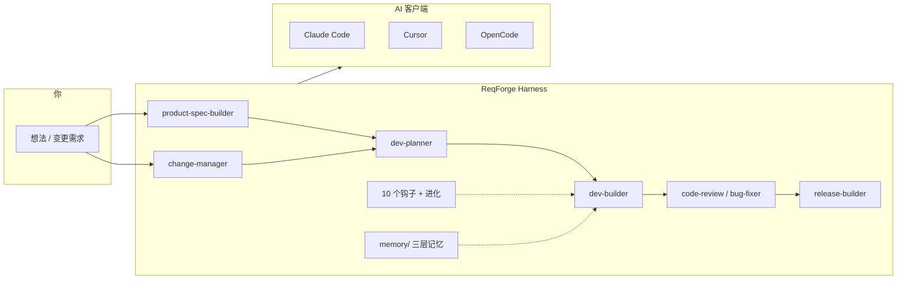

# ReqForge

[](CHANGELOG.md) [](LICENSE) [](README.md) [](README.zh-CN.md)

**从需求到可交付产品** — 面向独立开发者、产品与创业团队的完整 AI 引导流程（需求 → 计划 → 开发 → 审查 → 发布）。

**开源 Agent Harness** — 适配 Claude Code、Cursor、OpenCode：用 Skill、钩子、记忆与进化约束模型，产出可验证、可回滚，而不只靠对话。

**一句话理解 Harness**：大模型像 CPU，Harness 像操作系统——负责编排、记忆、护栏和验收，让结果**能交付**，而不止于聊完。ReqForge 专注 **需求→可发布产品**（规格、代码、发布），不做「关窗后替你发周报」一类消费级生活自动化。[成熟度自检清单 →](core/docs/harness-maturity-checklist.md) · [七层对照 →](core/docs/agent-harness-seven-layer-map.md) · [Loadout 场景选型 →](core/docs/loadout-scenarios.md) · [平台合规 →](core/docs/platform-compliance.md)

> **和 [OpenSpec](https://github.com/Fission-AI/OpenSpec)？** 单次存量变更。[OpenSpec →](core/docs/openspec-comparison.md) · **和 [Superpowers](https://github.com/obra/superpowers)？** 工程纪律 vs 全流程。[Superpowers →](core/docs/superpowers-comparison.md) · **和 [Open Design](https://github.com/nexu-io/open-design)？** OD 出稿预览；ReqForge 需求→代码（已吸收发现问卷/反 slop）。[Open Design →](core/docs/open-design-comparison.md) · **和 [Context7](https://github.com/upstash/context7)？** 库文档注入；建议与 ReqForge **叠加**。[Context7 →](core/docs/context7-comparison.md) · **和 [RTK](https://github.com/rtk-ai/rtk)？** Shell 输出压缩；可选与 ReqForge **叠加**。[RTK →](core/docs/rtk-comparison.md) · **和 [nanochat](https://github.com/karpathy/nanochat)？** LLM 训练 Harness；Forge 借鉴黄金路径/快环纪律。[nanochat →](core/docs/nanochat-comparison.md) · **和 [autoresearch](https://github.com/karpathy/autoresearch)？** 约束编辑 + 固定预算 + 单指标；Forge 映射为 Spec/Plan 锁定 + Primary metric。[autoresearch →](core/docs/autoresearch-comparison.md) · **和 [llm-council](https://github.com/karpathy/llm-council)？** 多模型互评；Forge 用 role-based council（code-review + Spec Step 7）。[llm-council →](core/docs/llm-council-comparison.md) · **和 [jobs](https://github.com/karpathy/jobs)？** BLS 职业数据 + LLM rubric 批量打分（非任务队列）；Forge 映射 risk_rank + PROJECT-HEALTH。[jobs →](core/docs/jobs-comparison.md) · **和 [LLM Wiki gist](https://gist.github.com/karpathy/442a6bf555914893e9891c11519de94f)？** raw/wiki/schema + ingest/query/lint；Forge 映射 memory/ + ADR 归档。[llm-wiki →](core/docs/llm-wiki-comparison.md) · **Skill 自进化论文？** [EmbodiSkill](https://arxiv.org/abs/2605.10332) / [SkillEvolver](https://arxiv.org/abs/2605.10500) 与 Forge 对照。[Skill 进化 →](core/docs/skill-evolution-comparison.md) · **和 [SkillOpt](https://microsoft.github.io/SkillOpt/)？** 有预算 Skill 编辑 + eval 验证门；Forge 不做库内 optimizer。[SkillOpt →](core/docs/skillopt-comparison.md) · **Harness 是镜子？** … [Harness 镜子 →](core/docs/tencent-harness-mirror-comparison.md) · **和 [Matt Pocock Skills](https://github.com/mattpocock/skills)？** 可拼装日常工程 vs 全流程；已吸收 Light Grill。[Matt Pocock →](core/docs/mattpocock-skills-comparison.md)

**使用框架无需 npm install** — 将适配目录复制到项目根目录，打开 AI 客户端即可。仅在本仓库贡献或运行 `scripts/` 时才需要 Node.js + pnpm。

### 架构一览



| 章节 | 说明 |
|------|------|
| [安装与使用](#安装与使用) | 克隆、复制适配层、钩子、首次运行 |
| [工作流程](#工作流程) | 需求 → 计划 → 开发 → 发布（存量项目用 `/change-manager`） |
| [需求深度](#需求深度pm-框架与思维链cot) | PM 框架 + CoT |
| [Agent 执行纪律](#agent-执行纪律8-条) | 先计划再动手、改前先读、最小改动、测过才算完成 |
| [框架开发与维护](#框架开发与维护) | 测试、同步、`pnpm forge-smoke`、依赖图（贡献者） |

---

## 近期更新

### v1.35.5 — 2026-05-30
- **提示词瘦身（P4）**：`bug-fixer`（~14k→~5k）、`code-review`（~11k→~4.5k）主 SKILL 索引化；四阶段调试/审查流程 → `references/`

### v1.35.4 — 2026-05-30
- **提示词瘦身（P3）**：`design-brief-builder`（~20k→~4k）、`release-builder`（~18k→~5k）主 SKILL 索引化；访谈/发布流程 → `references/workflow.md`

### v1.35.3 — 2026-05-30
- **提示词瘦身（P2）**：`product-spec-builder` 主 SKILL 索引化（~17k→~7k）；Quick 路径 → `references/workflow-quick-mode.md`（不加载完整 0-to-1 访谈链）

### v1.35.2 — 2026-05-30
- **提示词瘦身（P1）**：`dev-planner` 主 SKILL 索引化（~28k→~5k）；分析/流程迁至 `references/`；`CLAUDE.md` volatile 路由外置至 `forge-quickref` §项目状态路由
- **`lite` loadout**：8 Skill + 8 hook（含 change-manager，无 design/release/evolution）— `pnpm apply-loadout lite <client>`

### v1.35.1 — 2026-05-30
- **提示词瘦身（P0）**：`dev-builder` 主 SKILL 索引化（~36k→~7k 字符）；完整流程 → `references/workflow.md`；原则 → `references/first-principles.md`；跨 Skill 共享指针 → `core/skills/_shared/`；压缩 `forge-bootstrap`；`bug-fixer` / `code-review` 去重 Karpathy 段落
- **跨客户端接力**：`forge-quickref` / `AGENTS.md` 固定 handoff 必读清单（换 Claude Code / Cursor / OpenCode 时按文件接力，不靠口头复述）

### v1.35.0 — 2026-05-29
- **AGENTS.md 模板**：增强版，新增并行 worktree 工作流（分支命名约定、依赖共享、多 Agent 协调规则）。`pnpm forge-install` 写入项目根目录。（受 [FreeTodo](https://github.com/FreeU-group/FreeTodo) 启发）
- **结构化探索图（trace）**：`pnpm forge-trace` — 记录 Phase 决策、死胡同、证据绑定至 `.forge/trace/phase-<N>.json`。集成到 dev-builder Loading Phase 和 Phase 完成评估。`forge-verify` 新增 `trace-fresh` 检查。（受 [ARA 论文](https://arxiv.org/abs/2604.24658) 启发）
- **作用域过滤（巽）**：`pnpm forge-scope` — 声明 Phase 文件边界（modify/readonly/outOfScope），`forge-verify scope-check` 通过 `git diff` 强制执行。防止实施中越界改代码。
- **进化提案（兌）**：dev-builder Phase 完成时触发 evolution-engine 扫描；向用户呈现基于反馈模式的可操作提案（Y/N 选择）。主动闭合反馈→进化循环。（受 [八卦信息论 巽兌 protocol audit] 启发）
- **Skill 质量 judge**：`pnpm skill-eval judge <name>` — 独立 sub-agent 按 5 维 rubric（结构完整性/可执行具体性/失败模式编码/反例完备性/实测表现）评估 Skill 质量。结果记录至 `judge-history.json`。（受 [darwin-skill](https://github.com/alchaincyf/darwin-skill) 启发）
- **Skill 编写模式参考**：[`core/docs/skill-authoring-patterns.md`](core/docs/skill-authoring-patterns.md) — SKILL.md 作者实战参考：工作流设计、失败模式编码、反例黑名单、rubric 自查表。

### v1.34.0 — 2026-05-28
- **Matt Pocock Skills 对照**：[mattpocock-skills-comparison.md](core/docs/mattpocock-skills-comparison.md)；Light Grill、zoom-out、架构保健、GitHub issue 切片
- **Light Grill**：说「grill me / 烤问」→ 轻量对齐，不必先写完整 Spec

### v1.33.0 — 2026-05-28
- **腾讯 Harness 镜子对照**：[tencent-harness-mirror-comparison.md](core/docs/tencent-harness-mirror-comparison.md) — 显形、三块石碑、不可能三角 ↔ Forge
- **`.forge/project-taste.md`**：团队口味/偏好（软 S3）；`forge-install` 写入；与硬红线 `security-guidance.md` 分层
- **判断力光谱 S1–S5**：`product-spec-builder`、`code-review`、`dev-builder` Loading Phase

### v1.32.0 — 2026-05-28
- **SkillOpt 对照**：[skillopt-comparison.md](core/docs/skillopt-comparison.md) — 有预算编辑、rejected-edits、train/held-out
- **skill-eval**：`rejected-edits.json` 模板；evolution 单条提案 ≤3 条结构化编辑

### v1.31.0 — 2026-05-28
- **用户自定义 Skill 评估器**：`pnpm skill-eval init <name>` + `pnpm skill-eval <name>`；`.forge/skills/<name>/eval/`（触发用例 + 输出断言）；详见 [skill-eval.md](core/docs/skill-eval.md)
- **skill-builder**：交付 Skill 时附带 eval 包；**forge-install** 写入 `.forge/skills/_template/eval/`

### v1.30.0 — 2026-05-28
- **发布 preflight 门禁**：`pnpm preflight` — 发布/部署前机器检查（git 干净、版本号、产物隐私扫描）；可配置 `.forge/preflight.json`（含公众号草稿示例 `preflight-wechat.example.json`）。
- **release-builder**：新增 Step 3b Preflight Gate — `exit 1` 则禁止发布；详见 [external-publish-preflight.md](core/docs/external-publish-preflight.md)。
- **forge-install**：自动写入 `.forge/preflight.json`（若不存在）。

### v1.29.0 — 2026-05-28
- **`.forge/security-guidance.md`**：`forge-install` 写入团队安全规则；审查/发布/敏感 Task 须对照。
- **forge-verify** 新增 `security-patterns` 轻量扫描 — [对照文档](core/docs/security-guidance-comparison.md)。

### v1.28.0 — 2026-05-27
- **dev-map（开发导航地图）**：项目级语义索引 `.forge/dev-map.md`——AI 编码前先了解模块结构和已有模式。由 dev-builder 维护（谁动代码谁改地图）。`pnpm forge-install` 自动写入模板。
- **forge-verify（事后验证）**：统一验证入口 `pnpm forge-verify`，5 项检查 + 基线对比（`--baseline save|compare|check`）。把"我觉得做完了"变成"系统确认做完了"。
- **dev-builder 集成**：Loading Phase 自动保存基线；Phase 完成后自动运行 forge-verify 并对比基线、更新 dev-map。新增 Post-Verification Gate 原则。

### v1.27.0 — 2026-05-27
- **CLAUDE.md 分区**：[Immutable/Stable/Volatile](CLAUDE.md#L1) 三个区段——每次会话变化的内容放末尾，保持前缀稳定以利 prompt caching。
- **Hook 修复**：PreToolUse/PostToolUse 改为数组（原为对象）；移除无效事件（PreCommit、BeforeCommand、AfterCommand、PostCommit、OnInit）；BeforeCommand/AfterCommand 合并进 PreToolUse/PostToolUse。
- **Skill 质量**：13/13 PASS，0 FAIL；4 个 Skill 满分 33/33（dev-planner、release-builder、request-dispatcher、skill-builder）。修复了 Gotchas 计数污染、step 统计范围问题、Analysis Strategies 复数不匹配 regex。
- **反馈清理**：JSON 反馈文件转为标准 .md frontmatter 格式，FEEDBACK-INDEX.md 补全缺失条目。

### v1.26.0 — 2026-05-27
- **验证循环**：执行纪律第 8 条 = 失败重跑直至通过；反模式见 [session-execution-discipline.md](core/docs/session-execution-discipline.md)。
- **`.forge/quickref.md`**：一页速查（机器门、四原则、Skill 命令）；`pnpm forge-install` 写入。
- **构思验证门 + MVP Scope**：Founder's Playbook — Spec § Idea Stage；DEV-PLAN 范围块；PreToolUse 六段链。
- **OpenSpec + Superpowers 衔接**：[shuge-openspec-superpowers-comparison.md](core/docs/shuge-openspec-superpowers-comparison.md)；change-manager Change-Scoped → dev-builder；Delta Spec + G/W/T 模板。
- **`request-dispatcher`**：模糊请求路由元 Skill；12 个 Skill 增加 HTML 知识边界标记。

### v1.25.0 — 2026-05-25
- **Harness 硬化**：`forge-bootstrap` 会话铁律；PreToolUse 五段链；**HARD-GATE**；implementer + worktree；forge-smoke **12** 项。
- **PM 框架（product-spec）**：可选 [pm-skills](https://github.com/phuryn/pm-skills)（MIT 摘编）— OST、JTBD、假设、竞品；见 [需求深度](#需求深度pm-框架与思维链cot)。
- **思维链（CoT）**：需求访谈、implementer、bug-fixer、bootstrap 第 9 条；无需用户手写「先想想看」。
- **进化**：`failure_class`；进化提案 RED / GREEN / Verify-by。
- **Agent 执行纪律（8 条）**：先列计划并批准、改前先读、最小改动、提交前 diff 确认、**验证循环**（失败重跑直至通过）— [全文](core/docs/session-execution-discipline.md)，会话摘要见 `forge-bootstrap`，用户项目见 [agents-template.md](core/templates/agents-template.md)；人类速查 `.forge/quickref.md`（安装时生成）。

### v1.24.0 — 2026-05-24
- **Karpathy 对照文档**：[autoresearch](core/docs/autoresearch-comparison.md)、[llm-council](core/docs/llm-council-comparison.md)、[jobs](core/docs/jobs-comparison.md)、[llm-wiki gist](core/docs/llm-wiki-comparison.md) — 方法论映射到 Forge Skill，非照搬代码。
- **Harness 纪律**：DEV-PLAN 每 Phase **Primary metric**；dev-builder Spec/Plan 只读 + Task 微循环；code-review **risk_rank**（S×I×C）；**PROJECT-HEALTH-template.md**；product-spec **LLM-as-Judge** + Spec Step 7 质量 council。
- **OpenCode 修复**：`pnpm sync` 将根目录 `CLAUDE.md` 同步到 `.opencode/AGENTS.md`（此前为空模板，Skill 调度失效）；`forge-smoke` `machine-gates-doc` 守门 OpenCode 与 Claude 一致。
- **记忆体系**：`memory-system.md` 增加 LLM Wiki 对照；dev-builder **Query filing** — 重要结论写入 ADR / project-memory，不单留对话。

### v1.23.0 — 2026-05-24
- **forge-smoke**：`pnpm forge-smoke` — 10 项静态发版守门（含 test-demo 黄金路径）；GitHub Actions 仅 push/PR，无 cron。
- **loadout-scenarios.md**：场景 → loadout → 先调哪个 Skill；内置 loadout 增加 `scenarios[]`；README Step 3b 速查表。
- **platform-compliance.md**：GitHub/OSS 合规（不存用户密钥、fork 用途、禁止 cron CI）；由 forge-smoke 的 workflow 检查强制执行。

### v1.22.2 — 2026-05-23
- **补齐**：Windows 配置与 Unix 一致；`retry-gate` 写入 loadout/文档；钩子计为 10 个；Skill 内文档链到 GitHub。

### v1.22.1 — 2026-05-23
- **Harness 七层对照** + **phase-exit-guard**（Phase 未完成阻止退出）；进化提案需写预期效果与验证方式。

### v1.22.0 — 2026-05-23
- **Context7**：对照文档、dev-builder 库文档策略、Spec/Plan 的 Context7 ID 列、`web-app` 可选 MCP。

### v1.21.0 — 2026-05-23
- **Harness 成熟度清单**：P0/P1/P2 自检 + README 定位（OS 比喻、可发布产品边界）。
- **Product-Spec**：集成/运维/定时表；Quick Mode 推断 + SKILL 0-to-1 引用修复。

### v1.20.9 — 2026-05-23
- **Open Design**：对照文档 + 设计发现问卷、五预设、反 slop 与五维自检。

### v1.20.8 — 2026-05-23
- **superpowers-comparison.md**：与 obra/superpowers 对照（TDD、子 Agent、选型）。

### v1.20.7 — 2026-05-23
- **定位**：首屏主句「需求→产品」，副句 Agent Harness；标题统一 **ReqForge**。

### v1.20.6 — 2026-05-23
- **可发现性**：README 顶部 OpenSpec 对照 + 架构图；可用脚本把 About/Topics 同步到 GitHub。

### v1.20.5 — 2026-05-23
- **memory-guard**：PostToolUse 合并归档与交接提示（默认 10 个钩子）。

### v1.20.4 — 2026-05-23
- **SKILL 瘦身**：`dev-builder`、`product-spec-builder` 细则迁入 `references/`，主 SKILL 控制在 500 行以内。

### v1.20.3 — 2026-05-23
- **全部 Commands 瘦身**：12 个 Skill 的 `commands/*.md` 仅作索引，详情在 `SKILL.md`。
- **auto-push 默认关闭**：已从适配器 `settings.json` 与 loadout 移除；需要时可按 README 手动启用。

### v1.20.2 — 2026-05-23
- **Spec 与 change-manager 分工**：迭代模式不再创建 `changes/`，单次功能走 `/change-manager`；大改仍直接改 Product-Spec.md。
- **审查默认轻量**：默认 `change_complexity=simple`，仅复杂变更才并行 4 Agent。
- **Commands 瘦身**：主要 slash 命令改为索引，详情在 SKILL.md。

### v1.20.1 — 2026-05-23
- **审计修复**：`CLAUDE.md` 对进行中 `changes/` 路由到 `/change-manager`；Mission 增加存量变更步骤；新增 `change-verify-template.md`。
- **CHANGELOG**：补记 `openhuman-comparison.md`。
- **Loadout**：`cli-tool` / `minimal` 刻意不含 change-manager；存量变更请用 `full` 或 `web-app`。

### v1.20.0 — 2026-05-23
- **change-manager Skill**：已有 `Product-Spec.md` 的存量项目，每个功能一个 `changes/<name>/` 目录，走 **提议 → 实现 → 验收 → 归档**（对齐 OpenSpec 思路）。含模板与 `/change-manager` 命令；编码仍由 `/dev-planner`、`/dev-builder` 执行。
- **openspec-comparison.md**：Forge 与 OpenSpec CLI 的定位对照、工件映射与选型说明 — [core/docs/openspec-comparison.md](core/docs/openspec-comparison.md)。
- **openhuman-comparison.md**：Forge 与 OpenHuman 对照（记忆、上下文压缩、不宜照搬项）— [core/docs/openhuman-comparison.md](core/docs/openhuman-comparison.md)。
- **12 个 Skill**：`change-manager` 已加入 `full` / `web-app` loadout，经 `pnpm sync` 同步到三端适配器。

### v1.19.1 — 2026-05-23
- **幻觉门已接入**：全部适配器 `settings.json` 注册 `PreToolUse` → `hallucination-gate`；钩子脚本修正为读取 `tool_name`；Windows 版改用 Node 解析 JSON。
- **并行审查文档对齐**：`code-review`、`dev-builder`、`bug-fixer` SKILL 及 README 工作流图统一为并行 4 Agent + 聚合，移除过时的 Stage 1/2 描述；置信度阈值统一为 ≥0.6 / 0.3。
- **Commands 层补全**：为 `design-brief-builder`、`design-maker`、`evolution-engine`、`feedback-writer` 新增 `commands/*.md`（11 个 Skill 凡有 slash 命令均有命令层）。
- **Loadout 清理**：用户 loadout 移除仅 ReqForge 自研可用的 `check-sync` 钩子。
- **跨平台工具**：`pnpm validate-skill` 默认使用 `scripts/validate-skill.mjs`（Windows 无需 bash）；新增 `pnpm apply-loadout <名称> <客户端>` 合并 loadout 钩子到 settings。
- **文档与版本**：`package.json`、DEV-PLAN、Product-Spec、`core/docs/` 同步至 v1.19.1；Sub-Agent 数量更正为 10。

### v1.19 — 2026-05-23
- **Loadout 机制**：可复用的技能/Agent/钩子/MCP 服务器捆绑包，适配不同项目类型。内置 4 个 loadout：`full`、`web-app`、`cli-tool`、`minimal`。`loadout.schema.json` 做校验，`pnpm sync` 同步到所有适配器。
- **loadout.schema.json**：JSON Schema v7 校验，定义必需字段（name、version、description、skills、agents、hooks）。

### v1.18 — 2026-05-23
- **skill.json 元数据**：全部 11 个 Skill 新增机器可读的 `skill.json`（名称、版本、触发条件、前置依赖、关联 Agent、钩子）。`validate-skill.sh` 通过 Node/Python 自动校验。JSON Schema 在 `core/skills/skill.schema.json`。
- **Commands 命令层**：全部 11 个 Skill 凡暴露 slash 命令均有 `commands/<name>.md`（v1.19.1 补全 design-brief-builder 等 4 个）；含 YAML 前导元数据 + 分阶段工作流。`pnpm validate-skill` 默认使用跨平台 `validate-skill.mjs`。
- **并行 Agent 代码审查**：4 个专业审查 Agent（design、bug、security、types）并发执行，每个返回结构化发现与置信度评分（0.0-1.0）。聚合器按阈值过滤（≥0.6 确认为问题，0.3-0.6 降级为疑似，<0.3 抑制），跨 Agent 协同时加分。替代旧的串行两阶段审查。
- **幻觉门（Hallucination Gate）**：PreToolUse 钩子在 Write/Edit 前验证目标目录是否存在（v1.19.1 已写入全部适配器 settings）。
- **项目状态注入**：`check-evolution.sh` 在会话启动时检测 Product-Spec/DEV-PLAN/Code 存在情况，以 `additionalContext` 注入路由引导。
- **validate-skill.sh — skill.json 校验**：新增存在性检查 + 必需字段验证（name、version、description、triggers.auto/manual/command）。
- **sub-agent-orchestration.md**：文档化并行审查模式，含全部 4 个专业 Agent 与聚合规则。
- 通过 `pnpm sync` 同步到全部 3 个适配器（claude-code、cursor、opencode）。

### v1.17 — 2026-05-22
- **Decidable Activation 可判定激活 — [Not For] 章节**：全部 11 个 Skill 新增 `[Not For]` 章节，明确什么时候不该使用该 Skill 及应改用什么。validate-skill.sh 将其列为必需章节。skill-template.md 同步更新。
- **三层诊断模型**：bug-fixer 不止定位根因——追问 现象层 → 设计缺陷层 → 原则违反层。每个修复报告包含三层诊断，从源头防止复发，而非仅修补症状。
- **数值化质量评分表**：skill-builder 新增 16 项 32 分制评分表，交付阈值 ≥ 24 分且无关键项为 0。运行 `pnpm validate-skill:bash --score` 计算评分（仅 bash 脚本支持）。
- **create-skill.sh 脚手架**：CLI 工具，从名称自动生成完整 Skill 目录。支持 `--minimal`（仅必需章节）和 `--full`（含推荐章节）。运行 `pnpm create-skill <名称>`。

### v1.16 — 2026-05-21
- **Harness Engineering 工程化原则**：dev-builder 新增 Tool AI-fication 优先级（CLI > MCP > Skill > GUI）、Substitute Don't Mock（真实替身替代 Mock）、Environment-First（项目先跑起来再写功能）、Minimum Runnable Subset（每个 Phase 交付端到端核心路径）、Scripted Verification（复杂 Phase 自动生成 `verify-phase-N.sh`）。
- **Machine Gates 机器门**：CLAUDE.md 新增三级可执行门禁——Hallucination Gate（路径/依赖不存在则失败）、Sloppiness Gate（无验证证据则阻止完成）、Overstepping Gate（范围蔓延则拒绝）。可编码的门禁必须用 lint/test/hook 实现。
- **Iron Rules 入门铁律**：提炼 8 条 Forge 基线规则（知识卸载、无 prompt 魔法、真实文件、护栏等），写入 Product-Spec.md 与 README。
- **llms.txt**：AI 可搜索的项目摘要，放置于仓库根目录。
- **目录级 AGENTS.md**：为 `core/skills/`、`core/agents/`、`core/hooks/`、`core/templates/`、`core/feedback/` 添加 MUST/MUST NOT/SHOULD 规则。
- **validate-skill.sh**：正式 SKILL.md 规范校验器——检查 frontmatter、必需章节、kebab-case 命名、Gotchas 条目数、文件大小、TODO 标记。通过 `pnpm validate-skill` 运行。
- **Claude Code 适配器规则迁移**：目录级规则从 AGENTS.md（Claude Code 不读取）迁移到 `.claude/rules/*.md`，使用路径作用域 `globs` 前导元数据。AGENTS.md 保留给 OpenCode 适配器。
- **SKILL.md 结构性审计**：校验全部 11 个 Skill——修复 11 个缺失必需章节的错误和 19 个警告（为 design-maker、evolution-engine、feedback-writer、bug-fixer、code-review、dev-builder、dev-planner 添加 [Dependency Check]、[File Structure]、[Initialization]、[Output Style]、[Gotchas] 章节）。
- **全 Skill 新增 Gotchas 章节**：11 个 Skill 全部增加 `[Gotchas]` 章节，记录领域特定失败模式（模糊需求、隐私泄漏、过早演化、重复反馈等）。每个 Skill 随时间积累实战教训。
- **Skill 模板更新**：新 Skill 自动包含 `[Gotchas]` 推荐章节。
- **CLAUDE.md 增加 CLI 最佳实践**：`/model`、`/compact`、`/context`、`/sandbox` 用法写入 General Rules。关键规则包裹 `<important if="">` 标签提升遵守率。
- **命名统一**：dev-builder、code-review、bug-fixer 的 `[Anti-Rationalization Checklist]` 统一为 `[Gotchas: Anti-Rationalization]`。
- **Glue Code First 胶水代码优先**：dev-builder 的 "SDK-First" 升级为 "Glue Code First"——优先级链：框架内置 → 开源库 → AI 提示词 → 仅业务逻辑自研。
- **Generator/Optimizer 递归原则**：evolution-engine 新增 First Principles，进化引擎自身也应是可被进化的对象。
- **跨会话审计**：code-review 新增原则——复杂审查必须在独立子会话中执行，防止自我确认偏差。
- **Prompt Remediation 补救提示词**：feedback 模板新增 `prompt_remediation` 字段，每次失败可附带可复用的 prompt 片段防止再犯。

### v1.14.2 — 2026-05-20
- **forge-install**：`pnpm forge-install <client> --target <目录>` 一键复制适配层，并写入 `.forge/quickref.md` 速查；提供 `install.sh` / `install.ps1` 封装
- **安全升级**：`--force` 合并安装，不覆盖已有 `feedback/` 与 `settings.local.json`

### v1.14.1 — 2026-05-20
- **脚本单元测试**：`scripts/__tests__/` 覆盖 `sync.ts` 与 `dependency-graph.ts`（Vitest 4.1.6），`pnpm test` 一键验证
- **依赖图修复**：正确解析 `import { x } from "./y"` 等命名导入，blast-radius 更准确
- **工程对齐**：`package.json` 版本 `1.14.1`，开发依赖精确锁定 patch 版本；`DEV-PLAN.md` 增加 Phase 进度表

### v1.14 — 2026-05-19
- **精确版本锁定**：每个依赖锁定到 `major.minor.patch`——无范围、无 `latest`
- **专属 AGENTS.md 模板**：OpenCode 用户项目约束见 `templates/agents-template.md`（v1.24.0：适配层主控 `.opencode/AGENTS.md` 经 `pnpm sync` 与根目录 `CLAUDE.md` 一致）
- **依赖图分析**：`scripts/dependency-graph.ts` — 文件级导入图，支持 blast-radius 影响范围分析。`pnpm dep-graph build | affected | risk | stats`。已集成到 dev-builder 审查循环，code-reviewer 接收 `affected_files` 精准定位审查范围

### v1.13 — 2026-05-19
- **Planner Sub-Agent**：专用于架构设计和 Phase 拆分的独立 Agent，与 implementer 上下文解耦
- **Session Handoff 会话交接**：`handoff-template.md` + `check-handoff` 钩子，在上下文重置前生成会话摘要，防止进度丢失
- **Complexity Gate 复杂度门**：`code-reviewer` 对 `change_complexity="simple"` 跳过并行 Agent，仅做快速质量检查
- **模型版本追踪**：`feedback-observer` 记录每次反馈的模型版本，使进化引擎能检测过时规则

### v1.10–1.12 — 2026-05-19
- **test-writer Sub-Agent**：为工具脚本生成 Vitest 测试（v1.14.1 已落地 `sync` / `dependency-graph` 测试套件）
- **check-sync 钩子**：编辑后检测 `core/` 与 `adapters/` 不同步
- **自身钩子配置**：ReqForge 自身的 `.claude/settings.json` 已接入钩子事件，`settings.local.json` 从 65 行精简至 32 行

### v1.9 — 2026-05-19
- **AI Only for Judgment Tasks**：确定性逻辑用代码而非 AI 推理
- **Fail Loudly**：不确定时明确说"不知道"
- **Token Budget Awareness**：每个 Task 后评估上下文使用量

完整版本历史见 [CHANGELOG.md](./CHANGELOG.md)。

---

## 概述

如果你体验过 Vibe Coding，就会知道难点不在于让 AI 写代码，而在于管理整个产品开发流程。你跟 AI 说"帮我做个写作工具"，它直接就开始写了。做到一半发现方向不对，推翻重来。功能终于能用了，UI 却一塌糊涂——没有设计规范，AI 只能从训练数据里拼凑默认样式。修 UI 引入 bug，修 bug 引入更多 bug。上下文越来越长，AI 忘了之前的需求，代码开始失控。

根本原因不是模型不够聪明，而是模型周围缺少一套**系统**。

Forge 是一个 **Agent Harness（智能体框架）**——不是优化你与 AI 对话的方式，而是构建一整套约束、引导和反馈系统。AI 在行动前就知道该做什么，行动后自动验证结果，出错时自我修正，并且不会重复犯同样的错误。

**Harness = 引导（前馈）+ 传感器（反馈）+ 转向循环（进化）**

- **引导（Guides）** — 每个 Skill 定义了方法论、工作流和验收标准。Agent 行动前就知道"怎么做"和"怎样才算完成"。
- **传感器（Sensors）** — 钩子脚本 + Code Review 在关键节点检查执行结果，不依赖模型的自我意识。
- **转向循环（Steering Loop）** — 每次纠正都被记录下来，相同问题出现 3 次以上自动升级为 Skill 的正式规则。

---

## 安装与使用

Forge 采用**复制即用**：不向 npm 发布包，你的业务项目里也**不需要** `npm install` 安装 Forge。

### 前置条件

| 必需 | 说明 |
|------|------|
| **AI 客户端**（任选其一） | [Claude Code](https://docs.anthropic.com/en/docs/claude-code)、[Cursor](https://cursor.com)、[OpenCode](https://opencode.ai) |
| **Git** | 用于克隆本仓库；你自己的项目可选用 Git |
| **项目目录** | 空目录或已有代码均可；Forge 文件放在项目根目录 |

| 可选（仅贡献本仓库） | 说明 |
|----------------------|------|
| Node.js 22.x LTS + pnpm 10.x | 运行 `pnpm test`、`pnpm sync`、`pnpm dep-graph` — 见 [框架开发与维护](#框架开发与维护) |

### 步骤 1 — 克隆 Forge

```bash
git clone https://github.com/zxpmail/ReqForge.git
cd ReqForge
```

记住克隆路径，后续从 `ReqForge/adapters/...` **复制到** 你的应用项目。

### 步骤 2 — 安装到你的项目

**方式 A — 一键安装（推荐）**

在 Forge 克隆目录下执行（需 Node.js，用于 `ts-node`）：

```bash
# 安装到指定项目
pnpm forge-install claude-code --target /path/to/my-app

# 安装到当前目录
pnpm forge-install cursor .

# 升级合并（保留你的 feedback/ 与 settings.local.json）
pnpm forge-install claude-code --target ../my-app --force
```

```powershell
# Windows — 或在仓库根目录使用 PowerShell 封装
.\scripts\install.ps1 claude-code C:\path\to\my-app
```

```bash
# macOS / Linux 封装
./scripts/install.sh opencode /path/to/my-app
```

Windows 下会自动应用 `settings.windows.json` → `settings.json`；其他平台可加 `--windows`。

`forge-install` 还会在项目根目录写入（若不存在）：

| 文件 | 用途 |
|------|------|
| `.forge/quickref.md` | 一页速查（机器门、Skill 命令） |
| `.forge/dev-map.md` | 开发导航地图模板 |
| `.forge/security-guidance.md` | 团队安全规则模板（硬红线） |
| `.forge/project-taste.md` | 团队口味/偏好模板（软 S3 — 命名、结构倾向） |
| `.forge/preflight.json` | 发布前检查清单（可编辑） |
| `.forge/preflight-wechat.example.json` | 公众号草稿规则示例（可复制进 preflight.json） |
| `.forge/skills/_template/eval/` | 自定义 Skill 评估模板（`triggers.json` / `cases.json`） |

**方式 B — 手动复制**

进入你的应用目录，按所用客户端**只复制对应适配目录**：

| 客户端 | 从 Forge 克隆中复制 | 复制到项目 |
|--------|---------------------|------------|
| **Claude Code** | `adapters/claude-code/.claude/` | `<你的项目>/.claude/` |
| **Cursor** | `adapters/cursor/.cursor/` | `<你的项目>/.cursor/` |
| **OpenCode** | `adapters/opencode/.opencode/` | `<你的项目>/.opencode/` |

**命令示例**（请替换为实际路径）：

```bash
# macOS / Linux — Claude Code
cp -R /path/to/ReqForge/adapters/claude-code/.claude /path/to/my-app/.claude

# macOS / Linux — Cursor
cp -R /path/to/ReqForge/adapters/cursor/.cursor /path/to/my-app/.cursor

# macOS / Linux — OpenCode
cp -R /path/to/ReqForge/adapters/opencode/.opencode /path/to/my-app/.opencode
```

```powershell
# Windows — Claude Code（PowerShell）
Copy-Item -Recurse -Force C:\path\to\ReqForge\adapters\claude-code\.claude C:\path\to\my-app\.claude

# Windows — Cursor
Copy-Item -Recurse -Force C:\path\to\ReqForge\adapters\cursor\.cursor C:\path\to\my-app\.cursor
```

> **OpenCode** 主控文件为 `.opencode/AGENTS.md` — **与根目录 `CLAUDE.md` 相同的 Forge 调度内容**（仅文件名遵循 OpenCode 约定）。用户项目约束模板见 `templates/agents-template.md`。

### 步骤 3 — 启用钩子（Claude Code / Cursor）

钩子在工具调用前、提交、编辑、会话启动等时机自动运行。默认 `settings.json` 注册 **10 个钩子**（含 `hallucination-gate`、`phase-exit-guard`、`retry-gate`；`auto-push` 可选）。复制 `.claude/` 或 `.cursor/` 后：

| 平台 | 操作 |
|------|------|
| **Windows** | 在 `.claude/`（或 `.cursor/rules` 下相应目录）执行：`copy settings.windows.json settings.json` |
| **Linux / Mac** | 默认 `settings.json` 使用 `.sh` 脚本，无需改动 |
| **OpenCode** | 无 `settings.json`；各平台原生支持 `.sh` / `.bat` 钩子 |

### 步骤 3b — Loadout（可选）

适配层自带 **4 个 loadout 捆绑包**（`loadouts/` 目录）：`full`、`web-app`、`cli-tool`、`minimal`。每个 JSON 列出该场景推荐的 skills、agents、hooks。

**不确定用哪个？** 见 **[loadout-scenarios.md](core/docs/loadout-scenarios.md)**（英文）— 场景 → loadout → 先调哪个 Skill。

| 你想… | Loadout |
|--------|---------|
| 从零做 Web 应用（需求 → 设计 → 发布） | `web-app` |
| 在已有项目上做一个功能 | `full` 或 `web-app` + `/change-manager` |
| CLI / 库 / 后端工具 | `cli-tool` |
| 快速原型 / 小脚本 | `minimal` |

- **默认安装** ≈ `full` loadout（`settings.json` 含全部钩子）。
- **精简钩子**（贡献者，在 Forge 克隆目录）：`pnpm apply-loadout minimal claude-code` 将更轻的钩子集写入 adapter 的 `settings.json`；加 `--dry-run` 可预览。
- Loadout 是**参考清单**——skills/agents 已随适配层复制，loadout 用于了解各场景包含什么。
- **存量变更**（`/change-manager`）：仅 `full`、`web-app` 包含；`cli-tool`、`minimal` 不含——CLI 项目需改用 loadout 或手动复制 `change-manager` Skill。

### 步骤 4 — 在 AI 客户端中首次使用

1. 用 AI 客户端打开**你的项目目录**（已包含 `.claude/`、`.cursor/` 或 `.opencode/`）。
2. 新建对话。Forge 会根据现有文件自动判断进度（`Product-Spec.md`、`DEV-PLAN.md`、代码、`memory/` 等）。
3. 用自然语言描述产品想法，或调用 Skill：

| 目标 | Skill 命令（Claude Code / OpenCode） | 产出 |
|------|--------------------------------------|------|
| 需求收集 | `/product-spec-builder` | `Product-Spec.md` |
| 设计规范（可选） | `/design-brief-builder` | `Design-Brief.md` |
| 开发计划 | `/dev-planner` | `DEV-PLAN.md` |
| 存量功能增量（已有 Spec） | `/change-manager propose <名称>` → apply → verify → archive | `changes/<名称>/` → `changes/archive/` |
| 编码实现 | `/dev-builder` | 代码 + 自动创建 `memory/` |
| Bug 修复 | 描述问题（可自动触发 `/bug-fixer`） | 修复 + 审查闭环 |
| 构建发布 | `/release-builder` | 打包 / 部署检查清单 |

**Cursor**：`.cursor/rules/` 规则会自动加载；在对话中说明要执行的 Skill（如「执行 product-spec-builder」），或使用客户端自带的 Skill 入口。

**快速 Spec**：一句话例如「带 AI 教练的习惯追踪 App」，可生成带 `[待确认]` 标记的最小 `Product-Spec.md`，再逐步完善。

**对照示范**：仓库内 [test-demo/](../test-demo/) 展示 Spec + Plan 经 Forge 后的 **示范代码**（`todo-cli/`）；**不是**框架 CLI，无需安装使用。维护者用 `pnpm test-demo-golden-path` 验证流程可交付 —— 见 [test-demo/README.md](../test-demo/README.md)。

### 安装后 — 项目中会出现的文件

```
my-app/
├── .claude/                    # 或 .cursor/ 或 .opencode/  ← 适配层
│   ├── CLAUDE.md               # 控制文件（OpenCode 为 AGENTS.md）
│   ├── settings.json           # 10 个钩子（Unix 用 .sh）；Windows 请复制 settings.windows.json
│   ├── skills/                 # 12 个 Skill + commands/
│   ├── agents/                 # 10 个 Sub-Agent
│   ├── hooks/                  # .sh + .bat 钩子脚本
│   ├── loadouts/               # full | web-app | cli-tool | minimal
│   ├── feedback/               # 进化燃料（经验教训）
│   ├── EVOLUTION.md            # 进化引擎层级说明
│   └── rules/                  # Claude Code: .claude/rules/*.md；Cursor: .cursor/rules/*.mdc
├── Product-Spec.md             # /product-spec-builder 之后
├── DEV-PLAN.md                 # /dev-planner 之后
├── Design-Brief.md             # 可选
├── changes/                    # 可选 — 存量迭代（/change-manager）
│   └── archive/
├── memory/                     # 首次 /dev-builder 时自动创建
│   ├── project-memory.md
│   ├── decisions-log.md
│   └── task-history.md
├── .forge/                     # forge-install 写入（可版本管理）
│   ├── quickref.md             # 速查
│   ├── preflight.json          # 发布门禁配置 → pnpm preflight
│   ├── preflight-wechat.example.json  # 公众号示例（可选参考）
│   ├── dev-map.md              # 模块导航（dev-builder 维护）
│   ├── security-guidance.md    # 安全规则（审查/发布对照）
│   ├── project-taste.md        # 团队口味/偏好（forge-install）
│   ├── skills/_template/eval/  # 自定义 Skill 评估模板（forge-install）
│   ├── skills/<name>/eval/     # 某 Skill 的评估包（pnpm skill-eval init <name>）
│   └── config                  # 可选 — 从 config.example 复制
├── eval-output/                # 可选 — skill-eval 产物断言目录（cases.json 引用）
└── <project-name>/ ...         # 业务代码（勿平铺在根目录）
```

除非你明确要求，Forge **不会**擅自修改你项目里的 `package.json`。

### 自定义 Skill 评估（skill-eval）

用 `/skill-builder` 或手写 **项目内自定义 Skill** 时，建议配套评估包（触发用例 + 输出断言）：

```bash
pnpm skill-eval init my-skill       # → .forge/skills/my-skill/eval/
pnpm skill-eval my-skill            # 静态检查 + 对 eval-output/ 跑断言
```

- 模板：`.forge/skills/_template/eval/`（`forge-install` 写入）
- 触发准确率：在 AI 客户端对有/无 Skill 对照 `triggers.json` 中的 prompt
- 详解：[skill-eval.md](core/docs/skill-eval.md)

### 项目口味 vs 安全规则

| 文件 | 角色 | 示例 |
|------|------|------|
| `.forge/security-guidance.md` | **红线**（S1–S2） | 禁止 `eval`、密钥不入库 |
| `.forge/project-taste.md` | **团队指纹**（S3） | 偏好简单胜过聪明；继承不超过两层 |

由 `pnpm forge-install` 写入。详见 [tencent-harness-mirror-comparison.md](core/docs/tencent-harness-mirror-comparison.md)。

### 发布前门禁（Preflight）

在 `/release-builder` 或手动发布前，在项目根目录运行（需 Node.js，仅执行检查时临时需要）：

```bash
pnpm preflight                      # 内置：git、package.json version
pnpm preflight --build-dir dist     # 额外扫描构建产物（密钥、.env、开发者路径）
pnpm preflight --strict             # 警告也视为失败
```

- 编辑 `.forge/preflight.json` 增加自定义规则（环境变量、文件存在、字节上限、正则）。
- 公众号等外部 API：参考 `.forge/preflight-wechat.example.json`，见 [external-publish-preflight.md](core/docs/external-publish-preflight.md)。
- **`exit 1` = 禁止发布**；由 `release-builder` Step 3b 强制执行。

### 在已有项目中升级 Forge

1. 拉取最新 `ReqForge` 克隆（或下载新版本）。
2. 用新适配目录覆盖项目中的 `.claude/` / `.cursor/` / `.opencode/`（若自定义过 `feedback/`，请先备份）。
3. Windows 下重新执行 `settings.windows.json` → `settings.json`（如适用）。

### YOLO 模式（不建议）

> Forge 的价值在于**关卡**：阶段、审查、进化提案需你确认。YOLO 会全自动放行，削弱框架约束。
>
> 若仍启用，关卡改为**异步写入**（产物在 `changes/`、`.claude/.yolo-pending/`）。🔴 红色边界操作仍须明确批准。
>
> 启用方式（优先级：项目 > 全局 > 环境变量）：
> 1. 复制 `.forge/config.example` → `.forge/config`，设置 `FORGE_MODE=yolo`
> 2. 或 `~/.forge/config` / `%USERPROFILE%\.forge\config`
> 3. 或环境变量 `FORGE_MODE=yolo`

更多说明见 [core/docs/](core/docs/)（行为边界、记忆体系、Sub-Agent 编排）。对照文档：[OpenSpec](core/docs/openspec-comparison.md) · [Superpowers](core/docs/superpowers-comparison.md) · [Open Design](core/docs/open-design-comparison.md) · [OpenHuman](core/docs/openhuman-comparison.md) · [RTK](core/docs/rtk-comparison.md) · [nanochat](core/docs/nanochat-comparison.md) · [autoresearch](core/docs/autoresearch-comparison.md) · [llm-council](core/docs/llm-council-comparison.md) · [jobs](core/docs/jobs-comparison.md) · [llm-wiki](core/docs/llm-wiki-comparison.md)。

---

## 核心架构

```
┌─────────────────────────────────────────────────────────────┐
│  控制文件 (CLAUDE.md / .cursor/rules/reqforge.mdc)          │ ← 编排层
│  <60 行 — 仅调度映射，详情在 core/docs/                      │
│  项目状态检测，流程路由，Skill 调度                           │
├─────────────────────────────────────────────────────────────┤
│  三层记忆体系（上下文保持）                                   │ ← 记忆层
│  ├─ project-memory.md  长期：架构、约束                      │
│  ├─ decisions-log.md   中期：ADR 技术决策                    │
│  └─ task-history.md    短期：近期任务摘要                     │
├─────────────────────────────────────────────────────────────┤
│  Sub-Agent × 10（上下文隔离防火墙）                          │ ← 执行层
│  ├─ implementer        编码 + 编译验证 + 自我检查            │
│  ├─ code-reviewer      并行调度 + 置信度聚合                 │
│  ├─ code-reviewer-*  4 个专业 Agent（design、bug、security、types）│
│  ├─ feedback-observer  捕获失败 + 用户纠正                   │
│  ├─ evolution-runner   扫描反馈积累                          │
│  ├─ test-writer        为工具/脚本生成测试                   │
│  └─ planner            分析 Spec，拆分 Phase，制定计划        │
├─────────────────────────────────────────────────────────────┤
│  Skills × 12 + Loadouts × 4（引导/前馈控制）                 │ ← 引导层
│  在 Agent 行动前注入方法论和标准                              │
├─────────────────────────────────────────────────────────────┤
│  钩子 + 审查循环（传感器/反馈控制）                          │ ← 检查层
│  在 Agent 行动后检查结果，确定性执行                          │
├─────────────────────────────────────────────────────────────┤
│  feedback/ + EVOLUTION.md（转向循环）                       │ ← 进化层
│  每次纠正都在改进框架，永不重复错误                          │
└─────────────────────────────────────────────────────────────┘
```

### 记忆层 — 三层项目记忆

AI 失忆是真实存在的问题。每次新会话，AI 都会忘记项目结构、决策历史和上周的进展。Forge 通过三层版本控制的记忆体系解决这个问题：

| 层级 | 文件 | 保留期 | 内容 |
|------|------|-----------|---------|
| 长期 | `memory/project-memory.md` | 永久 | 架构、技术栈、约束、已知陷阱、开发环境 |
| 中期 | `memory/decisions-log.md` | 永久 | ADR 格式决策记录（背景 → 方案 → 决策 → 影响） |
| 短期 | `memory/task-history.md` | 最近 30 条 | 任务摘要（日期、阶段、类型、变更文件、备注） |

**工作方式**：
- **会话启动**：AI 在执行任何任务前读取全部三个记忆文件 — 强制性上下文加载
- **任务完成**：AI 追加到 `task-history.md`（总是）、`decisions-log.md`（如有决策）、`project-memory.md`（如架构事实变更）
- **初始化**：首次调用 `/dev-builder` 时自动创建 `memory/` 目录

记忆文件是纯 Markdown，提交到项目仓库 — 跨会话、跨成员、跨 AI 工具共享。

### 行为边界 — 红绿灯系统

并非所有 AI 行动都应该有相同的自主级别。Forge 将所有操作分为三个级别：

| 级别 | 规则 | 示例 |
|-------|------|---------|
| 🟢 绿色 | 无需确认直接执行 | 变量命名、代码风格、测试、明显 bug 修复、文档、开发依赖 |
| 🟡 黄色 | 执行前需确认 | 外部依赖、数据库 Schema、核心业务逻辑、项目配置、新路由 |
| 🔴 红色 | 始终需明确批准 | 删除数据、生产配置、force push、发布、认证变更 |

**YOLO 模式**：YOLO 模式下 🟢 和 🟡 操作自动执行。🔴 红色操作**始终**需要确认，即使在 YOLO 模式下也无法覆盖。

### 快速启动模式

不想经历完整的需求访谈？一句话描述你的项目：

```
你："一个带 AI 教练的习惯追踪应用"
Forge：⚡ 快速 Spec 已生成！标记为 [待确认] 的条目是我的最佳猜测。
```

AI 推断一切——产品类型、目标用户、核心功能、技术栈、布局。不确定项默认选择更简单的方案并标记为待确认。随时切换到深度模式：`/product-spec-builder`。

### 需求深度：PM 框架与思维链（CoT）

除访谈流程外，**product-spec-builder** 内置可选参考（无需再装 65 个 pm-skills）：

| 层次 | 内容 | 位置 |
|------|------|------|
| **PM 框架** | 机会方案树、JTBD 价值主张、假设表、竞品简报 — 摘编自 [pm-skills](https://github.com/phuryn/pm-skills)（MIT） | `core/skills/product-spec-builder/references/pm-frameworks-*.md` → `Product-Spec.md` 可选章节 |
| **思维链（CoT）** | 先分步推理再给结论（选型、边界、自质疑）；分析与实现分轮 | `conversation-strategy.md`；implementer 写代码前、bug-fixer 清单、forge-bootstrap 第 9 条 |

**不必**每条消息写「先想想看」— 由 Skill 与会话铁律自动约束。见 [近期更新 → v1.25.0](#v1250--2026-05-25)。

### Agent 执行纪律（8 条）

**任务级**规则（本次改动怎么动手），与产品级 Iron Laws、HARD-GATE **叠加**。每次会话 `forge-bootstrap` 注入摘要；**完整条文**写入用户项目 `AGENTS.md`（来自 [agents-template.md](core/templates/agents-template.md)）。

| 条 | 要点 |
|----|------|
| 1 | 非琐碎任务：先列步骤，用户批准后再改 |
| 2 | 编辑前必须先读目标文件 |
| 3 | 尽量缩小范围；复用已有抽象，禁止穿透重实现 |
| 4 | 无先例则询问，不自行发明需求 |
| 5 | 影响用户的转向先确认；范围变了重新定计划 |
| 6 | 计划外问题只报告，不顺手修 |
| 7 | 提交前展示 diff，获批准后再 commit |
| 8 | **验证循环**：跑 lint/类型/测试 → 失败则修 → **重跑** → 全过才算完成（须附最后一轮命令输出） |

分工（主 Session vs implementer）、反模式与测试分层：[session-execution-discipline.md](core/docs/session-execution-discipline.md)。人类一页速查：`.forge/quickref.md`（`pnpm forge-install` 写入）。自检清单：[harness-maturity-checklist.md](core/docs/harness-maturity-checklist.md)。

### 引导层 — 12 个 Skill

每个 Skill 是独立的方法论模块——可组合、可扩展、可插拔。每个 Skill 包含 `[Gotchas]` 章节记录常见陷阱与实战教训：

| Skill | 职责 |
| ------------------------ | -------------------------------------------------------------------------------------- |
| **product-spec-builder** | 需求收集。多轮访谈产出 Product-Spec.md；可选 PM 框架（OST、JTBD、假设、竞品）与 CoT 模板（选型/边界/自质疑）。支持迭代与 Quick Mode。 |
| **change-manager** | 存量项目增量变更。每个功能一个 `changes/<name>/` 目录：提议 → 实现 → 验收 → 归档（对齐 OpenSpec 思路，见 [openspec-comparison](core/docs/openspec-comparison.md)）。 |
| **design-brief-builder** | 设计语言。将模糊描述（"暗色主题，简约"）量化为具体方向：调色板、交互风格、信息密度。 |
| **design-maker** | 设计原型。通过 Pencil 或 Figma MCP 生成完整页面设计稿。 |
| **dev-planner** | 开发计划。分析依赖关系，拆分为多个阶段，输出分阶段开发计划。 |
| **dev-builder** | 编码实现。将工作拆分为 Task——每个 Task 走"编码 → 审查 → 修复 → 提交"闭环。 |
| **bug-fixer** | 四阶段系统调试。不要猜测，不要盲目尝试：收集证据 → 分析模式 → 提出假设 → 修复。 |
| **code-review** | 并行 Agent 审查——4 个专业 Agent（design、bug、security、types）并发执行，置信度聚合（≥0.6 确认，0.3-0.6 疑似）。 |
| **release-builder** | 构建与部署。内置隐私审计和冒烟测试。 |
| **feedback-writer** | 记录用户纠正和反馈为结构化文件。为进化引擎提供数据。 |
| **evolution-engine** | 扫描积累的反馈，识别模式（3 次以上出现），生成升级规则或优化技能的提案。 |
| **skill-builder** | 使用项目模板从头创建新的 Skill 定义。由进化提案或手动调用触发。 |

### 执行层 — Sub-Agent 隔离（上下文防火墙）

每个 Task 获得**全新的 Sub-Agent 实例**。不重用，不继承上下文。编排器提供完整的任务上下文（Spec 项、交付物、文件、项目结构），但不提供之前的任务历史。这防止错误假设在任务间级联传播。

| Sub-Agent | 对应 Skill | 职责 |
|-----------|------------|------|
| **planner** | dev-planner | 架构设计 + Phase 拆分 |
| **implementer** | dev-builder | 编码 + 编译验证 + 自检 |
| **code-reviewer** | code-review | 聚合并行审查结果 |
| **code-reviewer-design** | code-review | 规格符合度、UI 一致性、漂移 |
| **code-reviewer-bug** | code-review | Bug 模式、竞态、资源泄漏 |
| **code-reviewer-security** | code-review | OWASP Top 10、凭据泄漏、XSS |
| **code-reviewer-types** | code-review | 类型安全、空值、边界情况 |
| **feedback-observer** | feedback-writer | 记录失败与用户纠正 |
| **evolution-runner** | evolution-engine | 扫描反馈 → 进化提案 |
| **test-writer** | dev-builder | 为脚本/工具生成 Vitest 测试 |

### 检查层 — 钩子 + 审查循环

代码不算完成直到被审查：

```
功能完成 → code-reviewer 并行 Agent 审查
  ├─ change_complexity="simple" → 快速质量检查
  ├─ moderate/complex → 4 个专项 Agent 并行（design、bug、security、types）
  ├─ 确认规格缺失 → 补实现 → 重新审查
  └─ 确认质量问题 → bug-fixer 修复 → 重新审查
  └─ 通过 → 提交（按需推送）→ Task 完成
```

默认适配器内置 **10 个**钩子（ReqForge 仓库另有 `check-sync`，见下方说明）：

> **对照文档**（`core/docs/*-comparison.md`、七层对照）在 [ReqForge  GitHub 仓库](https://github.com/zxpmail/ReqForge/tree/main/core/docs)，不在适配器包里；Skill 内链接指向该地址。

| 钩子 | 触发时机 | 动作 |
| ---------------------- | ------------------ | --------------------------------------- |
| hallucination-gate | 工具调用前 | Write/Edit 目标目录不存在则阻止 |
| pre-commit-check | 提交前 | 编译失败则阻止提交 |
| phase-exit-guard | Agent 停止前 | 存在 `.forge/phase-exit-block` 时阻止停止（Phase 未验收） |
| stop-gate | Agent 停止前 | 代码未审查则阻止停止 |
| retry-gate | Agent 停止前 | `.forge/.retry-counter.json` 为 `escalated` 时阻止继续（重试耗尽） |
| detect-feedback-signal | 用户消息时 | 自动检测纠正信号 |
| mark-review-needed | 文件编辑后 | 标记需要审查的变更 |
| check-evolution | 会话启动时 | 检查反馈积累 |
| memory-check | 文件编辑后 | 如果代码变更则提醒更新记忆 |
| memory-guard | 工具调用后 | 归档超长 task-history + 提示生成交接文档 |

> **说明**：`check-sync`（检测 core/ 与 adapters/ 不同步）仅存在于 ReqForge 仓库的 `core/hooks/`，不会随适配器安装到用户项目。

> **可选 — auto-push**：默认未启用。若需每次提交后自动推送，在 `settings.json` 增加：`"PostCommit": { "run": "sh .claude/hooks/auto-push.sh" }`（Cursor/OpenCode 请改路径）。

### 进化层 — 转向循环

一个不会从使用中学习的框架是静态的。Forge 持续进化：

1. **Level 0: Harness 基础** — 上下文压缩、渐进式披露、工具调用卸载、失败自动评分——可靠进化的前提条件
2. **经验积累** — 失败和纠正自动记录，附带推断的 Skill 评分（Precision/Coverage/Efficiency/Satisfaction）。评分数据是 Level 2+ 的燃料
3. **规则毕业** — 相同反馈出现 3 次以上 → 提议升级为 Skill 或控制文件中的正式规则
4. **Skill 优化** — Skill 的反馈评分持续偏低 → 提议调整
5. **新 Skill 创建** — 重复操作模式且无 Skill 覆盖 → 提议新 Skill

所有进化提案都需要你明确确认，不会自动更改规则。

### 入门铁律 — 不可变通的底线

1. 先定义问题，再让 AI 写代码
2. 先让 AI 给计划，再让 AI 执行
3. 每一步都要能验证——"看起来对"不算完成
4. 频繁提交 Git——每个进展点都应是可回滚的检查点
5. 文档持续更新——上下文丢失是无声杀手
6. 只相信机器证据（可复现命令、测试输出、CI 状态）——不相信 AI 的口头保证
7. 重要规范必须代码化——能写成 lint/test/schema/hook/CI 的就必须代码化，自然语言不算执行
8. 不符合规范的产出必须失败，而不是靠人记住提醒 AI

---

## 控制文件理念

CLAUDE.md 控制在 60 行以内——是调度映射，不是操作手册。详细流程在各 Skill 的 SKILL.md 中（仅在该 Skill 激活时加载）。参考文档（行为边界、记忆系统、Sub-Agent 编排）在 `core/docs/` 中。

CLAUDE.md 中的每条规则必须可追溯到特定的失败或反馈。通用的最佳实践规则属于 SKILL.md，不应放在控制文件中。这保持了提示词的简洁，每条规则都靠实例说话。

## 设计优先级

```
设计工具稿（最高）→ Design-Brief.md → Product-Spec.md（功能逻辑）
```

当存在设计稿时，所有 UI 必须与设计一致。冲突以设计工具为准。

---

## 工作流程

1. **描述你的想法** — `/product-spec-builder` 多轮访谈（或快速模式一句话）。想法模糊时，可选 **PM 发现**（OST、假设）与 **CoT** 模板，先理清再写 Spec，不写业务代码。
2. **生成 Spec** — 输出 `Product-Spec.md`（可含 JTBD、指标、竞品、假设等可选章节）→ 用户确认 → `.forge/spec-confirmed.json`
3. **设计简报（可选）** — 调用 /design-brief-builder
4. **设计稿（可选）** — 调用 /design-maker
5. **开发计划** — 调用 /dev-planner，输出 DEV-PLAN.md
6. **构建** — 调用 /dev-builder，逐个完成每个 Phase 的 Task
7. **记忆自动更新** — 每个 Task 后自动更新项目记忆
8. **自动审查** — code-reviewer 并行 Agent 审查 + 置信度聚合
9. **自动修复** — 审查失败自动触发 bug-fixer
10. **提交和推送** — 审查通过后自动提交 + 推送
11. **阶段验证** — 跨 Task 集成检查 + 编译 + 功能测试
12. **迭代** — 在对话中请求变更；自动更新 Spec → Plan → 代码 → 审查
13. **存量功能**（可选，已有 Spec）— `/change-manager propose <名称>` → 填写 `changes/<名称>/` → apply（限定范围的 dev-planner/dev-builder）→ verify → archive
14. **发布** — 调用 `/release-builder`；构建产物后运行 `pnpm preflight --build-dir <产物目录>`，通过后再部署/打 tag

## 仓库结构

```
Forge/
├── core/                      # 核心共享内容
│   ├── skills/                # 12 个 Skill 定义，每个独立目录
│   ├── agents/                # 10 个 Sub-Agent 定义
│   ├── loadouts/              # 可复用的技能/Agent/钩子捆绑包
│   ├── templates/             # 文档模板
│   │   └── memory/            # 三层记忆 + 会话交接模板
│   ├── hooks/                 # 钩子脚本 (.sh/.bat/.ps1)
│   ├── docs/                  # 详细文档
│   └── feedback/              # 反馈模板
├── adapters/
│   ├── claude-code/           # Claude Code 适配（.claude/ + .claude/rules/）
│   ├── cursor/                # Cursor 适配
│   └── opencode/              # OpenCode 适配
├── .forge/                    # Forge 项目配置
├── .claude/                   # Forge 自身的控制文件
├── CLAUDE.md                  # 主控制文件
├── llms.txt                   # AI 可搜索的项目摘要
├── scripts/
│   ├── sync.ts                # core → adapter 同步脚本
│   ├── install.ts             # adapter → 用户项目安装
│   ├── install.sh / install.ps1 # 安装命令封装
│   ├── dependency-graph.ts    # 文件级依赖图与 blast-radius 分析
│   ├── validate-skill.mjs     # 跨平台 SKILL.md 校验（默认 pnpm validate-skill）
│   ├── validate-skill.sh      # 完整校验 + --score 评分（pnpm validate-skill:bash）
│   ├── create-skill.sh        # 脚手架新建 Skill（pnpm create-skill）
│   ├── apply-loadout.ts       # 将 loadout 钩子合并到 adapter settings
│   ├── preflight.ts           # 发布前门禁（pnpm preflight）
│   ├── skill-eval.ts          # 用户项目自定义 Skill 评估（pnpm skill-eval）
│   └── __tests__/             # Vitest 单元测试（含 preflight、skill-eval）
├── vitest.config.ts           # 测试配置
├── changes/                   # 变更产物
├── EVOLUTION.md               # 进化引擎定义
├── Product-Spec.md            # Forge 自身产品需求文档
├── Product-Spec-CHANGELOG.md  # Spec 变更日志
├── DEV-PLAN.md                # Forge 自身的开发计划
├── package.json               # Forge 开发依赖
├── tsconfig.json
├── LICENSE                    # MIT 许可证
└── README.md / README.zh-CN.md # 使用说明
```

---

## 框架开发与维护

修改 `core/` 后需同步到各适配器，提交前建议跑通测试与编译。

**环境要求**：Node.js 22.x LTS、pnpm 10.x

```bash
pnpm install          # 安装开发依赖（TypeScript、Vitest 等）
pnpm test             # 运行单元测试（40 项，含 preflight、skill-eval、project-taste 安装）
pnpm preflight        # 本地验证发布门禁（见上方「发布前门禁」）
pnpm build            # 编译 scripts/ 到 dist/
pnpm sync             # 将 core/ 同步到 adapters/
pnpm forge-smoke      # 发版守门：12 项 smoke（约 15–30 秒；含 skill-fixtures、skill-bypass、test-demo 黄金路径）
pnpm validate-skill   # 校验 core/skills/（跨平台 .mjs，可加 --strict）
pnpm apply-loadout full claude-code  # 将 loadout 钩子写入 adapter settings
pnpm dep-graph build  # 构建项目依赖图 → .forge/graph.json
pnpm dep-graph stats  # 查看图统计
```

| 命令 | 说明 |
|------|------|
| `pnpm forge-smoke` | 发版守门：12 项 smoke（#11 内含 validate-skill）；push/PR 到 `core/`、`adapters/`、`test-demo/` 时 CI 自动跑 |
| `pnpm test:watch` | 监听模式运行测试 |
| `pnpm validate-skill:bash` | bash 版 validate-skill.sh（需 WSL/Git Bash）；加 `--score` 为 32 分评分表 |
| `pnpm create-skill <名称>` | 从名称脚手架生成 Skill（`--minimal` 或 `--full`） |
| `pnpm apply-loadout <loadout> <client>` | 将 loadout（full/web-app/cli-tool/minimal）钩子合并到 settings；加 `--dry-run` 预览 |
| `pnpm set-github-metadata` | 把 `.github/repo-metadata.json` 同步到 GitHub About/Topics；令牌放 `.env.local` 的 `GITHUB_TOKEN=`（见 `.env.local.example`） |
| `pnpm dep-graph affected [files...]` | blast-radius：列出受变更影响的文件（无参数时用 git diff） |
| `pnpm dep-graph risk [files...]` | 变更风险评分 |
| `pnpm forge-install <client> --target <dir>` | 将适配层安装到用户项目；写入 `.forge/quickref.md`、`project-taste.md`、`preflight.json`、`skills/_template/eval/` 等 |
| `pnpm preflight [--build-dir dist]` | 发布前门禁（git/版本/产物隐私 + `.forge/preflight.json`） |
| `pnpm skill-eval init <name>` / `pnpm skill-eval <name>` | 用户项目自定义 Skill 评估包（触发用例 + 产物断言） |

修改 `core/skills`、`core/agents`、`core/hooks` 等后务必执行 `pnpm sync`，否则 `check-sync` 钩子会提示不同步。

**平台合规**（CI、fork、密钥）：[platform-compliance.md](core/docs/platform-compliance.md)。Workflow 仅允许 **push/PR** 触发，禁止 cron；由 `forge-smoke` 守门。

---

## 参考与对照

已调研的外部 Harness（非依赖）：

| 项目 | 侧重 | Forge 文档 |
|------|------|------------|
| [OpenSpec](https://github.com/Fission-AI/OpenSpec) | 规格驱动 `changes/` + CLI | [openspec-comparison.md](core/docs/openspec-comparison.md) — 已吸收为 `/change-manager` |
| [Superpowers](https://github.com/obra/superpowers) | Skill + TDD + 子 Agent 驱动开发 | [superpowers-comparison.md](core/docs/superpowers-comparison.md) — 技能化/TDD 已融入 dev-builder |
| [Open Design](https://github.com/nexu-io/open-design) | 设计稿、预览、Design System 库 | [open-design-comparison.md](core/docs/open-design-comparison.md) — 问卷/五预设/反 slop 已进 design Skill |
| [OpenHuman](https://github.com/tinyhumansai/openhuman) | 个人 AI 运行时、Memory Tree、集成 | [openhuman-comparison.md](core/docs/openhuman-comparison.md) — 可选记忆后端与上下文规则 |
| [RTK](https://github.com/rtk-ai/rtk) | Shell 输出压缩（PreToolUse Bash 代理） | [rtk-comparison.md](core/docs/rtk-comparison.md) — 可选第 5 层伙伴；verify 摘要+日志路径 |
| [nanochat](https://github.com/karpathy/nanochat) | 端到端 LLM 训练 Harness（speedrun、排行榜） | [nanochat-comparison.md](core/docs/nanochat-comparison.md) — 黄金路径/快环纪律（方法论参照） |
| [autoresearch](https://github.com/karpathy/autoresearch) | 自主 LLM 训练实验（约束编辑、val_bpb） | [autoresearch-comparison.md](core/docs/autoresearch-comparison.md) — Primary metric + Spec/Plan 锁定 + Task 微循环 |
| [llm-council](https://github.com/karpathy/llm-council) | 多 LLM 互评 + Chairman 综合 | [llm-council-comparison.md](core/docs/llm-council-comparison.md) — code-review council + Spec Step 7 |
| [jobs](https://github.com/karpathy/jobs) | BLS 职业数据 + LLM rubric 打分（非任务队列） | [jobs-comparison.md](core/docs/jobs-comparison.md) — risk_rank + PROJECT-HEALTH |
| [LLM Wiki gist](https://gist.github.com/karpathy/442a6bf555914893e9891c11519de94f) | 持久 wiki：raw/schema + ingest/query/lint | [llm-wiki-comparison.md](core/docs/llm-wiki-comparison.md) — memory/ + ADR 归档纪律 |
| Founder's Playbook（PDF） | Idea → MVP → Launch → Scale；先验证再构建 | [founders-playbook-comparison.md](core/docs/founders-playbook-comparison.md) — Idea Validation Gate + DEV-PLAN MVP Scope |
| Claude Code security-guidance 插件 | 实时安全 hooks ↔ 项目规则文件 | [security-guidance-comparison.md](core/docs/security-guidance-comparison.md) — 安装时写入 `.forge/security-guidance.md` |
| 术哥无界 OpenSpec + Superpowers 实战 | 双工具流水线 → 统一 Harness | [shuge-openspec-superpowers-comparison.md](core/docs/shuge-openspec-superpowers-comparison.md) — change-manager ↔ dev-builder 衔接 |
| [SkillOpt](https://microsoft.github.io/SkillOpt/) | 有预算 Skill 编辑 + 验证门 | [skillopt-comparison.md](core/docs/skillopt-comparison.md) — rejected-edits、进化纪律 |
| 腾讯「Harness 镜子」 | 显形 / 三块石碑 / 不可能三角 | [tencent-harness-mirror-comparison.md](core/docs/tencent-harness-mirror-comparison.md) — `.forge/project-taste.md` |
| [Matt Pocock Skills](https://github.com/mattpocock/skills) | 可拼装日常工程 vs 全流程 | [mattpocock-skills-comparison.md](core/docs/mattpocock-skills-comparison.md) — Light Grill 等 |

**ReqForge 维护者文档**（非第三方对照）：

| 主题 | 文档 |
|------|------|
| 选哪个 loadout | [loadout-scenarios.md](core/docs/loadout-scenarios.md) |
| GitHub Actions 与 fork 策略 | [platform-compliance.md](core/docs/platform-compliance.md) |
| 发版守门（贡献者） | `pnpm forge-smoke` · [scripts/forge-smoke/README.md](scripts/forge-smoke/README.md) · [forge-smoke.yml](.github/workflows/forge-smoke.yml) |
| 黄金路径示范 | [test-demo/README.md](test-demo/README.md) · `pnpm test-demo-golden-path`（`todo-cli/` 为 Spec+Plan 产物，非框架 CLI） |
| Agent 执行纪律（8 条） | [session-execution-discipline.md](core/docs/session-execution-discipline.md) · `agents-template.md` § Agent 执行纪律 |
| Founder's Playbook ↔ Forge 机器门 | [founders-playbook-comparison.md](core/docs/founders-playbook-comparison.md) |
| 安全规则 security-guidance | [security-guidance-comparison.md](core/docs/security-guidance-comparison.md) |
| 发布 preflight（用户项目 + 贡献者） | [external-publish-preflight.md](core/docs/external-publish-preflight.md) · `pnpm preflight` |
| 自定义 Skill 评估 | [skill-eval.md](core/docs/skill-eval.md) · `pnpm skill-eval` |
| SkillOpt ↔ Forge | [skillopt-comparison.md](core/docs/skillopt-comparison.md) |
| Harness 镜子（腾讯） | [tencent-harness-mirror-comparison.md](core/docs/tencent-harness-mirror-comparison.md) · `.forge/project-taste.md` |
| Matt Pocock Skills ↔ Forge | [mattpocock-skills-comparison.md](core/docs/mattpocock-skills-comparison.md) |

---

## 模型推荐

Forge 覆盖完整的产品开发流程，对模型的要求高于单一任务场景。推荐使用 Opus 或 Sonnet 级别的模型。建议先用小项目验证输出质量和工作流程流畅度，再投入到大型项目。

## 许可证

MIT

## 平台合规

GitHub Actions、fork 用法与密钥策略：[core/docs/platform-compliance.md](core/docs/platform-compliance.md)。
