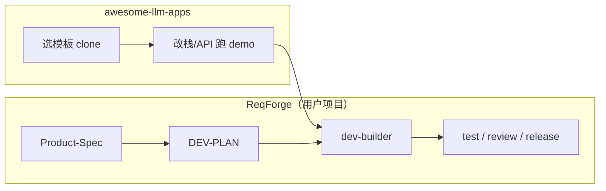

# ReqForge 与 Awesome LLM Apps 对照

> 参考：[Shubhamsaboo/awesome-llm-apps](https://github.com/Shubhamsaboo/awesome-llm-apps) — 100+ 可运行的 Agent / RAG / MCP / Voice 模板库，Apache-2.0，强调「3 条命令跑起来」。  
> 中文导读（同主题）：[这个开源项目，正在被全球程序员疯狂 Star…](https://mp.weixin.qq.com/s/tlPwOqi16vQzVoKLykTv4g)（公众号「给点知识」/ AI研究院，推介同一仓库）  
> 与 [founders-playbook-comparison.md](./founders-playbook-comparison.md)（验证先于构建）、[skill-evolution-comparison.md](./skill-evolution-comparison.md)（Skill 进化）、[loadout-scenarios.md](./loadout-scenarios.md)（选型）互补。

---

## 一句话定位

| 来源 | 擅长 |
|------|------|
| **awesome-llm-apps** | **应用菜谱**：克隆模板 → 改 API/栈 → 快速做出可演示的 LLM 产品（Streamlit、ADK、CrewAI…） |
| **ReqForge** | **交付 Harness**：在同一仓库里把需求写成 Spec/Plan，用测试与审查门把改动做成 **可合并、可发布** 的软件 |

仓库回答「做什么 App、用什么框架」；Forge 回答「这个 App 怎么按验收持续演进、别停在 demo」。

---

## 仓库在说什么（摘要）

| 维度 | awesome-llm-apps |
|------|------------------|
| 形态 | 13 类目录：Starter Agents、Advanced、Multi-agent Teams、Voice、MCP、RAG、Agent Skills、Memory、Fine-tuning、Framework Crash Course 等 |
| 承诺 | 手写模板、端到端测过、`pip install` + 运行；多模型可切换；[Unwind AI](https://www.theunwindai.com) 教程 |
| Agent Skills | `awesome_agent_skills/` 约 19 个**任务角色** Skill（code-reviewer、project-planner、deep-research…） |
| 亮点项 | Self-Improving Agent Skills（Gemini+ADK）、Trust-Gated Multi-Agent Research Team、MCP Router、RAG Failure Diagnostics |
| 许可 | Apache-2.0，可商用 fork |

**不是**：统一 CLI、统一 Spec 格式、跨项目的 phase-check / forge-loop。

### 微信长文补充的表述（与仓库一致）

| 角度 | 文章强调 | Forge 用法 |
|------|----------|------------|
| **痛点** | 每次 AI 项目重搭 RAG/Agent/记忆「轮子」 | 模板降 **脚手架** 成本；Forge 降 **交付与回归** 成本 |
| **RAG 真复杂度** | 上传→清洗→切块→嵌入→库→检索→拼 Prompt→生成→流式等 **11 步** 每步有坑 | 在 `Product-Spec.md` § Integrations / 验收写清 pipeline 与失败指标，勿只写「做个 RAG」 |
| **MCP** | AI 的「USB-C」，接浏览器/GitHub/Notion 等 | loadout 可选 MCP；接线学模板，**门禁**仍用测试 + review |
| **Vendor-agnostic** | 改配置切换 Claude/GPT/Qwen/DeepSeek | 与 Forge 多 adapter 一致；密钥不进 core |
| **Self-Improving Skills** | Agent 自调 Prompt | 对照 [skill-evolution-comparison](./skill-evolution-comparison.md)；Forge 要人审 + `skill-eval` |
| **趋势叙事** | AI 应用「开源砖厂」→ 创新在「做什么」 | 对应 [founders-playbook](./founders-playbook-comparison.md) 验证先于构建 + Spec 锁定范围 |

---

## 与 ReqForge 的分工

| 阶段 | 用 awesome-llm-apps | 用 ReqForge |
|------|---------------------|-------------|
| 0→1 验证「能不能跑」 | ✅ `starter_ai_agents/`、RAG 教程 | Quick Mode Spec（轻量） |
| 做成团队可维护产品 | 需自建规范 | ✅ 全 loadout + hooks |
| 多 Agent 编排示例 | ✅ `agent_teams/`、ADK/CrewAI 课 | `code-review` council、`request-dispatcher` |
| MCP 集成示例 | ✅ `mcp_ai_agents/` | loadout 可选 Context7 / Playwright MCP |
| 自进化 Skill | ✅ `self-improving-agent-skills` | `feedback/` + `evolution-engine`（人审 + verify-by） |
| 微调 / 语音 / 游戏 Agent | ✅ 目录内模板 | **非** Forge core |

---

## 类别对照表

| awesome-llm-apps 类别 | ReqForge 映射 | 关系 |
|----------------------|---------------|------|
| Starter / Advanced Agents | 用户应用代码；Forge 不附带业务模板 | **叠加**：模板当 `src/`，Forge 管流程 |
| Multi-agent Teams | `code-review` 多 reviewer、`implementer`/`planner` | 同构不同域：研究/销售 vs **工程交付** |
| MCP Agents | MCP 在 loadout 文档中可选 | 学接线；验收仍靠 Spec+测试 |
| RAG Tutorials | — | 应用内实现；Spec § 数据/检索要求 |
| **awesome_agent_skills** | `core/skills/*`（workflow Skills） | **勿混用**：前者=角色 prompt 包，后者=Spec→Release 流水线 |
| Memory Tutorials | `memory/` 三层 | Forge 记忆服务**产品开发**，非聊天记忆产品 |
| LLM Optimization | RTK 等可选（见 [rtk-comparison](./rtk-comparison.md)） | 上下文成本；非主路径 |
| Framework Crash Course | 学 ADK/OpenAI SDK | Forge 客户端无关（Claude/Cursor/OpenCode） |
| Trust-Gated Agent Team | S0/S1、`forge-verify`、Confirm 门 | 工程版「信任门」 |

---

## 对维护者与用户的启示

| 启示 | 落地建议 |
|------|----------|
| **模板 ≠ Harness** | fork `ai_travel_agent` 后在本仓执行 `pnpm forge-install`，补 `Product-Spec.md` / `DEV-PLAN.md` |
| **demo 可跑 ≠ shippable** | 模板缺持久测试门时，用 `dev-builder` TDD + `pnpm test` + `/code-review` |
| **19 个 Agent Skills** | 可作**领域参考**写自定义 Skill；不要替代 `product-spec-builder` / `dev-planner` 工件 |
| **Self-Improving Skills** | 与 [skill-evolution-comparison](./skill-evolution-comparison.md) 同向；Forge 强制**人工确认**与 `skill-eval`，避免 ADK 全自动改 Skill |
| **Provider-agnostic** | 与 Forge 多 adapter 一致；API 密钥仍在用户环境，不进 core |
| **Trust-Gated Team** | 研究类「引证门」↔ 工程类「Spec 条款 + 测试绿 + review」 |
| **RAG Failure Diagnostics** | 可写入 Spec 验收（检索失败率、引用格式）；实现留在应用仓 |
| **Apache-2.0 模板 + MIT Forge** | 许可兼容；合并时注意不要把模板 README 当成项目 Spec |

---

## 推荐工作流（创始人 / 独立开发者）

1. **探索**：从 [awesome-llm-apps](https://github.com/Shubhamsaboo/awesome-llm-apps) 选最接近的模板，`git clone` 子目录，3 命令跑通 demo。  
2. **立项**：在用户项目 `forge-install` → `/product-spec-builder`（写清 RAG/Agent/MCP 范围与验收）。  
3. **实现**：`/dev-planner` → `/dev-builder`；需要多 Agent 时参考模板架构，但 **Phase 与测试** 以 `DEV-PLAN` 为准。  
4. **收紧**：`/code-review` + `pnpm forge-loop`；发布走 `/release-builder` + `pnpm preflight`。  
5. **进化**：踩坑写 `feedback/` → `/evolution-engine`（不要只依赖模板里的 self-improving demo 无审计链）。

---

## 刻意不做

- 把 100+ 模板 vendoring 进 `ReqForge` 仓库  
- 用 `awesome_agent_skills/code-reviewer` 替换 Forge `code-review`（缺 Spec 引用与分级输出）  
- 在 core 维护 Streamlit/ADK/CrewAI 启动器  
- 宣称 Forge 取代 RAG/语音/微调教程目录  

---

## 与相关对照文档

| 文档 | 分工 |
|------|------|
| [founders-playbook-comparison.md](./founders-playbook-comparison.md) | 何时验证、何时 MVP |
| [openhuman-comparison.md](./openhuman-comparison.md) | 个人助理运行时 vs 产品 Harness |
| [skill-evolution-comparison.md](./skill-evolution-comparison.md) | 论文级 Skill 进化 vs `evolution-engine` |
| [context7-comparison.md](./context7-comparison.md) | 库文档 MCP |
| [loadout-scenarios.md](./loadout-scenarios.md) | 场景 → loadout |

---

## 参考

- 仓库：[github.com/Shubhamsaboo/awesome-llm-apps](https://github.com/Shubhamsaboo/awesome-llm-apps)
- Quick Start 示例：`starter_ai_agents/ai_travel_agent`
- 教程：[theunwindai.com](https://www.theunwindai.com)
- 微信导读：[mp.weixin.qq.com/s/tlPwOqi16vQzVoKLykTv4g](https://mp.weixin.qq.com/s/tlPwOqi16vQzVoKLykTv4g)
