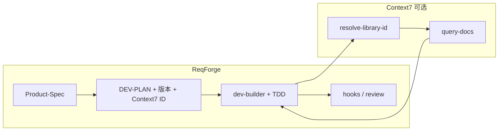

# ReqForge 与 Context7 对照

> 参考：[upstash/context7](https://github.com/upstash/context7)（Up-to-date, version-specific library docs for LLMs — MCP + CLI/Skills）  
> 本文说明两者定位差异、**推荐叠加方式**，以及 ReqForge **不应自建** 的部分。与 [openspec-comparison.md](./openspec-comparison.md)、[superpowers-comparison.md](./superpowers-comparison.md)、[openhuman-comparison.md](./openhuman-comparison.md)、[rtk-comparison.md](./rtk-comparison.md) 互补。

---

## 一句话定位

| 项目 | 擅长 |
|------|------|
| **Context7** | **外部库知识注入**：按版本拉取官方文档与示例，减少 API 幻觉与过时用法（`resolve-library-id` → `query-docs`） |
| **ReqForge** | **需求→可交付产品**：Spec、Plan、TDD 实现、审查、发布、记忆与进化；`hallucination-gate` 等主要防「路径/流程」类错误 |

**推荐组合**：用 ReqForge 管「做对流程、做对产物」；用 Context7 管「写对第三方库 API 与版本」。**叠加，不替代。**

---

## 问题域对照

| 幻觉/错误类型 | Context7 | ReqForge |
|---------------|----------|----------|
| 不存在的 API、旧版签名 | ✅ 注入源文档 | WebSearch（弱于结构化检索） |
| 写到错误目录、跳过测试 | ❌ | ✅ hooks + Machine Gates |
| 需求漂移、无验收 | ❌ | ✅ Product-Spec、DEV-PLAN、code-review |
| 跨 session 丢决策 | ❌ | ✅ `memory/` + `memory-guard` |

ReqForge 的 **Web-First** 与 **Pin exact version** 与 Context7 天然一致：Plan 锁定版本，实现阶段用 Context7 取该版本文档。

---

## 工作流叠加



### 典型调用顺序（实现 Phase 内）

1. 读 DEV-PLAN **Tech Stack** 表：已有 `Context7 Library ID` → 直接 `query-docs`
2. 无 ID、有库名 → `resolve-library-id`（`libraryName` + 当前 Task 的 `query`）→ `query-docs`
3. 仍缺竞品/趋势/报错帖 → **WebSearch**（Context7 不替代）
4. 无法确认 → 标 `[待确认]`，写入 `memory/decisions-log.md`

---

## 与 ReqForge 工件映射

| Context7 概念 | ReqForge 落点 |
|---------------|---------------|
| `/org/project` 库 ID | DEV-PLAN Tech Stack 表 **Context7 Library ID** 列（dev-planner 填写） |
| 提示中指定版本 | 与 `CLAUDE.md` Pin exact version + Plan 版本列一致 |
| MCP `https://mcp.context7.com/mcp` | `web-app` loadout 可选 MCP；用户 `npx ctx7 setup` |
| CLI `ctx7 docs` | 无 MCP 时的降级（dev-builder Online-First） |
| 自动规则「涉及库文档即用 Context7」 | 见下文可选片段 |

---

## 安装（用户项目侧，非 ReqForge 仓库依赖）

```bash
npx ctx7 setup
# 或手动：MCP URL https://mcp.context7.com/mcp ，header CONTEXT7_API_KEY
```

文档：[Context7 README](https://github.com/upstash/context7) · [Tools reference](https://www.mintlify.com/upstash/context7/mcp/tools-reference)

---

## 可选：复制到项目 `CLAUDE.md` 的规则片段

```txt
When implementing or configuring dependencies listed in DEV-PLAN.md or package.json,
use Context7 MCP (resolve-library-id → query-docs) for library/API documentation
before writing integration code. Use WebSearch for competitors, trends, and forum errors.
If Context7 is unavailable, fall back to WebSearch and mark uncertain APIs [待确认].
```

---

## ReqForge 已从 Context7 借鉴（v1.21.1+）

| 借鉴点 | 落点 |
|--------|------|
| 库文档优先结构化检索 | `dev-builder/references/development-strategies.md` — **Library Docs Strategy** |
| Plan 阶段固化库 ID | `dev-planner` 模板 Tech Stack 增加 **Context7 Library ID** 列 |
| 推荐 MCP 伙伴 | `core/loadouts/web-app.json` 可选 Context7 项 |
| 对照文档 | 本文 |

---

## 明确不做

| Context7 能力 | ReqForge 为何不做 |
|---------------|-------------------|
| 自建文档爬取索引与 API 后端 | 重运营；MIT 轻量 Harness，应集成而非复制 |
| 用 Context7 替代 Spec/Plan/Review | 流程主权在 Forge |
| 用 Context7 替代 WebSearch 全貌 | 非库文档类信息仍需搜索 |
| 将 Context7 列为必需依赖 | 可选 MCP；零 npm 即用 Forge 不变 |

---

## 选型简表

| 场景 | 建议 |
|------|------|
| 只有写代码、不要产品流程 | Context7 + 客户端规则即可 |
| 从想法到可发布产品 | ReqForge 为主 |
| 两者都要 | ReqForge 全流程 + Context7 MCP（推荐） |
| 无 API Key / 离线 | Forge + WebSearch；关键 API 手写链接进 Spec |

---

## Related

- [harness-maturity-checklist.md](./harness-maturity-checklist.md) — P0 验证环、上下文管理
- [superpowers-comparison.md](./superpowers-comparison.md) — TDD 与子 Agent
- [rtk-comparison.md](./rtk-comparison.md) — Shell 输出压缩（与库文档正交）
