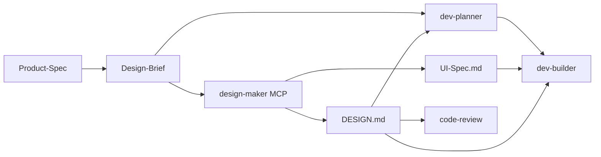

# ReqForge 设计链与 Google design.md 对照

> 参考：[google-labs-code/design.md](https://github.com/google-labs-code/design.md)（面向编码 Agent 的视觉身份格式：YAML token + Markdown rationale + `designmd` CLI）  
> 本文说明 **Google DESIGN.md 规范** 与 **ReqForge 设计 Skill 链** 的分工、衔接方式，以及勿与 OpenSpec `changes/.../design.md` 混淆。

---

## 一句话定位

| 侧 | 擅长 |
|----|------|
| **Google design.md** | 定义 **DESIGN.md 文件格式** + lint / diff / export（Tailwind、DTCG）；让 Agent **读数值写 UI** 时有稳定 token |
| **ReqForge** | 定义 **怎么产出** 该文件：Brief 访谈 → mockup → 冻结 token；并接入 dev-builder、code-review、quickref |

**关系**：ReqForge **不 fork** Google 的 schema 或 CLI；mockup 验收后按 `@google/design.md` 格式写出根目录 `DESIGN.md`，可选 `npx -p @google/design.md designmd lint`。

---

## 四份「设计文档」分工（勿混名）

| 文件 | 谁写 | 内容 | 机器可读 | 典型读者 |
|------|------|------|----------|----------|
| `Design-Brief.md` | `/design-brief-builder` | 方向、参照产品、反 slop；**不写 hex** | 弱（访谈锁定表） | design-maker、人 |
| Mockups | `/design-maker` + MCP | 像素稿 | 设计工具内 | 人审、MCP |
| `UI-Spec.md` | design-maker Step 3c | 页面结构、组件清单、验收 | YAML 结构 | dev-builder（布局） |
| **`DESIGN.md`** | design-maker Step 3e | token + design rationale | **YAML frontmatter** | dev-builder、code-review、export |
| `changes/<name>/design.md` | `/change-manager` | **单次变更**的技术/UI 方案 | 自由 Markdown | dev-builder（变更范围） |

根目录 **`DESIGN.md`（全大写）** = 产品级视觉身份。  
**`changes/.../design.md`（小写路径）** = OpenSpec 变更级方案，变更 UI 时**交叉引用**根 `DESIGN.md`，不替代它。

---

## 哲学对照

Google [PHILOSOPHY.md](https://github.com/google-labs-code/design.md/blob/main/PHILOSOPHY.md) 强调：**prose 决定气质，token 是 prose 的上下文**；具体参照物（「像 1970 年代讲义」）优于空泛形容词。

| 维度 | Google design.md | ReqForge |
|------|------------------|----------|
| Token 角色 | 上下文，非渲染指令 | 同；Brief 阶段故意不写 hex，数值来自 mockup |
| 发现阶段 | 假设你已有设计意图 | **design-brief-builder** 用问卷 + 参照产品帮用户澄清意图 |
| 冻结时机 | 规范未规定流水线 | **mockup 验收后** Step 3e 强制冻结（skip mockup 则无 DESIGN.md） |
| 校验 | `designmd lint` / `diff` / `export` | Skill 内 **Recommended** lint；**未**接入 forge-verify hook（见下） |
| 扩展节 | 未知 section 保留不报错 | 同；可自增 motion 等 token 块 |

ReqForge 的 **Reference Anchoring**（Brief）与 Google 的 **specific reference > adjectives** 一致；DESIGN.md 负责把 Brief 里的方向 **落地为可 lint 的 token**。

---

## 工作流对照



**样式读取优先级**（dev-builder / code-review 一致）：

```text
DESIGN.md  >  设计工具 MCP  >  Design-Brief.md  >  Product-Spec.md
```

**结构读取**：`UI-Spec.md`（若存在）> Spec 正文。

---

## ReqForge 在 Google 格式之上增加了什么

| 能力 | ReqForge 落点 |
|------|----------------|
| 访谈 → Brief | `design-brief-builder` + Next Step Gate |
| Mockup + 状态覆盖 | `design-maker` + UI-Spec |
| Brief + 工具数值 → DESIGN.md | `references/design-md-freeze.md` + `templates/design-md-template.md` |
| 实现期读 token | `dev-builder/references/workflow.md` |
| 审查期对 token | `code-review` v2.2.1+ |
| 路由与命令说明 | `core/templates/forge-quickref.md` §设计链 |
| 示例文件 | `test-demo/react-table/DESIGN.md` |

---

## Google CLI 互操作（维护者 / 用户项目）

```bash
# Windows/PowerShell 须用 designmd 别名
npx -p @google/design.md designmd lint DESIGN.md
npx -p @google/design.md designmd export --format css-tailwind DESIGN.md > src/theme.css
npx -p @google/design.md designmd diff DESIGN.md DESIGN-v2.md
```

用户项目可在 `package.json` 增加 `"design:lint": "designmd lint DESIGN.md"`（devDependency：`@google/design.md`）。

---

## 建议不照搬 / 暂不内置的部分

| Google / 社区能力 | ReqForge 选择 |
|-------------------|---------------|
| 把 DESIGN.md 当作唯一设计输入（无 Brief） | 否 — 0→1 仍需 Brief 发现 |
| fork `@google/design.md` 进仓库 | 否 — 用 npx，跟随上游 alpha |
| forge-verify 强制 designmd lint | **暂缓** — 多数项目无 DESIGN.md；见 [open-design-comparison](./open-design-comparison.md) 旁路说明 |
| 独立 `design-token-freeze` Skill | 否 — 已并入 design-maker Step 3e |

---

## 与 Open Design 的关系

Open Design 出 artifact / 预览；**DESIGN.md 冻结**是 ReqForge 在 mockup 后的 **token 层**，与 OD 正交。组合用法见 [open-design-comparison.md](./open-design-comparison.md)。

---

## 相关文件

| 路径 | 用途 |
|------|------|
| `core/skills/design-maker/references/design-md-freeze.md` | 冻结流程 |
| `core/skills/design-maker/templates/design-md-template.md` | 输出模板 |
| `core/skills/design-brief-builder/` | Brief（无 hex） |
| `core/skills/dev-builder/references/workflow.md` | 实现读 DESIGN.md |
| `core/skills/code-review/references/review-dimension-checklist.md` | UI 审查基线 |
| `test-demo/react-table/DESIGN.md` | 可 lint 的示例 |
| Google 上游 | https://github.com/google-labs-code/design.md |

---

*v1.48.6+ · ReqForge 设计链 · MIT*
