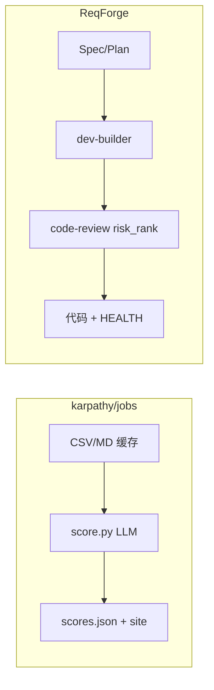

# ReqForge 与 karpathy/jobs 对照

> 参考：[karpathy/jobs](https://github.com/karpathy/jobs)（**US Job Market Visualizer** — BLS 职业数据流水线 + LLM 批量 rubric 打分 + treemap；**不是**后台 Job 队列/Cron）  
> 本文说明两者定位差异、**可借鉴的数据→判断→输出纪律**，以及 ReqForge **不应自建** 的部分。与 [nanochat-comparison.md](./nanochat-comparison.md)、[autoresearch-comparison.md](./autoresearch-comparison.md)、[llm-council-comparison.md](./llm-council-comparison.md) 互补。

---

## 一句话定位

| 项目 | 擅长 |
|------|------|
| **karpathy/jobs** | **数据流水线**：scrape → parse → CSV → **LLM rubric 打分**（0–10 + rationale）→ 静态可视化 |
| **ReqForge** | **产品交付 Harness**：Spec → Plan → 实现 → **LLM 审查/评分** → 可发布代码 |

**关系**：jobs 教 **结构化源数据 + 可重跑判断层 + 增量 JSON checkpoint**；Forge 把同一纪律用在 **需求→产品**，**不**做 BLS 爬虫或 treemap。**「jobs」= occupations，≠ task scheduler。**

---

## 三层管道（修正映射）

| 层 | jobs | ReqForge |
|----|------|----------|
| **结构化源** | BLS → `occupations.csv` / `pages/*.md` | `Product-Spec.md` / `DEV-PLAN.md` / git diff |
| **生成层** | （数据已存在） | `dev-builder` / `implementer` |
| **LLM 判断层** | `score.py`（锚点 rubric + JSON） | `code-review`（**risk_rank**）、Spec Step 7 Council、evolution |
| **输出层** | treemap / `site/data.json` | **可运行代码** + verify 证据 + `PROJECT-HEALTH.md` |



**生成与评估已分离**：Task 环 = 实现 → 微循环 → `code-reviewer`；不必再拆 dev-builder。jobs 启示是 **只重跑判断层**（改 rubric 重审，不必重写实现）。

---

## 五项启示 ↔ Forge 落点（v1.25）

### 1. LLM-as-Judge 批量 rubric — **已落地（code-review）**

| jobs | Forge |
|------|-------|
| exposure 0–10 + 锚点 | 每条 finding：**severity / impact / confidence**（各 1–5） |
| `scores.json` 增量 | aggregator 按 **risk_rank = S×I×C** 排序 |
| rationale 字段 | finding + evidence（已有） |

evolution 的 Precision/Coverage/Efficiency/Satisfaction 是 **反馈→进化** 维度，与 code-review **risk_rank** 分开命名。

### 2. 混合管道 — **文档 + 流程确认**

- 改审查 rubric → 重跑 `/code-review`
- 改 Spec → `/change-manager` 或 replan
- `Primary metric` + 测试 = 结构化验收；LLM = 解释层

### 3. 项目健康快照 — **已落地（用户项目）**

Phase 完成后更新 **`PROJECT-HEALTH.md`**（ASCII 表，非 Web Dashboard）：Spec 完成度、Primary metric、测试、最近变更。模板：`core/templates/PROJECT-HEALTH-template.md`。

### 4. 周末项目方法论 — **Forge 核心命题**

```text
人定框架 → AI 填充 → 结构化输出 → 可验证
```

与 autoresearch / llm-council / nanochat 同族；写进对照即可，不新加 runtime。

### 5. 内置约束 vs 事后免责声明 — **Forge 方向正确**

| 项目 | 策略 |
|------|------|
| jobs | 爆火后补「AI Exposure 不是什么」 |
| autoresearch | `prepare.py` 只读 |
| **Forge** | Machine Gates + hooks + Spec/Plan 只读 |

Product-Spec 中 **LLM 打分/分类** 功能须带：**JSON 输出格式 + 免责声明**（见 product-spec 模板 § LLM-as-Judge）。

---

## 明确不做

| jobs 能力 | 原因 |
|-----------|------|
| BLS 爬虫 / Playwright scrape | 用户产品或研究工具，非 Harness |
| OpenRouter 342 条批处理脚本 | 用户产品「AI 评分功能」时自建 |
| treemap Web UI | 路线图 Dashboard；框架用 `PROJECT-HEALTH.md` |
| Job 队列 / Cron Harness | 与「职业 jobs」无关；Spec 模板仅描述**用户产品**调度需求 |

---

## 与 Karpathy 项目族

| 项目 | 教 Forge 什么 |
|------|----------------|
| nanochat | 黄金路径、快环/满环 |
| autoresearch | 单指标、约束编辑 |
| llm-council | 生成→评审→综合 |
| **jobs** | **rubric 量化、缓存工件、重跑判断层、HEALTH 快照、免责声明** |

---

## Related

- [llm-council-comparison.md](./llm-council-comparison.md) — Council + 综合结论
- [harness-maturity-checklist.md](./harness-maturity-checklist.md) — 消费级 automation 边界
- [sub-agent-orchestration.md](./sub-agent-orchestration.md) — risk_rank 聚合
- [../templates/PROJECT-HEALTH-template.md](../templates/PROJECT-HEALTH-template.md) — Phase 快照模板
