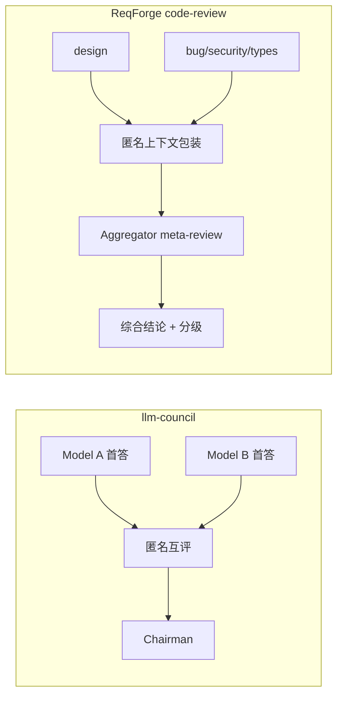

# ReqForge 与 llm-council 对照

> 参考：[karpathy/llm-council](https://github.com/karpathy/llm-council)（多 LLM 独立首答 → 匿名互评排序 → Chairman 合成最终答案）  
> 本文说明两者定位差异、**已落地的 Council 式纪律**，以及 **路线图** 项。与 [superpowers-comparison.md](./superpowers-comparison.md)、[autoresearch-comparison.md](./autoresearch-comparison.md)、[nanochat-comparison.md](./nanochat-comparison.md) 互补。

---

## 一句话定位

| 项目 | 擅长 |
|------|------|
| **llm-council** | **开放问答质量**：多模型并行 → 匿名 peer rank → Chairman 综合叙述 |
| **ReqForge** | **产品交付 Harness**：Spec → Plan → 实现 → **Council 式审查** → 发布 |

**关系**：Council 教 **生成 → 评审 → 综合** 三层结构；Forge 用 **同模型 + 多 role**（非多模型路由）实现同一组织方式。**不**内置 OpenRouter / 多模型 / Web UI。

---

## 三阶段 ↔ Forge（v1.24+ 已落地部分）

| llm-council | ReqForge | 状态 |
|-------------|----------|------|
| Stage 1：并行首答 | 4 专项 `code-reviewer-*` 并行；Spec Step 7 四视角评审 | **已落地（轻量）** |
| Stage 2：匿名互评 | 审查去 implementer 上下文；aggregator **meta-review** suspected | **已落地（轻量）** |
| Stage 3：Chairman | `code-reviewer` **综合结论** + Must-fix/Should-fix/Insight | **已落地** |
| Tab 并排 UI | 无 — 结构化 Markdown 报告 | 不做 |
| 多模型 OpenRouter | 用户客户端选模型 | **不做** |

**更简洁的表达**（与七层 Layer 4 一致）：**生成（实现/Spec）→ 评审（专项 Agent）→ 综合（Chairman 式 aggregator）**。

---

## 五项启示 ↔ 落点

### 1. 代码审查 Council 升级 — **已落地（轻量版）**

| 提议 | 落点 |
|------|------|
| 匿名化 | 传给 reviewer 前剥离 implementer session / task 叙述；**保留** `file:line` |
| 互评 | **Meta-review**：aggregator 对 suspected 二次裁决（非 full peer mesh） |
| 加权综合 | 综合结论 + Must-fix/Should-fix/Insight；跨 Agent 同 line 佐证仍用 confidence +0.1 |
| 历史权重 | **路线图 P2**（需 `.forge/reviewer-stats.json`） |

### 2. Spec 质量 Council — **已落地**

| 视角 | Agent role |
|------|------------|
| 完整性 | 关键维度是否覆盖 |
| 一致性 | 自相矛盾需求 |
| 可行性 | 技术栈下可落地 |
| 用户视角 | 目标用户遗漏 |

挂在 `product-spec-builder` **Step 7**（Step 6 Final Validation 之后）：四视角并行 → Chairman 输出 **可交付 / 待确认 / 阻塞**。

### 3. 设计评审 Council — **路线图**

`design-brief-builder` 已有 2–3 选项 + preset；full 三阶段（多方向 → 匿名打分 → Chairman）**未排期** — 设计决策频率低，ROI 次于 code/spec review。

### 4. Evolution Council — **路线图**

`evolution-engine` 保留 **3+ 硬阈值**；对 graduation 候选做双 judge + chairman → **P2**（feedback 量不足时 full council 过重）。

### 5. 少即是多 — **确认**

| 项目 | 极简结构 |
|------|----------|
| llm-council | 3 阶段 · 1 API |
| autoresearch | 3 文件 · 1 指标 |
| **ReqForge** | Spec/Plan/代码 · Hooks · **生成→评审→综合** |

Forge 路线正确：**接口清晰、循环紧密、约束硬** — 4 专项 reviewer 已是 Council 的内置实现。

---

## 与 ReqForge Skill 的关系

| Skill | Council 启示 |
|-------|--------------|
| **code-review** / **code-reviewer** | 匿名上下文 + meta-review + 综合结论 |
| **product-spec-builder** | Step 7 四视角 Spec council |
| **design-brief-builder** | 路线图：三阶段设计 council |
| **evolution-engine** | 路线图：graduation 双 judge |
| **dev-builder** | dispatch code-reviewer 时传 **匿名审查包** |

---

## 明确不做

| llm-council 能力 | 原因 |
|------------------|------|
| OpenRouter 多模型 | Harness 不路由模型 |
| Council Web App / Tab UI | 非框架职责 |
| Full peer review of reviews（每 Task） | Token/延迟；用 meta-review 代替 |
| Reviewer 历史加权（无数据时） | P2，需 telemetry 闭环 |

---

## 选型简表

| 场景 | 建议 |
|------|------|
| 提高开放问答质量 | 用 **llm-council**（或自建多模型） |
| 从 Spec 到可发布代码 | **ReqForge** 全流程 |
| 减少审查护短 / 低质量 finding | Forge **code-review Council 轻量版**（已内置） |
| Spec 交付前质量门 | **product-spec-builder Step 7** |

---

## Related

- [superpowers-comparison.md](./superpowers-comparison.md) — TDD / 子 Agent
- [autoresearch-comparison.md](./autoresearch-comparison.md) — Primary metric / 微循环
- [agent-harness-seven-layer-map.md](./agent-harness-seven-layer-map.md) — Layer 4 = Council 工程化
- [sub-agent-orchestration.md](./sub-agent-orchestration.md) — 并行 reviewer 编排
