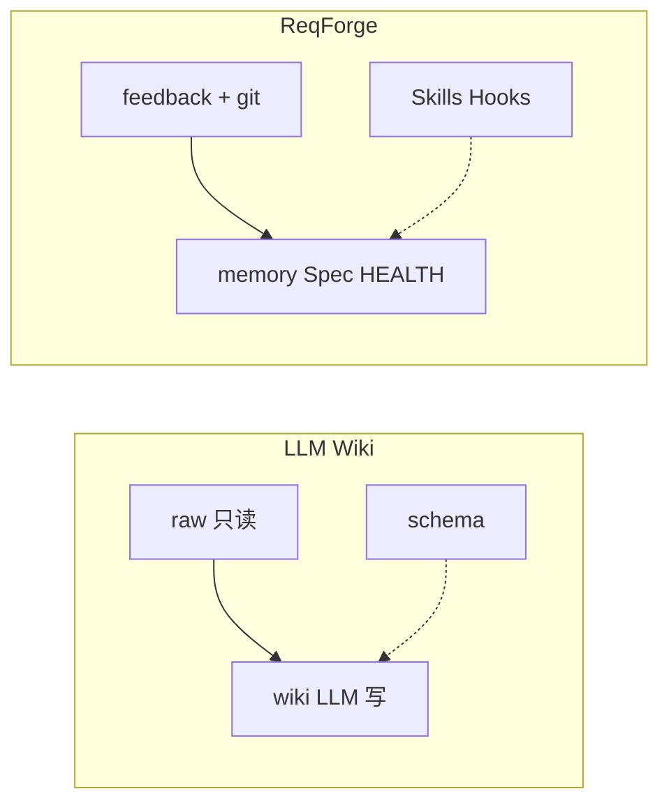

# ReqForge 与 LLM Wiki 模式对照

> 参考：[Karpathy LLM Wiki gist](https://gist.github.com/karpathy/442a6bf555914893e9891c11519de94f)（raw/wiki 三层 + ingest/query/lint 三操作）  
> **不是代码仓库**——是「持久化、可复利知识库」的模式说明。与 [memory-system.md](./memory-system.md)、[openhuman-comparison.md](./openhuman-comparison.md)、[jobs-comparison.md](./jobs-comparison.md) 互补。

---

## 一句话定位

| 模式 | 擅长 |
|------|------|
| **LLM Wiki** | 避免每次 RAG 重推——LLM **维护**交叉链接 Markdown 维基（raw 只读 → wiki 编译 → schema 纪律） |
| **ReqForge** | **可发布产品**——Spec/Plan 为验收真理，memory 为编译缓存，**chat 不是档案库** |

**关系**：Wiki 教 **ingest / query / lint + index/log**；Forge 用 **change-manager + ADR + Machine Gates** 实现受控版「复利」，**不**做无边界自动改 Spec。

---

## 三层 ↔ Forge

| LLM Wiki | ReqForge | 说明 |
|----------|----------|------|
| **raw/**（只读源） | 用户提供的材料、git 历史、`feedback/` 原始条目 | Forge 不内置 Obsidian/剪藏 |
| **wiki/**（LLM 维护） | `memory/`、`PROJECT-HEALTH.md`；**Product-Spec** 经用户确认 | Spec **非**自由 wiki；dev-builder **只读** Spec/Plan |
| **schema/** | `CLAUDE.md` / `AGENTS.md`、Skills、hooks | 与 gist「schema = 纪律」同构 |

---

## 三操作 ↔ Forge

| 操作 | Wiki | Forge |
|------|------|-------|
| **Ingest** | 新源 → 更新多页 + index | `/product-spec-builder`、`/change-manager` propose、`feedback-observer` |
| **Query** | 查 wiki → 答案 **写回** wiki | 读 Spec/Plan/memory 再实现；**重要结论 → ADR**（`decisions-log.md`），不写进 chat  alone |
| **Lint** | 矛盾、孤儿页、过时 claim | Spec Step 6/7 Council、code-review、evolution（**无** full wiki graph lint） |

**index / log**：gist 的 `index.md` / `log.md` ≈ DEV-PLAN 目录 + `task-history.md` + `Product-Spec-CHANGELOG.md`。

---

## 已借鉴（文档级，v1.25）

| 启示 | 落点 |
|------|------|
| 编译层 vs 每次 RAG | Project State Detection；先读 Spec/Plan/memory |
| Query 写回 | dev-builder：**架构/方案结论 → ADR**；Phase → PROJECT-HEALTH |
| schema 协同演化 | EVOLUTION.md + evolution-engine |
| 模式 > 实现 | Forge = 纯文本 Skills + hooks，零 npm 使用框架 |

---

## 明确不做（ROI 低）

| Wiki 能力 | 原因 |
|-----------|------|
| 自动 cross-ref 15 页 | 单项目 `memory/` 三文件够用 |
| memory-lint 子引擎 | evolution + Spec Council 已覆盖主要矛盾 |
| 无边界 LLM 改 Product-Spec | Overstepping Gate；走 change-manager |
| embedding RAG / Obsidian 内置 | 用户产品或可选工具，非 Harness 核心 |

---

## Karpathy 参照族（四 + Wiki）

| 参照 | Forge 模块 | 文档 |
|------|------------|------|
| autoresearch | dev-builder 微循环 + Primary metric | [autoresearch-comparison.md](./autoresearch-comparison.md) |
| llm-council | code-review Council | [llm-council-comparison.md](./llm-council-comparison.md) |
| jobs | risk_rank + PROJECT-HEALTH | [jobs-comparison.md](./jobs-comparison.md) |
| **LLM Wiki gist** | memory/ + ingest/query/lint 纪律 | 本文 |

---

## Related

- [memory-system.md](./memory-system.md) — 三层 memory + Wiki 模式对照
- [behavior-boundaries.md](./behavior-boundaries.md) — Spec 权威
- [change-manager](../skills/change-manager/SKILL.md) — brownfield ingest
