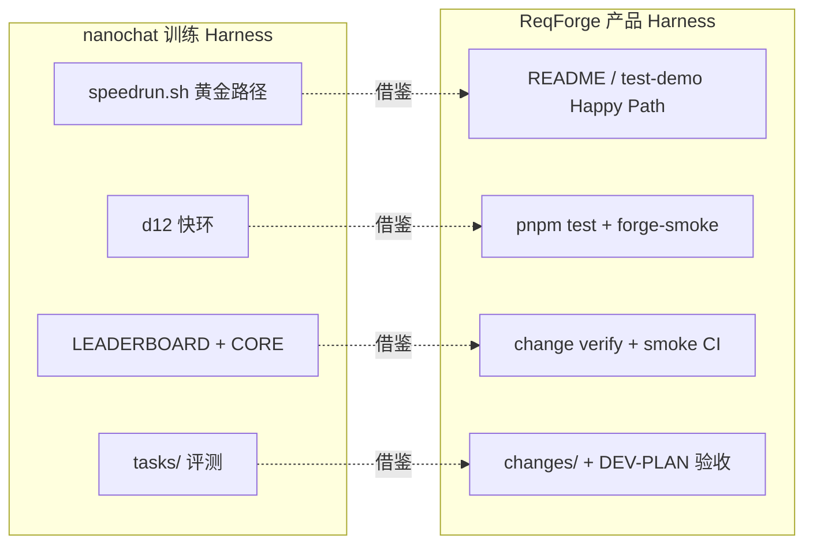

# ReqForge 与 nanochat 对照

> 参考：[karpathy/nanochat](https://github.com/karpathy/nanochat)（The best ChatGPT that $100 can buy — 单 GPU 节点上端到端训练 LLM 的实验型 Harness）  
> 本文说明两者定位差异、**可借鉴的 Harness 工程纪律**，以及 ReqForge **不应自建** 的部分。与 [rtk-comparison.md](./rtk-comparison.md)、[context7-comparison.md](./context7-comparison.md)、[superpowers-comparison.md](./superpowers-comparison.md) 互补：nanochat 对齐「端到端参考跑法 + 快环/满环 + 客观验收」；RTK 对齐 Shell 输出压缩；Context7 对齐库文档；Superpowers 对齐 TDD 与子 Agent。

---

## 一句话定位

| 项目 | 擅长 |
|------|------|
| **nanochat** | **LLM 训练实验 Harness**：tokenizer → 预训练 → SFT → 评测 → 推理 → Chat UI；`runs/speedrun.sh` 黄金路径；`--depth` 单旋钮；Time-to-GPT-2 排行榜 |
| **ReqForge** | **产品交付 Harness**：Spec → Plan → 实现 → verify → 审查 → 发布 → 进化；Loadout 选型；Machine Gates |

**关系**：nanochat 教 **如何把 Harness 做成可复现、可迭代、极简可 fork 的基线**；ReqForge 把同一套纪律用在 **需求→可发布产品**，**不**训练模型。**借鉴方法论，不叠加运行时。**

---

## 问题域对照

| 维度 | nanochat | ReqForge |
|------|----------|----------|
| 端到端流水线 | 训练栈 6 阶段 | 产品栈 7+ Skill 阶段 |
| 成功指标 | DCLM CORE、墙钟 Time-to-GPT-2 | Spec 验收、测试、verify、review |
| 复杂度旋钮 | `--depth`（其余超参自动推导） | Loadout + Spec Quick/完整模式 |
| 黄金路径 | `runs/speedrun.sh` 随主分支更新 | [test-demo/](../../test-demo/) + `pnpm test-demo-golden-path`（见 [test-demo/README.md](../../test-demo/README.md)） |
| 快环 / 满环 | d12 ~5min 实验 vs speedrun ~2–3h | Vitest/forge-smoke vs 完整 Phase |
| 客观记录 | `dev/LEADERBOARD.md` + commit | `forge-smoke` CI + verify 证据 |
| 评测定义 | `tasks/*.py` | `changes/*/specs.md` + DEV-PLAN 验收表 |

---

## Harness 工程映射

| nanochat 概念 | ReqForge 落点（已有或推荐） |
|---------------|----------------------------|
| `runs/speedrun.sh` | [test-demo/README.md](../../test-demo/README.md) + `pnpm test-demo-golden-path`；forge-smoke 第 10 项守门 |
| d12 快环 | Phase 内先 `test`/`tsc`；`pnpm forge-smoke` / `pnpm test`（框架仓库） |
| `--depth` 单旋钮 | [loadout-scenarios.md](./loadout-scenarios.md) 30 秒选型；product-spec-builder Quick 模式 |
| `tasks/` 客观评测 | change-manager verify 模板 + DEV-PLAN 验收项 |
| `runs/` vs `nanochat/` 分离 | `scripts/` + `core/skills/` vs 用户项目代码 |
| 排行榜 + commit 绑定 | evolution 改动附 smoke 前后结果；CI badge |
| Contributing LLM 披露 | [platform-compliance.md](./platform-compliance.md) 可选贡献者披露 |
| 极简、反配置怪兽 | Loadout JSON + Markdown Skill；minimal loadout |

---

## 与 ReqForge Skill 的关系

| Skill | nanochat 启示 |
|-------|---------------|
| **product-spec-builder** | 需求侧「单旋钮」：Quick vs 完整 Spec |
| **dev-planner** | 按 loadout 预填 Tech Stack，减少 Plan 填表 |
| **dev-builder** | **快环**（单测/tsc）再 Phase 签收；对标 d12 → speedrun |
| **change-manager** | `changes/` = 可复现变更 run；verify = tasks 式客观评测 |
| **release-builder** | speedrun 终点是 `chat_web`；Forge 终点是 **可安装 artifact** |
| **evolution-engine** | 规则/Skill 变更需 before/after 证据（smoke 或 verify） |

nanochat **不替代** 任何 Forge Skill；也不提供 LLM 训练能力。

---

## ReqForge 已从 nanochat 借鉴的理念（文档级）

| 借鉴点 | 落点 |
|--------|------|
| 黄金路径永不过期 | [test-demo/](../../test-demo/) + `forge-smoke` `test-demo-golden-path` |
| 快环 before 满环 | dev-builder Phase 验收；change-verify 摘要 + 日志路径 |
| 单旋钮降认知负担 | loadout-scenarios、Spec Quick 模式 |
| 客观指标非感觉 | forge-smoke、harness-maturity-checklist |
| 编排与库分离 | `scripts/`、`core/skills/`、`changes/` 分工 |

---

## 明确不做

| nanochat 能力 | ReqForge 为何不做 |
|---------------|-------------------|
| GPU 训练 / wandb / tokenizer 栈 | 领域不同；MIT 轻量 Harness 不做 ML 基础设施 |
| Time-to-GPT-2 公开排行榜 | 用户产品形态各异，无统一 CORE 分数 |
| 单仓库硬编码 `speedrun.sh` 给所有用户 | 只能 **文档化 Happy Path + 示例 repo** |
| 为刷 benchmark 牺牲 Spec/Plan 纪律 | Forge KPI 是 **可交付、可维护** |
| 将 nanochat 列为依赖或 loadout MCP | 方法论参照，非运行时伙伴 |

---

## 与 RTK / Context7 的叠加关系

| 工具 | 层 | 与 nanochat |
|------|-----|-------------|
| **Context7** | 库文档注入 | 正交 |
| **RTK** | Shell 输出压缩 | 正交 |
| **nanochat** | Harness **设计参照** | 不提供可安装组件；教 speedrun / 快环 / 验收纪律 |

典型栈：**ReqForge 全流程** + 按需 Context7 / RTK；nanochat 仅作 **对照阅读**，不参与安装。

---

## 选型简表

| 场景 | 建议 |
|------|------|
| 训练自己的 ChatGPT（<$1000） | 用 **nanochat**，不用 ReqForge 替训练 |
| 从想法做 Web/CLI 产品 | **ReqForge** 为主 |
| 学 Harness 怎么设计 | 读 nanochat README + 本文 + [agent-harness-seven-layer-map.md](./agent-harness-seven-layer-map.md) |
| 维护 ReqForge 仓库 | `pnpm forge-smoke` = 框架侧 speedrun 守门（含 test-demo） |

---

## Related

- [agent-harness-seven-layer-map.md](./agent-harness-seven-layer-map.md) — 七层教学对照
- [harness-maturity-checklist.md](./harness-maturity-checklist.md) — P0 验证环
- [loadout-scenarios.md](./loadout-scenarios.md) — Loadout 单旋钮选型
- [rtk-comparison.md](./rtk-comparison.md) — Shell 输出（可选伙伴）
- [test-demo/README.md](../../test-demo/README.md) — 黄金路径 living demo
- [platform-compliance.md](./platform-compliance.md) — OSS / 贡献政策
