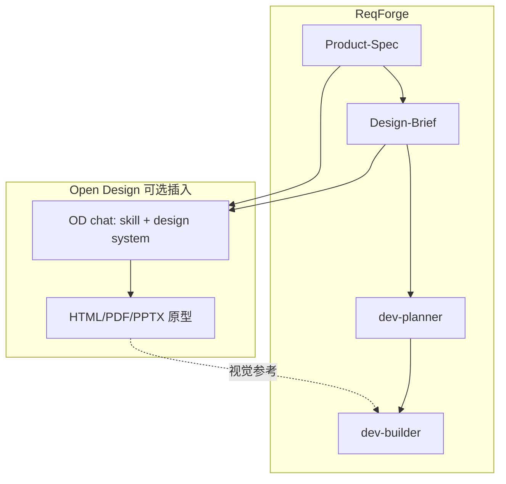

# ReqForge 与 Open Design 对照

> 参考：[nexu-io/open-design](https://github.com/nexu-io/open-design)（开源 Claude Design 替代：本地 daemon、31 设计 Skill、上百 Design System、沙箱预览与多格式导出）  
> 本文说明定位差异、ReqForge **已吸收（P0）** 的能力，以及何时用 OD 而非 ReqForge 设计 Skill。

---

## 一句话定位

| 项目 | 擅长 |
|------|------|
| **Open Design (OD)** | **出设计稿**：原型、Deck、海报、动效、HTML/PDF/PPTX/MP4；自带预览 UI 与媒体管线 |
| **ReqForge** | **需求→可交付产品**：Spec、计划、TDD 编码、审查、发布；设计阶段用 Brief + MCP（可选 OD 外挂） |

**推荐组合**：ReqForge 定 `Product-Spec.md` + `Design-Brief.md` → 要高保真可点原型时用 **OD** → 定稿后 **dev-builder** 对稿编码。

---

## ReqForge 已从 OD 吸收（v1.20.9+）

| OD 做法 | ReqForge 落点 |
|---------|----------------|
| Turn-1 discovery 表单 | `design-brief-builder/references/design-discovery-questionnaire.md` |
| 5 视觉方向学派 + 确定性描述 | `references/visual-direction-presets.md` |
| Anti–AI-slop / 反模板化 | `references/anti-ai-slop-checklist.md` |
| 五维设计自检 | `design-maker/references/design-self-critique.md` |
| Design System 作 Markdown 引用 | Brief 可选 `reference_design_system`；链到社区 awesome-design-md，不 vendoring 129 套 |

模板：`Design-Brief.md` 新增 **Design Discovery**、**Visual Direction Preset**、**Anti-Slop Review** 三节。

---

## 哲学对照

| 维度 | Open Design | ReqForge |
|------|-------------|----------|
| Agent | 调本机 16+ CLI，不绑模型 | 同：多客户端适配层 |
| 分发 | Web + daemon + 桌面安装包 | 复制 `.claude/` / `.cursor/` / `.opencode/`，零 npm |
| 设计产出 | `<artifact>` + iframe 预览 | Pencil/Figma MCP 或跳过 |
| 产品产出 | 弱（偏设计文件） | Product-Spec、DEV-PLAN、代码、memory、evolution |
| 技能数量 | 31 设计场景 Skill | 12 产品全流程 Skill（含 design-brief / design-maker） |

---

## 工作流对照

| 阶段 | 只用 ReqForge | ReqForge + Open Design |
|------|---------------|-------------------------|
| 需求 | `/product-spec-builder` | 同左 |
| 视觉方向 | `/design-brief-builder`（含问卷+五预设） | 同左；Brief 给 OD 作 brief |
| 高保真稿 | `/design-maker`（要 MCP） | 或 OD 出 artifact，dev-builder 对 HTML/截图 |
| 开发 | `/dev-planner` → `/dev-builder` | 同左 |

---

## 建议不照搬 OD 的部分

| OD 能力 | 原因 |
|---------|------|
| 本地 daemon + SQLite + Electron | 完整产品，非 Harness 片段 |
| 沙箱 iframe、流式 artifact UI | ReqForge 不做设计工作台 |
| 图像/视频/HyperFrames | 与主链「需求→产品」无关 |
| BYOK 多厂商代理 | 维护与安全面过大 |
| 内置 70+ Design System 仓库拷贝 | 用外链引用即可 |

---

## 相关文件

- 设计访谈：`core/skills/design-brief-builder/SKILL.md`
- 设计交付：`core/skills/design-maker/SKILL.md`
- OpenSpec：[openspec-comparison.md](./openspec-comparison.md)
- Superpowers：[superpowers-comparison.md](./superpowers-comparison.md)
- OpenHuman：[openhuman-comparison.md](./openhuman-comparison.md)
