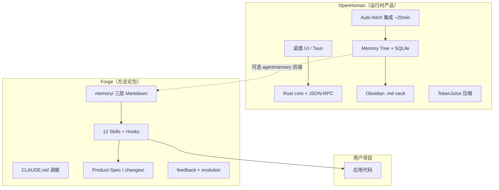
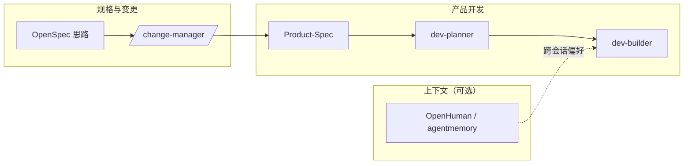

# Forge 与 OpenHuman 对照

> 参考：[tinyhumansai/openhuman](https://github.com/tinyhumansai/openhuman)（Personal AI harness — local memory, integrations, desktop UI）  
> 本文说明两者定位差异、可借鉴点，以及 Forge **不建议照搬** 的部分。与 [openspec-comparison.md](./openspec-comparison.md)、[superpowers-comparison.md](./superpowers-comparison.md)、[context7-comparison.md](./context7-comparison.md)、[rtk-comparison.md](./rtk-comparison.md) 互补：OpenSpec 对齐「变更工件」；OpenHuman 对齐「记忆与上下文基础设施」；Superpowers 对齐「TDD 与子 Agent 执行纪律」；Context7 对齐「库文档/API 知识注入」；RTK 对齐「Shell 工具输出压缩」。

---

## 一句话定位

| 项目 | 擅长 |
|------|------|
| **OpenHuman** | 个人 AI 助理运行时：桌面 App、Memory Tree + Obsidian vault、118+ 集成自动拉取、TokenJuice 压缩、语音/会议等 |
| **Forge (ReqForge)** | 产品开发方法论包：Spec → 计划 → TDD 实现 → 并行审查 → 发布 → 进化；嵌入 Claude Code / Cursor / OpenCode |

**推荐组合**：用 Forge 管「把产品做出来」；用 OpenHuman（或 [agentmemory](https://github.com/rohitg00/agentmemory)）管「跨工具、跨生活的持久记忆」——二者并存，不竞争。

---

## 架构层对照

| 维度 | OpenHuman | Forge |
|------|-----------|-------|
| 交付形态 | 可安装桌面应用 + 可选托管后端 | 复制 `adapters/*` 到项目，无独立运行时 |
| 记忆存储 | SQLite + 分层摘要树 + Obsidian 文件 | `memory/` 下三份 Markdown（Git 友好） |
| 上下文来源 | OAuth 集成定时同步（邮件、日历、GitHub…） | Spec、Plan、代码、用户对话、Task 摘要 |
| Token 策略 | TokenJuice 规则引擎压缩工具/网页输出 | 渐进披露、大输出 offload、`context-compaction` 钩子 |
| 工程门禁 | PR 覆盖率、Rust/TS 质量 | Machine Gates、并行 code-review、validate-skill |
| 许可 | GPL-3.0 | MIT |

---

## 可借鉴的启发（Forge 侧）

### 1. 可选外部记忆后端（文档级，见 memory-system.md）

OpenHuman 支持 `memory.backend = "agentmemory"`，与 Claude Code、Cursor、Codex、OpenCode 共用持久存储。

Forge 默认 **`memory/` 为单项目开发记忆**（架构、ADR、近期 Task）。可扩展约定：

| 层级 | 内容 | 权威来源 |
|------|------|----------|
| 产品真相 | 需求、验收标准 | `Product-Spec.md` + `changes/*/specs.md` |
| 项目记忆 | 实现细节、陷阱、决策 | `memory/*.md` |
| 个人/跨项目记忆（可选） | 偏好、长期上下文 | agentmemory 或 OpenHuman Memory Tree |

**原则**：外部记忆不得覆盖 Spec 中的验收标准；dev-builder 仍以 Spec + tasks 为准。

### 2. 进模型前的上下文治理（理念，非新引擎）

TokenJuice 做法：HTML→Markdown、长 URL 缩短、工具输出去重摘要，且保留 CJK/emoji。

Forge 已有 CLAUDE.md「Tool-call offloading」与 dev-builder 验证证据规则。可在 Skill 中强化：

- 压缩/摘要**不得删除**：文件路径、错误栈、验收标准 ID、安全相关字段
- 重复工具输出只保留 diff 或最后一轮结果
- 与 Hallucination Gate 一致：路径不存在仍应失败，不能因「摘要丢了路径」而绕过

### 3. 外部上下文来源（用户项目实现，Forge 不内置 OAuth）

OpenHuman 的 **auto-fetch** 适合个人助理，不适合作为 Forge 核心依赖（隐私、OAuth 托管、GPL 产品形态）。

Forge 可在 `changes/<name>/design.md` 或 Product-Spec 中描述：

- 定时同步（cron、webhook）
- MCP / CLI 拉取上下文
- 写入 `memory/project-memory.md` 或专用 `memory/integrations.md`（项目自定）

### 4. 技能外置仓库

OpenHuman 技能在 [openhuman-skills](https://github.com/tinyhumansai/openhuman-skills) 独立维护；Forge 为 `core/skills` + `pnpm sync` + `validate-skill`。社区 Skill 可遵循 `skill.schema.json` 与 loadout 清单发布。

### 5. 贡献者 Agent 协作

OpenHuman `AGENTS.md` 含覆盖率门禁、debug 脚本包装、Codex PR checklist。Forge 贡献者参考：

- `pnpm test` / `pnpm sync` / `pnpm validate-skill`
- 长任务可用 `core/templates/memory/` 交接模板 + `memory/task-history.md`

---

## 建议不照搬的部分

| OpenHuman 能力 | Forge 选择 | 原因 |
|----------------|------------|------|
| 桌面 UI、吉祥物、语音、Google Meet | 不做 | 方法论包，非消费级 App |
| 118+ Composio OAuth + 托管模型路由 | 不做 | 用户 BYO 客户端与模型；零 npm 安装 |
| Memory Tree + SQLite 引擎 | 不做 | 已有 Markdown `memory/`；可选接 agentmemory |
| GPL 整仓复制 | 保持 MIT | 框架分发策略不同 |
| 20 分钟全量 auto-fetch | 不默认 | 由用户产品在 Spec/design 中自行定义 |

---

## 与 OpenSpec、Forge 主流程的关系

- **OpenSpec / change-manager**：这次改什么、怎么验收、怎么归档  
- **Forge 主流程**：从想法到可发布产品  
- **OpenHuman 类工具**：Agent 更快「了解你」——不替代 Spec 与 Machine Gates

---

## 相关文件

- 记忆体系：`core/docs/memory-system.md`（含可选外部后端说明）
- OpenSpec 对照：`core/docs/openspec-comparison.md`
- Superpowers 对照：`core/docs/superpowers-comparison.md`
- Open Design 对照：`core/docs/open-design-comparison.md`
- 变更流 Skill：`core/skills/change-manager/SKILL.md`
- 记忆模板：`core/templates/memory/`
- 主调度：`CLAUDE.md`
