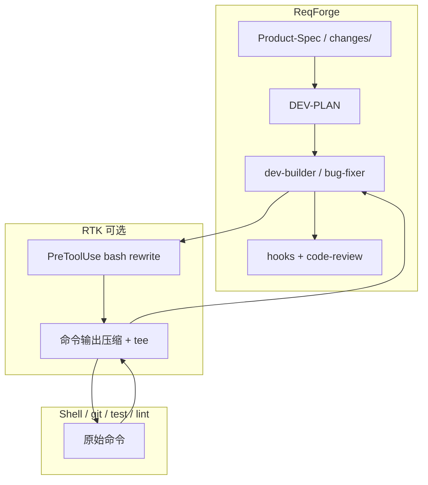

# ReqForge 与 RTK 对照

> 参考：[rtk-ai/rtk](https://github.com/rtk-ai/rtk)（Rust Token Killer — CLI 代理，压缩常见 dev 命令输出，PreToolUse Hook 自动改写 Bash）  
> 本文说明两者定位差异、**推荐叠加方式**，以及 ReqForge **不应自建** 的部分。与 [context7-comparison.md](./context7-comparison.md)、[openhuman-comparison.md](./openhuman-comparison.md)、[superpowers-comparison.md](./superpowers-comparison.md) 互补：Context7 对齐「库文档注入」；OpenHuman 对齐「记忆与跨会话上下文」；RTK 对齐「Shell 工具输出压缩」；Superpowers 对齐「TDD 与子 Agent 执行纪律」。

---

## 一句话定位

| 项目 | 擅长 |
|------|------|
| **RTK** | **上下文经济学（工具输出层）**：`git status`、`cargo test`、`pnpm test` 等命令输出过滤、分组、截断、去重；失败时 tee 保留全文路径 |
| **ReqForge** | **需求→可交付产品**：Spec、Plan、TDD 实现、变更 verify、审查、发布、记忆与进化；Hook 主要防路径/流程/验收类错误 |

**推荐组合**：用 ReqForge 管「做对流程、做对产物」；用 RTK 管「少把垃圾 shell 输出喂进模型」。**叠加，不替代。**

---

## 在 Harness 七层中的位置

| 层 | ReqForge | RTK |
|----|----------|-----|
| 5 上下文压缩 | 会话级：`memory-guard`、大输出 offload、`context-compaction` | 命令级：每条 Bash 输出经 RTK 过滤器 |
| 6 Hook 安全网 | `hallucination-gate`、`pre-commit-check`、`stop-gate` 等 | `PreToolUse` 改写 Bash → `rtk <cmd>`（仅 Bash） |



---

## 问题域对照

| 问题 | RTK | ReqForge |
|------|-----|----------|
| `git status` / 测试日志占满 context | ✅ 主战场 | 大输出 offload（弱于逐命令过滤） |
| 需求漂移、无验收 | ❌ | ✅ Product-Spec、DEV-PLAN、verify |
| 写到错误路径、跳过测试 | ❌ | ✅ Machine Gates + hooks |
| 第三方库 API 幻觉 | ❌ | WebSearch；叠加 Context7 更强 |
| 跨 session 丢决策 | ❌ | ✅ `memory/` + `memory-guard` |

---

## 与 ReqForge Skill 的关系

| Skill | RTK 价值 | 说明 |
|-------|----------|------|
| **product-spec-builder** | 低 | 对话与文档为主，shell 输出少 |
| **change-manager** | 中 | verify 阶段跑测试时受益 |
| **dev-builder** | **高** | TDD、lint、git 输出最密集 |
| **bug-fixer** | **高** | 复现与测试循环 |
| **code-review** | 低 | 审查看 diff 与 Spec，不靠 RTK 替审 |

RTK **不进入需求层**；主要在实现与验证阶段作为可选加速器。

---

## 安装（用户项目侧，非 ReqForge 仓库依赖）

```bash
# 官方推荐：从 GitHub 安装（避免 crates.io 同名包冲突）
cargo install --git https://github.com/rtk-ai/rtk rtk

rtk init -g          # Claude Code / Cursor 等：PreToolUse Hook
rtk gain             # 查看 token 节省统计（可选）
```

文档：[RTK README](https://github.com/rtk-ai/rtk)

### 与 `forge-install` 的顺序

1. `pnpm forge-install <client> --target <dir>`（或复制 adapters）
2. 在用户环境单独安装 RTK 并 `rtk init -g`
3. 两者独立；ReqForge **不**打包、不 pin RTK 版本

### Windows

| 环境 | RTK Hook | ReqForge |
|------|----------|----------|
| **WSL** | 完整 PreToolUse 改写 | 与 Linux 一致 |
| **原生 Windows** | Hook 能力受限；可用 `rtk` 手动前缀命令 | `settings.windows.json` 等适配 |

重度 shell 工作流建议 **WSL**，Forge 与 RTK 均受益。

---

## Hook 覆盖边界（共存须知）

| 会经过 RTK | 不会自动经过 RTK |
|------------|------------------|
| Agent 发起的 **Bash**（Hook 改写后） | 客户端内置 **Read / Grep / Glob** |
| 用户手动前缀 `rtk git status` | 用户粘贴进对话的巨型输出 |
| | ReqForge 的 **非 Bash** 类 Hook 逻辑（路径校验、phase-exit 等） |

ReqForge Hook 与 RTK Hook **职责正交**：RTK 改「命令怎么跑、输出多长」；Forge 管「能不能写、测没测、Phase 收没收尾」。  
若同一 `PreToolUse` 链上有多条 Hook，以各客户端文档为准；冲突时优先保证 **hallucination-gate** 等安全 Hook 仍生效。

---

## ReqForge 已从 RTK 借鉴的理念（文档级，非二进制）

| 借鉴点 | ReqForge 落点 |
|--------|---------------|
| 失败时「摘要 + 全文 artifact 路径」（tee） | `change-verify-template.md`：证据写摘要，长日志附文件路径 |
| 诚实说明 Hook 不覆盖 Read/Grep | 本文 + [behavior-boundaries.md](./behavior-boundaries.md) Related |
| 可选伙伴工具，不写进架构 Phase | 本文；README 研究表 |

---

## 明确不做

| RTK 能力 | ReqForge 为何不做 |
|----------|-------------------|
| 自研 Rust CLI + 100+ 命令过滤器 | 与「需求→产品」使命无关；维护成本极高 |
| 将 token 节省作为主 KPI | Forge 的 KPI 是可交付、可验证 |
| 将 RTK 列为必需依赖 | 可选叠加；零 RTK 仍可用全流程 |
| 用 RTK 替代 Spec / verify / review | 流程主权在 Forge |

---

## 选型简表

| 场景 | 建议 |
|------|------|
| 长会话、大量 test/git 输出 | ReqForge + **RTK**（可选） |
| 库 API 易写错 | ReqForge + **Context7** |
| 只要省 token、不要产品流程 | RTK + 客户端规则即可 |
| 从想法到可发布产品 | ReqForge 为主；RTK/Context7 按需叠加 |

---

## Related

- [agent-harness-seven-layer-map.md](./agent-harness-seven-layer-map.md) — 第 5 层上下文压缩
- [context7-comparison.md](./context7-comparison.md) — 库文档（与 RTK 正交）
- [openhuman-comparison.md](./openhuman-comparison.md) — 记忆与 TokenJuice 理念
- [harness-maturity-checklist.md](./harness-maturity-checklist.md) — P0 验证环、上下文管理
