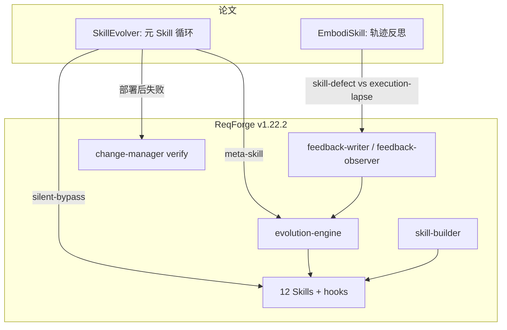
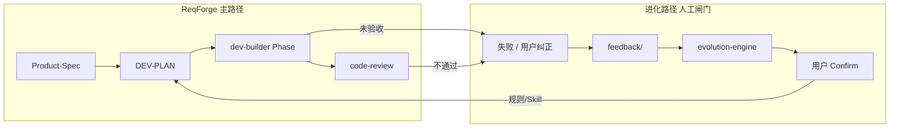

# ReqForge 与 Skill 自进化论文对照

> 参考：  
> - [EmbodiSkill: Skill-Aware Reflection for Self-Evolving Embodied Agents](https://arxiv.org/abs/2605.10332)（arXiv:2605.10332）  
> - [SkillEvolver: Skill Learning as a Meta-Skill](https://arxiv.org/abs/2605.10500)（arXiv:2605.10500)  
>  
> 本文说明两篇论文的核心思想、与 ReqForge **已有能力** 的映射，以及 **明确不做**（含 P1/P2 暂缓项）。与 [agent-harness-seven-layer-map.md](./agent-harness-seven-layer-map.md)（AHE 可观测进化）、[context7-comparison.md](./context7-comparison.md) 互补。

---

## 一句话定位

| 来源 | 擅长 |
|------|------|
| **EmbodiSkill** | 具身任务失败后，区分 **Skill 内容该改** vs **执行未跟 Skill**，再定向修订 Skill |
| **SkillEvolver** | 用 **元 Skill** 在线写、部署、精炼领域 Skill；信号来自 **部署后真实失败**；防过拟合与 **静默绕过** |
| **ReqForge** | **需求→可发布产品** + Harness；`feedback/` + `evolution-engine` 做 **数据驱动、人工确认** 的规则/Skill 升格；不改模型权重 |

**关系**：两篇论文进化的是 **Skill 制品（文字/流程）**；ReqForge 的 12 Skills + hooks 已是同一类制品。论文补的是 **失败归因粒度** 与 **部署后验证**，不是替换 Spec/Plan/Build 主流程。

---

## 两篇论文在解决什么

### EmbodiSkill（具身 Skill 感知反思）

| 问题 | 做法 |
|------|------|
| 任务失败时，不知道是 Skill 错了还是 Agent 没执行 Skill | 对轨迹做 **skill-aware reflection**：**skill-changing evidence** → 改 Skill 正文；**execution-lapse evidence** → 保留并强调已有有效指引 |
| 数字环境里「粗粒度改 Skill」直接搬到具身会误伤 | **Training-free**；按证据类型更新，避免把执行失误当成 Skill 缺陷 |

实验结论（论文摘要）：在 ALFWorld 等基准上，冻结执行器 + 自进化 Skill 可显著抬高任务成功率——说明 **归因正确的 Skill 进化** 比单纯换更大模型更有效。

### SkillEvolver（Skill 学习即元 Skill）

| 问题 | 做法 |
|------|------|
| Skill 多由人写或一次性生成，**使用后不改进** | 单一 **meta-skill** 迭代 **author → deploy → refine** 领域 Skill |
| 只靠探索轨迹蒸馏，与真实使用脱节 | **部署 learnt skill 之后** 才精炼；信号来自 **其他 Agent 使用时的失败** |
| 改 Skill 可能对当前会话过拟合、或 Skill 从未被调用 | **Fresh-agent overfit audit**；检测 **silent-bypass**（内容看似有效但运行时从不 invoke） |
| 需要重训模型 | 学习目标是 **Skill 的 prose/code**，产物可插入任意协议兼容 CLI Agent |

---

## 概念对照（论文 ↔ ReqForge）

| 维度 | EmbodiSkill | SkillEvolver | ReqForge 现状 |
|------|-------------|--------------|---------------|
| 进化对象 | 具身 procedural Skill | 领域 Skill（MD + 可选 code） | `SKILL.md`、`skill.json`、规则升格到 `CLAUDE.md` |
| 失败归因 | Skill 变更 vs 执行失误 | 部署后失败 + 审计 | 用户纠正 / 验证失败 / 四维 `scores`；**未显式标签** skill-defect / execution-lapse |
| 触发阈值 | 轨迹级反思 | 真实使用失败 + 过拟合审计 | `occurrences ≥ 3` 升格；Skill 低分/连续低分触发优化 |
| 闭环 | 自动改 Skill 正文（训练无关） | 元 Skill 自动迭代（可插拔） | **用户 Confirm/Skip** 后合并；`check-evolution` 会话初扫描 |
| 防劣化 | 保留有效指引 | Fresh-agent 审计、silent-bypass | **Predicted effect + Verify by**（v1.22.1+）；无「Skill 是否被调用」自动检测 |
| 评测 | ALFWorld、EmbodiedBench | SkillsBench、KernelBench | `pnpm test`、Phase 验收、`code-review`、Product-Spec 验收 |

---

## ReqForge 已从论文方向借鉴（已有）

| 论文思想 | ReqForge 落点 |
|----------|---------------|
| 进化的是制品而非权重 | `evolution-engine` 改规则/Skill，不训练模型 |
| 数据驱动、避免单次 anecdote | `occurrences ≥ 3` 升格；Gotchas 强调样本量 |
| 可验证、可观测的进化提案 | Proposal 必填 **Predicted effect** / **Verify by**（对齐 AHE，见 [agent-harness-seven-layer-map.md](./agent-harness-seven-layer-map.md)） |
| 部署/验收后再记失败 | `dev-builder` Phase 验收、`change-manager verify`、`feedback-observer` 在失败/纠正后写入 |
| 执行纪律 vs Skill 正文 | hooks（`hallucination-gate`、`phase-exit-guard`、`retry-gate`）约束 **执行**；Skill 管 **流程** |
| 新 Skill 由专门 Skill 创建 | `skill-builder`；`evolution-engine` 只 **提议** 新 Skill |

---

## 论文启示 vs 暂缓项（P0 / P1 / P2）

| 优先级 | 内容 | 状态 |
|--------|------|------|
| **P0** | 本文：对照 + 选型 + 明确不做 | ✅ |
| **P1-lite** | `failure_class` + RED 行 + evolution 四件套 + `feedback-observer` 分类 | ✅ v1.24+（`feedback-writer`、`evolution-engine`、`check-evolution` / `forge-bootstrap`） |
| **P1-full** | 自动从轨迹推断 skill-defect vs execution-lapse（无人工标签） | ⏸ 暂缓 |
| **P2** | `skill-bypass`：带 command 的 Skill 须在 `CLAUDE.md` Dispatch 出现 | ✅ forge-smoke `skill-bypass.mjs`（静态）；长期未触发统计仍暂缓 |

### P1-lite 使用说明

- 写 feedback 时设 `failure_class`；正文写 **RED** 一句（见 `feedback-topic-template.md`）
- `evolution-engine` 按标签分流：execution-lapse → 优先 bootstrap/hooks，避免 Skill 正文膨胀
- 仍依赖人工判断；误判时用 `unset` 并在 body 说明

### 何时再考虑 P1-full

### 何时再考虑 P2

- 用户反复口头要求「按某 Skill」，但会话日志里 **从未触发** 对应 `/command` 或 `skill.json` triggers。

**人工替代**：定期看 `FEEDBACK-INDEX.md` + 各 Skill 的 `occurrences` 是否长期为 0。

---

## 工作流叠加（概念图）

论文中的 **EmbodiSkill 反思** 适合插在 `Fail → FB` 之间（归因）；**SkillEvolver 部署后精炼** 对应 `Phase/Review` 之后写入 feedback，而不是仅在「探索轨迹」阶段改 Skill。

---

## 明确不做

| 论文能力 | ReqForge 为何不做 / 暂缓 |
|----------|---------------------------|
| 具身环境轨迹、物体搜索 Skill | 主场景是 **软件开发交付**，非 ALFWorld |
| SkillEvolver **全自动** 改 Skill、无人工 Confirm | 与 Machine Gates、用户 Confirm 冲突；`FORGE_MODE=yolo` 也不默认开启无人值守进化 |
| 用 SkillsBench 准确率驱动合并 | 项目级验收以 Spec/DEV-PLAN + `pnpm test` 为准 |
| 端到端 **meta-skill 替代** evolution-engine + skill-builder | 现有分工已覆盖；合并会增加隐式依赖 |
| P1 失败归因字段、P2 bypass 自动检测 | **已决策暂缓**；见上表 |
| 微调 / RL 更新模型 | 与两篇 **training-free** 一致，保持改制品 |

---

## 选型简表

| 你的目标 | 建议 |
|----------|------|
| 理解 Skill 如何随使用进化 | 读 EmbodiSkill + SkillEvolver 摘要 + 本文 |
| 在真实项目里进化 Harness | ReqForge `feedback/` + `/evolution-engine`（人工确认） |
| 区分「改 Skill」还是「加强执行」 | P1 未做：靠 feedback 正文 + hooks；重复误改再开 P1 |
| 防止 Skill 写了不用 | P2 未做：查 triggers 与 CLAUDE 路由；重复 bypass 再开 P2 |
| 具身/游戏 Agent | 论文栈；不用 ReqForge 主流程替代 |

---

## Related

- [agent-harness-seven-layer-map.md](./agent-harness-seven-layer-map.md) — 七层 Harness + AHE 可验证进化
- [harness-maturity-checklist.md](./harness-maturity-checklist.md) — 生产成熟度自检
- [context7-comparison.md](./context7-comparison.md) — 库文档注入（与 Skill 进化正交）
- [superpowers-comparison.md](./superpowers-comparison.md) — TDD / 子 Agent 纪律
- [memory-system.md](./memory-system.md) — 跨 session 记忆（非 Skill 进化，但互补）
