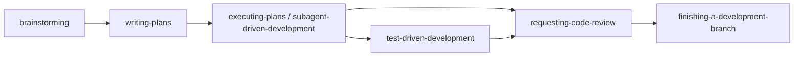
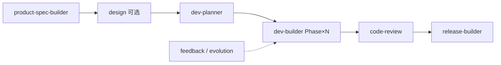
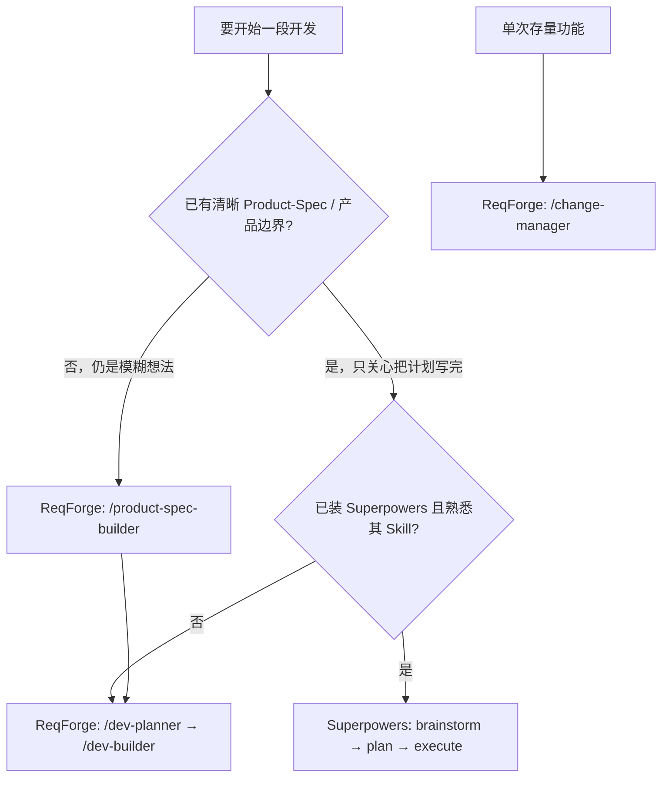

# ReqForge 与 Superpowers 对照

> 参考：[obra/superpowers](https://github.com/obra/superpowers)（Agentic skills framework & development methodology — brainstorm → plan → subagent execution → TDD → review）  
> 本文说明两者定位差异、ReqForge 已吸收的能力，以及**何时单独用、何时叠加、何时不要混用两套主流程**。与 [openspec-comparison.md](./openspec-comparison.md)、[openhuman-comparison.md](./openhuman-comparison.md) 互补。

---

## 一句话定位

| 项目 | 擅长 |
|------|------|
| **Superpowers** | **工程执行纪律**：可组合 Skill + 铁律（TDD、两阶段审查、子 Agent 按任务隔离），从「有个想法」到「按计划写完并审过」 |
| **ReqForge** | **需求→产品全流程 Harness**：Product-Spec、DEV-PLAN、多 Phase 交付、钩子机器门、记忆、进化、多客户端适配；执行层同样强调 TDD 与子 Agent |

**关系**：ReqForge 在 Product-Spec 中写明吸收了 Superpowers 的**技能化架构与 TDD 纪律**；不是替代品，而是「产品开发 OS」vs「高质量编码工作流库」。

---

## 哲学对照

Superpowers 典型结构（每个 Skill 内）：

- **Iron Law** — 不可协商规则（如先写失败测试）
- **Rationalization table** — 列出 Agent 常用来跳规则的借口

ReqForge 对齐项：

| Superpowers 思想 | ReqForge 落点 |
|------------------|---------------|
| 技能可组合、上下文触发 | `core/skills/*` + `skill.json` triggers + `commands/` 索引层 |
| RED-GREEN-REFACTOR | `dev-builder` [First Principles] — TDD First，非协商 |
| 子 Agent 按任务新鲜上下文 | `implementer`、`planner`、`code-reviewer` + 4 专项 reviewer |
| 两阶段审查（规格符合 → 代码质量） | 默认 `change_complexity=simple`；复杂时并行 4 Agent + 置信度聚合 |
| Git worktree 隔离 | `dev-builder` Per-Task worktree 步骤 |
| 写 Skill 的方法论 | `skill-builder` + `validate-skill` + `create-skill.sh` |

ReqForge **额外**（Superpowers 不覆盖或较弱）：

- **产品层**：`product-spec-builder` 访谈 → `Product-Spec.md`（定位、用户、AI 能力、路线图）
- **计划层**：`dev-planner` → `DEV-PLAN.md` Phase / 技术栈表
- **设计层**：`design-brief-builder`、`design-maker`（可选）
- **存量变更**：`/change-manager`（对齐 OpenSpec 工件，非 Superpowers 核心叙事）
- **进化层**：`feedback/` + `evolution-engine`（重复失败 → 规则升级提案）
- **机器门**：`hallucination-gate`、`pre-commit-check`、`phase-exit-guard`、`retry-gate`、`memory-guard` 等 10 个默认钩子
- **项目记忆**：`memory/` 三层 Markdown（跨 session，可版本管理）
- **多客户端**：`core/` + `adapters/`（claude-code / cursor / opencode）同步，用户项目零 npm

---

## 工作流对照

### Superpowers 基本链路（简化）

### ReqForge 基本链路（简化）

### Skill 映射表

| Superpowers Skill（代表） | ReqForge 对应 | 说明 |
|---------------------------|---------------|------|
| brainstorming | `product-spec-builder`（0-to-1 / Quick） | 完整 Product-Spec；可选 `pm-frameworks-*`（MIT / pm-skills）与 CoT 访谈模板（`conversation-strategy`） |
| writing-plans | `dev-planner` | DEV-PLAN Phase、技术栈、交付清单 |
| executing-plans | `dev-builder`（Continuous 模式） | 一次 /dev-builder 一个 Phase，强制停止 |
| subagent-driven-development | `dev-builder` + `implementer` | 每 Task 审查闭环；复杂审查走 code-reviewer 并行 |
| test-driven-development | `dev-builder` [First Principles] | 同样 RED-GREEN-REFACTOR，写进 Harness |
| systematic-debugging | `bug-fixer` | 三层诊断（现象 / 设计缺陷 / 原则违反） |
| requesting / receiving-code-review | `code-review` | 并行专项 Agent + 聚合；simple 时轻量 |
| using-git-worktrees | `dev-builder` worktree 步骤 | 任务级隔离 |
| finishing-a-development-branch | `release-builder` + dev-builder 提交规范 | 发布与 Phase 验收更完整 |
| writing-skills | `skill-builder` | 16 项评分表 + `skill.schema.json` |
| dispatching-parallel-agents | `code-reviewer` + 4 specialists | 审查场景并行，非通用任务调度 |
| using-superpowers | `CLAUDE.md` + loadouts | 项目状态检测与 Skill 分发 |

**ReqForge 无直接等价**（需自备或不用）：Superpowers 的 **Claude 官方插件市场一键安装**（`/plugin install superpowers@superpowers-marketplace`）——ReqForge 走 **复制适配层 / `pnpm forge-install`**。

---

## 安装与分发

| 维度 | Superpowers | ReqForge |
|------|-------------|----------|
| 安装 | Claude Code 插件市场为主；其他客户端有社区安装器 | 复制 `adapters/*` 到项目；`pnpm forge-install` |
| 更新 | `/plugin update superpowers` | `forge-install --force`（保留 feedback） |
| 用户项目依赖 | 随插件分发 Skill 文件 | **零 npm**（业务项目） |
| _star 规模（约）_ | 社区极高（插件生态） | 早期仓库，重文档与 Harness 深度 |

---

## 何时用哪条路径

**推荐组合（进阶）**：

1. **ReqForge 定产品真相** — `Product-Spec.md`、`DEV-PLAN.md`、`memory/`
2. **Superpowers 管单次实现冲刺** — 在已对齐的 Phase 内用其 TDD / subagent-driven-development（需自行避免与 `/dev-builder` 的 Phase 边界冲突）
3. **只选一套主流程** — 若团队没有专人维护两套规则，**优先 ReqForge 全流程**，避免 CLAUDE.md 与 Superpowers 初始指令互相抢优先级

**优先只用 Superpowers**：小工具、单仓库、已有明确 issue/计划，不需要 Product-Spec / 设计 Brief / 进化闭环。

**优先只用 ReqForge**：独立产品、0→1、要多客户端一致、要 hooks 机器门与 `changes/` 存量流。

---

## 建议不照搬 Superpowers 的部分

| Superpowers 做法 | ReqForge 选择 | 原因 |
|------------------|---------------|------|
| 插件市场为唯一主分发 | core + adapters 同步 | 需控制 hooks、loadouts、validate-skill 与版本一致 |
| 以 brainstorm 为默认入口 | product-spec-builder 访谈 + Quick Mode | 目标用户要「产品 Spec」而不只是设计澄清 |
| 两阶段审查固定串行 | simple 默认轻量；复杂才 4 并行 Agent | 降低小改 token 与延迟 |
| 无全局 Product-Spec / evolution | 显式 Product-Spec + feedback 进化 | 需求→产品与长期纠偏是核心定位 |

---

## 建议从 Superpowers 继续借鉴（未完全复制）

- **Rationalization 表** — `dev-builder/references/anti-rationalization.md`；`product-spec-builder/references/hard-gate-rationalization.md`（HARD-GATE）
- **Session Bootstrap 硬度** — `core/templates/forge-bootstrap.md` + `check-evolution` Part 0 注入（v1.24+）
- **Skill 进化 TDD** — `evolution-engine` RED/GREEN/Predicted effect/Verify by 四件套；`feedback` `failure_class` 路由
- **finishing-a-development-branch** — 与 `release-builder` 的 PR/合并清单可对齐
- **systematic-debugging** — 与 `bug-fixer` 三层模型交叉审查

---

## 相关文件

- OpenSpec 变更对照：[openspec-comparison.md](./openspec-comparison.md)
- Open Design 设计对照：[open-design-comparison.md](./open-design-comparison.md)
- OpenHuman 记忆对照：[openhuman-comparison.md](./openhuman-comparison.md)
- TDD 与 Phase 执行：`core/skills/dev-builder/SKILL.md`
- 审查聚合：`core/skills/code-review/SKILL.md`、`core/agents/code-reviewer.md`
- 主调度：`CLAUDE.md`
