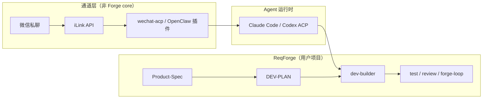

# ReqForge 与微信 iLink / ACP 桥接对照

> 参考：[微信文章](https://mp.weixin.qq.com/s/n5ZZl0i_dIAGsBKOvpIxzA)（公众号签名含「关注 AGI 的沿途风景」；抓取时遇验证页，下文结合同源技术资料整理）  
> 技术背景：[iLink Bot API](https://allclaw.org/blog/what-is-ilink) · [wechat-acp](https://github.com/formulahendry/wechat-acp) · [weixin-agent-sdk](https://github.com/wong2/weixin-agent-sdk) · [ACP](https://agentclientprotocol.com/) · 博客园解读：[formulahendry](https://www.cnblogs.com/formulahendry/p/19762347)  
> 与 [openhuman-comparison.md](./openhuman-comparison.md)（多通道收件箱）、[agent-harness-engineering-survey-comparison.md](./agent-harness-engineering-survey-comparison.md)（ETCLOVG）、[external-publish-preflight.md](./external-publish-preflight.md)（公众号草稿发布）互补。

---

## 一句话定位

| 来源 | 擅长 |
|------|------|
| **iLink + 桥接项目** | 把 **个人微信私聊** 接到任意 **ACP Agent**（Claude Code、Codex、Copilot…）：扫码登录、长轮询收消息、stdio 转发 |
| **ReqForge** | 在 **IDE 内** 把需求做成 **可测试、可合并、可发布** 的软件；**不做** 微信聊天入口与 7×24 收件箱 |

文章回答「如何在微信里遥控 coding Agent」；Forge 回答「遥控之后产出的代码如何验收与上线」。

---

## 技术栈在说什么（摘要）

### 1. 官方 iLink（智联）

- 端点：`https://ilinkai.weixin.qq.com`，HTTP/JSON，长轮询 `getupdates`（类 Telegram Bot）。
- 登录：二维码 → `bot_token`；回复须带 **`context_token`**（会话绑定）。
- 与灰色 Hook（WeChatFerry 等）对比：**协议在腾讯侧**，个人 Bot 有官方 ClawBot / OpenClaw 插件路径（2026 年起）。
- 参考逆向/文档：[openclaw-weixin weixin-bot-api.md](https://github.com/hao-ji-xing/openclaw-weixin/blob/main/weixin-bot-api.md)

### 2. OpenClaw 官方通道

- 安装 `@tencent-weixin/openclaw-weixin` 等插件 → 微信里出现 ClawBot 联系人 → 消息经 iLink 到本机 OpenClaw。
- 企业微信另有 OpenClaw / CLI 能力（消息、文档、日程等），与个人 iLink **不是同一套接入**。

### 3. 社区桥：ACP 解耦

| 项目 | 作用 |
|------|------|
| [wechat-acp](https://github.com/formulahendry/wechat-acp) | `npx wechat-acp --agent copilot`：iLink 收消息 → ACP 子进程 → 回微信 |
| [weixin-agent-sdk](https://github.com/wong2/weixin-agent-sdk) | TS SDK：实现 `Agent.chat()` 或只用 Transport 层 |
| [weixin-agent-gateway](https://github.com/BytePioneer-AI/weixin-agent-gateway) | 单微信入口多后端（OpenClaw、Codex、Claude…） |

典型能力：单聊、每用户一会话、Markdown 转纯文本、长文拆分、媒体加解密上传、**权限请求默认自动放行**（生产风险点）。

---

## ETCLOVG 视角：桥接层补了什么

| 层 | iLink 桥接 | ReqForge |
|----|------------|----------|
| **E** | 本机跑 Agent 子进程；无托管沙箱 | 用户 IDE + 项目仓库 |
| **T** | iLink 发送/媒体 API + ACP stdio | Skills、bash、MCP |
| **C** | 每微信用户一会话；可选 SQLite/Redis | `memory/`、`DEV-PLAN` |
| **L** | 收消息→转发→回消息循环 | Spec→Plan→Build→Review→Release |
| **O** | 桥接日志；一般无完整 trace 产品 | `.forge/evidence/`、CI |
| **V** | **弱**（聊天即交付） | **强**（测试、review、phase-check） |
| **G** | 自动批准 Agent 权限、单聊限制 | hooks、S0/S1、人工 Confirm |

**启示**：微信桥解决 **入口（T+L 的通道）**；Forge 解决 **上线（V+G）**。只接桥不接 Forge，容易变成「在手机里 vibe coding」。

---

## 与 ReqForge 的关系（推荐组合）

| 场景 | 建议 |
|------|------|
| 路上发一句「修登录 bug」 | 可用 wechat-acp **触发**；**验收**仍在桌面跑 `pnpm test` + `/code-review` |
| 正式改生产库 | **禁止**依赖微信线程做唯一审查；`--cwd` 指向已 `forge-install` 的项目 |
| 公众号/服务号发文 | 走 [external-publish-preflight](./external-publish-preflight.md)（`draft/add`、图床），**不是** iLink 私聊 Bot |
| 企业微信办公自动化 | 官方 OpenClaw/WeCom 插件；Spec § Integrations 写清边界 |

---

## 对维护者与用户的启示

| 启示 | Forge 落点 |
|------|------------|
| **通道 ≠ Harness** | README / [harness-maturity-checklist](./harness-maturity-checklist.md) P2：多通道 inbox **不在范围** |
| **ACP 可插拔** | Forge 适配 Claude Code / Cursor / OpenCode；微信桥是 **外层包装**，不替代 `pnpm forge-install` |
| **权限自动放行** | 与 S0/S1 冲突；若试用 wechat-acp，限只读仓或副本，**勿**直连 prod |
| **群聊/多租户** | 多数桥仅私聊；团队应用走企微 + 明确身份 |
| **「继续」与长任务** | 微信不适合跑 `forge-loop` 全 Phase；回 IDE 跑 `pnpm forge-loop <N>` |
| **合规** | iLink 为官方个人 Bot 路径；仍须遵守微信条款；非官方 SDK 标注「学习交流」 |

---

## 与 OpenHuman / CowAgent 的分工

| 产品 | 定位 |
|------|------|
| [OpenHuman](https://github.com/tinyhumansai/openhuman) / [CowAgent](https://github.com/zhayujie/CowAgent) | 7×24 多通道个人助理 + 记忆 |
| **iLink 桥** | 轻量：微信 ↔ 已有 CLI Agent |
| **ReqForge** | 产品开发 Harness，可叠加在 **同一仓库** 上 |

三者可并存：**OpenHuman 管生活收件箱，Forge 管仓库交付，微信桥仅作移动触发器**。

---

## 刻意不做

- 在 `core/` 实现 iLink 登录、长轮询、媒体加解密
- 将 `wechat-acp` 写入 `pnpm forge-install` 默认依赖
- 用微信对话记录替代 `Product-Spec.md` 或 code-review 证据
- 混淆 **个人 iLink Bot** 与 **公众号 Open API**（后者已有 preflight 示例）

---

## 快速命令对照

| 目标 | 命令/路径 |
|------|-----------|
| 微信里调 Copilot/Claude ACP | `npx wechat-acp --agent <preset> --cwd <你的项目>` |
| 项目内规范交付 | `pnpm forge-install` → `/dev-builder` → `pnpm forge-loop` |
| 公众号草稿发布门 | `pnpm preflight` + [external-publish-preflight](./external-publish-preflight.md) |
| Harness 七层自检 | [agent-harness-engineering-survey-comparison](./agent-harness-engineering-survey-comparison.md) |

---

## 参考

- 微信（待浏览器打开）：[mp.weixin.qq.com/s/n5ZZl0i_dIAGsBKOvpIxzA](https://mp.weixin.qq.com/s/n5ZZl0i_dIAGsBKOvpIxzA)
- [formulahendry/wechat-acp](https://github.com/formulahendry/wechat-acp)
- [wong2/weixin-agent-sdk](https://github.com/wong2/weixin-agent-sdk)
- [What is iLink (All Claw)](https://allclaw.org/blog/what-is-ilink)
- Forge 发布门：[external-publish-preflight.md](./external-publish-preflight.md)
