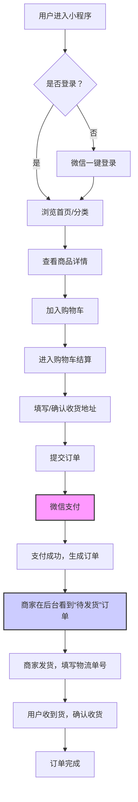

好的，没问题。作为你的产品经理，我已经根据你的需求梳理了一份清晰、可落地的 Product Spec。这份文档将指导你与开发团队沟通，并明确第一期需要实现的核心功能。

---

# 产品需求规格说明书 (Product Spec)

**产品名称：** 匠心集 (暂定名) - 手工艺品社区电商小程序
**版本：** V1.0 (MVP - 最小可行产品)
**负责人：** [你的名字]
**文档状态：** 初稿

---

## 1. 产品概述

### 1.1 产品定位
一个轻量级、低成本的社区电商小程序，专注于手工艺品的展示与销售。核心目标是快速验证商业模式，让手工艺人（即你）能够以最低的技术投入开始线上销售。

### 1.2 产品愿景
成为手工艺爱好者的首选购物平台，连接匠心与生活。第一阶段（V1.0）聚焦于完成从商品展示到交易履约的闭环。

### 1.3 核心价值
-   **对商家（你）：** 零代码或低代码快速开店，实现商品管理、订单处理、直播卖货的一站式管理。
-   **对用户（买家）：** 便捷浏览、一键登录、微信支付、实时追踪订单。

### 1.4 第一期范围 (MVP)
为了控制成本并快速上线，V1.0 将优先实现最核心的交易闭环功能。直播带货、会员体系、智能推荐将作为 V2.0 的规划。

**V1.0 核心功能：**
1.  商品展示与分类
2.  用户注册登录（微信一键登录）
3.  下单与微信支付
4.  订单管理（商家端与用户端）

**V2.0 待规划功能：**
1.  直播带货
2.  会员体系与积分
3.  个性化商品推荐

---

## 2. 目标用户

| 用户角色 | 描述 | 核心需求 |
| :--- | :--- | :--- |
| **手工艺品消费者** | 25-45岁女性，对手工、原创、有温度的商品感兴趣，注重品质和独特性，有线上购物习惯。 | 发现好物、安全支付、快速下单、查看订单状态。 |
| **商家（你）** | 手工艺人，需要简单高效的后台管理工具。 | 快速上架商品、处理订单、查看交易数据。 |

---

## 3. 核心功能 (V1.0)

### 3.1 商品管理 (后台)
-   **功能描述：** 商家在后台添加、编辑、下架商品。
-   **字段：** 商品名称、商品图片（最多9张）、商品描述（富文本）、价格、库存、分类（陶瓷/木工/布艺）、上架状态。
-   **操作：** 新增、编辑、删除、上下架。

### 3.2 商品展示 (前台)
-   **功能描述：** 用户在小程序首页浏览商品。
-   **核心模块：**
    -   **首页：** 商品瀑布流或列表展示，推荐热销或最新商品。
    -   **分类导航：** 顶部或侧边栏固定显示“全部”、“陶瓷”、“木工”、“布艺”分类，点击切换。
    -   **商品详情页：** 展示商品大图、名称、价格、库存、商品详情描述、购买按钮。

### 3.3 用户系统
-   **功能描述：** 用户注册与登录。
-   **核心逻辑：**
    -   **微信一键登录：** 首次进入小程序，弹窗引导用户授权微信信息（昵称、头像、手机号）进行注册/登录。
    -   **访客模式：** 允许用户在不登录的情况下浏览商品，但在点击“购买”时强制引导登录。
    -   **用户信息：** 自动获取微信昵称、头像，并绑定手机号。

### 3.4 购物车与下单
-   **功能描述：** 用户将商品加入购物车，并完成下单。
-   **核心流程：**
    1.  用户从商品详情页点击“加入购物车”。
    2.  进入购物车页面，可修改数量、删除商品。
    3.  点击“结算”，进入确认订单页（选择/填写收货地址、选择商品规格（如有）、查看总价）。
    4.  点击“提交订单”，调用微信支付接口。
    5.  支付成功后，生成订单，跳转至订单详情页。

### 3.5 订单管理
-   **用户端：**
    -   **我的订单：** 列表展示所有订单，按状态分类（待付款、待发货、待收货、已完成/已取消）。
    -   **订单详情：** 显示商品信息、价格、物流信息、订单状态。
    -   **操作：** 取消订单（待付款状态）、确认收货。
-   **商家端（后台）：**
    -   **订单列表：** 按状态（待发货、已发货、已完成）筛选查看所有订单。
    -   **订单详情：** 查看用户信息、商品信息、支付金额、收货地址。
    -   **操作：** 发货（填写物流单号）、标记订单状态。

---

## 4. 用户流程 (V1.0)

### 4.1 核心购物流程

### 4.2 商家后台管理流程
1.  登录小程序后台（通常由开发平台提供或独立的网页后台）。
2.  进入“商品管理” -> “新增商品” -> 填写信息 -> “上架”。
3.  进入“订单管理” -> 查看“待发货”订单 -> 点击“发货” -> 填写物流单号 -> 确认。

---

## 5. 技术要求

### 5.1 技术选型建议
为了满足“低成本”、“快速上线”的需求，强烈推荐使用 **SaaS 平台 + 定制开发** 或 **低代码平台** 的方案，而非从零开始原生开发。

| 方案 | 优点 | 缺点 | 适用性 |
| :--- | :--- | :--- | :--- |
| **方案A：SaaS平台 (推荐)** | **成本极低**（按年付费，约几千元）、**上线快**（几天内）、**功能全**（自带支付、物流、后台）、**无需操心服务器**。 | **定制化程度低**（功能受限于平台）、**数据所有权**（在平台上）。 | **非常适合MVP阶段**。例如：微盟、有赞、聚水潭等电商SaaS平台。 |
| **方案B：低代码平台** | **成本中等**（约1-2万）、**有一定定制空间**、**开发周期短**（1-2周）。 | 需要一定的技术能力或找开发者。 | 适合希望有一定品牌独特性，但预算有限。 |
| **方案C：原生开发** | **高度定制化**、**数据完全私有**。 | **成本高**（5万+）、**周期长**（1-2月+）、**需要运维**。 | **V1.0不建议**，未来用户量极大且需要复杂逻辑时考虑。 |

**强烈建议：** 采用 **方案A（SaaS平台）** 作为 V1.0 的基础。SaaS平台通常已经提供了商品管理、订单、支付、用户系统等核心功能，你需要做的只是“装修”店铺、上传商品。成本通常在几千元/年，完全符合你的预算预期。

### 5.2 核心API依赖
无论采用何种方案，以下接口是必须的：
-   **微信登录 API：** `wx.login` 获取code，换取openid和session_key。
-   **微信支付 API：** `wx.requestPayment` 调起支付。
-   **微信地址 API：** `wx.chooseAddress` 方便用户选择收货地址。
-   **云开发/服务器：** 用于存储商品、订单、用户数据。SaaS平台已提供，无需操心。

### 5.3 安全与性能
-   **支付安全：** 必须使用微信官方支付接口，所有支付逻辑在服务端完成，禁止在前端处理敏感密钥。
-   **数据安全：** 用户手机号等敏感信息需加密存储。
-   **性能：** 商品图片需进行压缩处理（建议WebP格式），保证小程序加载速度。

---

## 6. 后续规划 (V2.0 & V3.0)

-   **V2.0 核心功能：**
    -   **直播带货：** 接入微信小程序直播组件（需开通直播权限），实现边看边买。
    -   **会员体系：** 建立积分系统（消费积分、签到积分），积分可抵扣现金或兑换商品。
    -   **营销工具：** 优惠券、拼团、秒杀等。
-   **V3.0 核心功能：**
    -   **个性化推荐：** 基于用户浏览历史、购买记录，利用算法推荐可能感兴趣的商品。
    -   **社区互动：** 用户评价、晒单、手工艺人故事等内容板块。

---

**总结：**
**第一步：** 立刻去调研 **微盟、有赞、聚水潭** 等SaaS平台，选择一家免费试用，体验其后台功能。
**第二步：** 确定平台后，花1-2天时间完成店铺装修、上传你的手工艺品（陶瓷、木工、布艺）。
**第三步：** 上线测试，邀请朋友体验下单流程，确保支付和订单功能正常。
**第四步：** 正式推广你的小程序。

这样做，你可以在 **1周内、花费几千元** 就拥有一个功能完善的电商小程序，完全符合你“先用简单的方式做起来”的需求。